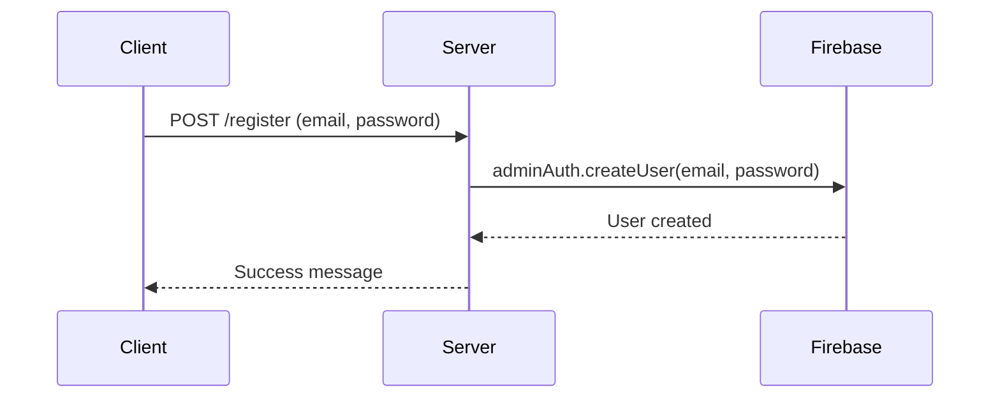
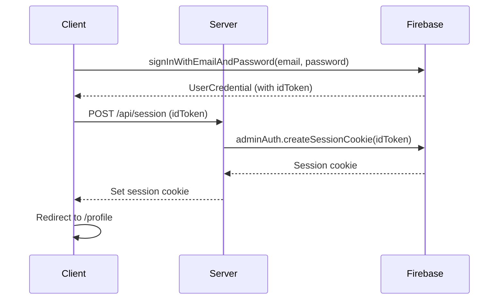
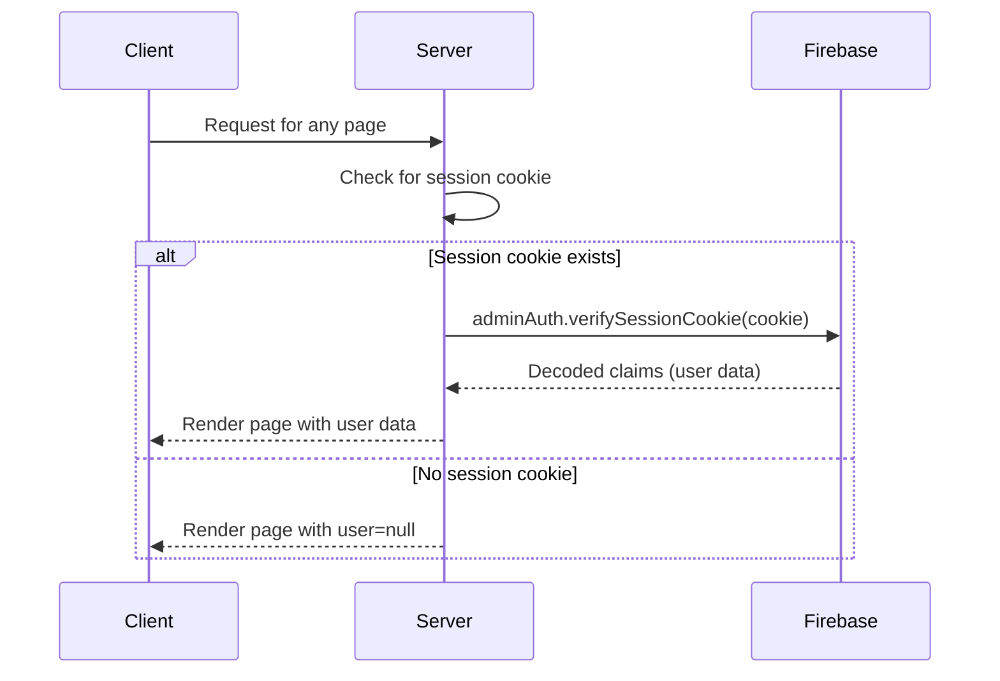

# Technical Documentation: Local Authentication with SvelteKit and Firebase

This document outlines the structure, pages, functions, and data flow of the local authentication system implemented in this SvelteKit application.

## 1. Project Structure

The project is organized into the following key directories and files:

-   `frontend/src/routes/`: Contains the application's pages and API endpoints.
    -   `+layout.server.ts`: Server-side logic for the root layout, responsible for session verification.
    -   `+layout.svelte`: The main client-side layout for the application.
    -   `login/`: The login page.
    -   `register/`: The registration page.
    -   `profile/`: The user profile page, which is a protected route.
    -   `api/session/`: API endpoint for creating and deleting user sessions.
-   `frontend/src/lib/`: Contains shared libraries and components.
    -   `auth.ts`: Client-side authentication logic, including the user store.
    -   `firebase.ts`: Client-side Firebase initialization.
    -   `server/firebase.ts`: Server-side Firebase Admin SDK initialization.
    -   `components/`: Reusable Svelte components.
        -   `Login.svelte`: The login form component.
        -   `Register.svelte`: The registration form component.
        -   `Profile.svelte`: The user profile component.

## 2. Pages and Components

### 2.1. Pages

-   **`/login`**: Displays the login form, allowing users to sign in with their email and password.
-   **`/register`**: Displays the registration form, allowing new users to create an account.
-   **`/profile`**: A protected route that displays the authenticated user's profile information.

### 2.2. Components

-   **`Login.svelte`**: A form that captures the user's email and password, handles the login process, and displays any errors.
-   **`Register.svelte`**: A form that captures the user's email and password and submits them to the server for registration.
-   **`Profile.svelte`**: A component that displays the user's profile information and provides a logout button.

## 3. Functions and Data Flow

### 3.1. Registration

The registration process is initiated from the `/register` page and handled by a server-side action.



### 3.2. Login

The login process is initiated from the `/login` page and involves both client-side and server-side logic.



### 3.3. Session Management

Session management is handled by a combination of a server-side layout and an API endpoint.



### 3.4. Logout

The logout process is initiated from the `/profile` page and clears the session cookie.

```mermaid
sequenceDiagram
    participant Client
    participant Server

    Client->>Server: DELETE /api/session
    Server->>Client: Delete session cookie
    Client->>Client: Redirect to /login