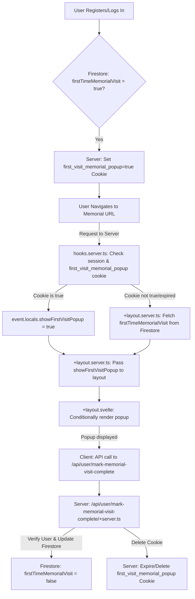

# Design for "First-Time Visit" Tracking Mechanism

## 1. Optimal Location for the Popup Bar

The popup bar should appear between the global navigation bar and the specific memorial page header.

*   **Location**: The popup bar component will be integrated into `frontend/src/routes/+layout.svelte`.
*   **Conditional Display**: Inside `+layout.svelte`, the popup will be conditionally rendered based on two factors:
    1.  The current route ID matches a memorial page pattern (e.g., `/tributes/[fullSlug]`). This can be checked using `$page.route.id`.
    2.  A `showFirstVisitPopup` flag is `true`, passed down from the server-side `+layout.server.ts`.

This approach ensures the popup is consistently positioned across all memorial pages and only appears when relevant.

## 2. State Management for "first-time visit" Flag

A hybrid approach combining **Firestore (database)** and **server-side HTTP-only cookies** is recommended for robust, persistent, and secure state management.

### **Mechanism:**

1.  **Firestore as Source of Truth**:
    *   A boolean field, `firstTimeMemorialVisit`, will be added to each user's document in Firestore (e.g., `users/{uid}`). This field will default to `true` upon user creation.
    *   This ensures persistence across sessions and devices, and is the most reliable source for the flag.

2.  **Server-side HTTP-only Cookie for Performance**:
    *   A secure, HTTP-only cookie (e.g., `first_visit_memorial_popup`) will be used as a cache to reduce database reads on subsequent visits.
    *   This cookie will be set to `true` when the user registers or logs in and their `firstTimeMemorialVisit` flag in Firestore is `true`.
    *   It will be deleted/expired once the popup has been displayed and the flag is marked `false` in Firestore.

3.  **SvelteKit `event.locals` for Request Scope**:
    *   In `frontend/src/hooks.server.ts`, after successful session verification, the `handle` hook will check for the `first_visit_memorial_popup` cookie.
    *   If the cookie exists and is `true`, and the user is authenticated, `event.locals.showFirstVisitPopup` will be set to `true`.
    *   This `event.locals` property will then be accessible by `+layout.server.ts`.

4.  **`+layout.server.ts` for Data Flow**:
    *   A new `+layout.server.ts` file will be created (or an existing one modified) to fetch the `showFirstVisitPopup` flag.
    *   It will prioritize `event.locals.showFirstVisitPopup`. If not present, it will perform a Firestore lookup for the authenticated user's `firstTimeMemorialVisit` flag.
    *   The resulting boolean will be passed to `+layout.svelte` via the `data` prop (e.g., `data.showFirstVisitPopup`).

### **Pros of this approach:**

*   **Persistence**: Firestore guarantees the flag persists across all user sessions and devices.
*   **Security**: HTTP-only cookies prevent client-side JavaScript access, and Firestore rules enforce server-side access control.
*   **Performance**: The cookie acts as a fast-path cache, avoiding a database read on every request once the popup status is known. Firestore is only queried if the cookie is absent or expired.
*   **Server-Side Rendering (SSR)**: The flag is available during SSR via `event.locals` and `+layout.server.ts`, allowing the popup to be rendered as part of the initial HTML, which is beneficial for SEO and perceived load times.

## 3. Interaction with Registration (Setting Flag to `true`)

1.  **Server-Side Registration Logic**:
    *   Upon successful user registration (e.g., in `frontend/src/routes/register/loved-one/+page.server.ts` or a dedicated API endpoint), after creating the user in Firebase Authentication and their corresponding user document in Firestore:
        *   Set the `firstTimeMemorialVisit` field in the newly created Firestore user document to `true`.

2.  **Setting the Cookie**:
    *   Immediately after registration and successful user authentication, the server-side logic will set the `first_visit_memorial_popup` HTTP-only cookie to `true`. This ensures that on the very first visit to a memorial page post-registration, the cookie is already present.

## 4. Interaction with Popup Display (Setting Flag to `false`)

1.  **Client-Side Trigger**:
    *   Once the "first-time visit" popup bar is displayed to the user on a memorial page, and they either dismiss it or a predefined display duration elapses, a client-side action will be triggered.
    *   This action will make an API call to a new server endpoint (e.g., `POST /api/user/mark-memorial-visit-complete`).

2.  **Server-Side API Endpoint (`frontend/src/routes/api/user/mark-memorial-visit-complete/+server.ts`)**:
    *   This new server endpoint will handle the request to mark the first visit as complete.
    *   **Authentication**: It will first verify the user's session using the session cookie.
    *   **Firestore Update**: It will then update the authenticated user's document in Firestore, setting `firstTimeMemorialVisit` to `false`.
    *   **Cookie Expiration/Deletion**: Crucially, it will also expire or delete the `first_visit_memorial_popup` HTTP-only cookie. This prevents the cookie from being sent on subsequent requests, ensuring the popup does not reappear.

### Mermaid Diagram for Workflow

---

## Implementation Todo List

1.  **Backend: Firestore Update**
    *   Add `firstTimeMemorialVisit: boolean` field to the user schema in Firestore, defaulting to `true` on new user creation.
2.  **Backend: Registration/Login Logic**
    *   Modify the user registration and login server-side logic (e.g., in `frontend/src/routes/register/loved-one/+page.server.ts` and potentially login actions) to:
        *   Set `firstTimeMemorialVisit` to `true` in Firestore for new users.
        *   Set a secure, HTTP-only cookie `first_visit_memorial_popup=true` if `firstTimeMemorialVisit` is `true` for the authenticated user.
3.  **Backend: `hooks.server.ts` Modification**
    *   In `frontend/src/hooks.server.ts`, after successfully verifying the session and populating `event.locals.user`:
        *   Check for the `first_visit_memorial_popup` cookie.
        *   If the cookie exists and is `true`, set `event.locals.showFirstVisitPopup = true`.
        *   Define `App.Locals` interface in `frontend/src/app.d.ts` to include `showFirstVisitPopup: boolean | undefined`.
4.  **Backend: `+layout.server.ts` for Data Fetching**
    *   Create or modify `frontend/src/routes/+layout.server.ts` to:
        *   Access `event.locals.showFirstVisitPopup`.
        *   If `event.locals.showFirstVisitPopup` is `undefined` (e.g., no cookie or expired), perform a Firestore lookup for the authenticated user's `firstTimeMemorialVisit` flag.
        *   Return `showFirstVisitPopup: boolean` in the `data` prop for `+layout.svelte`.
        *   Define `App.PageData` interface in `frontend/src/app.d.ts` to include `showFirstVisitPopup: boolean | undefined`.
5.  **Frontend: Popup Component**
    *   Create a new Svelte component for the popup bar (e.g., `frontend/src/lib/components/FirstVisitPopup.svelte`).
        *   This component should include the UI for the popup.
        *   It should have a mechanism to trigger the "mark as complete" action (e.g., a close button or an `onMount` effect with a delay).
6.  **Frontend: `+layout.svelte` Integration**
    *   In `frontend/src/routes/+layout.svelte`:
        *   Import the `FirstVisitPopup` component.
        *   Conditionally render the `FirstVisitPopup` component:
            *   Check if `$page.route.id` matches the memorial page pattern (`/tributes/[fullSlug]`).
            *   Check if `data.showFirstVisitPopup` is `true`.
            *   Place the component between the `Navbar` and the `main` content.
7.  **Backend: API Endpoint to Mark Visit Complete**
    *   Create a new server endpoint `frontend/src/routes/api/user/mark-memorial-visit-complete/+server.ts` to handle `POST` requests:
        *   Verify the user's authentication.
        *   Update the `firstTimeMemorialVisit` flag to `false` in the user's Firestore document.
        *   Expire or delete the `first_visit_memorial_popup` cookie.
        *   Return a success response.
8.  **Frontend: Client-Side Interaction**
    *   In the `FirstVisitPopup.svelte` component:
        *   Implement a function to call the `POST /api/user/mark-memorial-visit-complete` endpoint.
        *   Trigger this function when the user dismisses the popup or after its initial display.
        *   After the API call, consider invalidating the SvelteKit data or updating local state to hide the popup immediately without a full page reload.