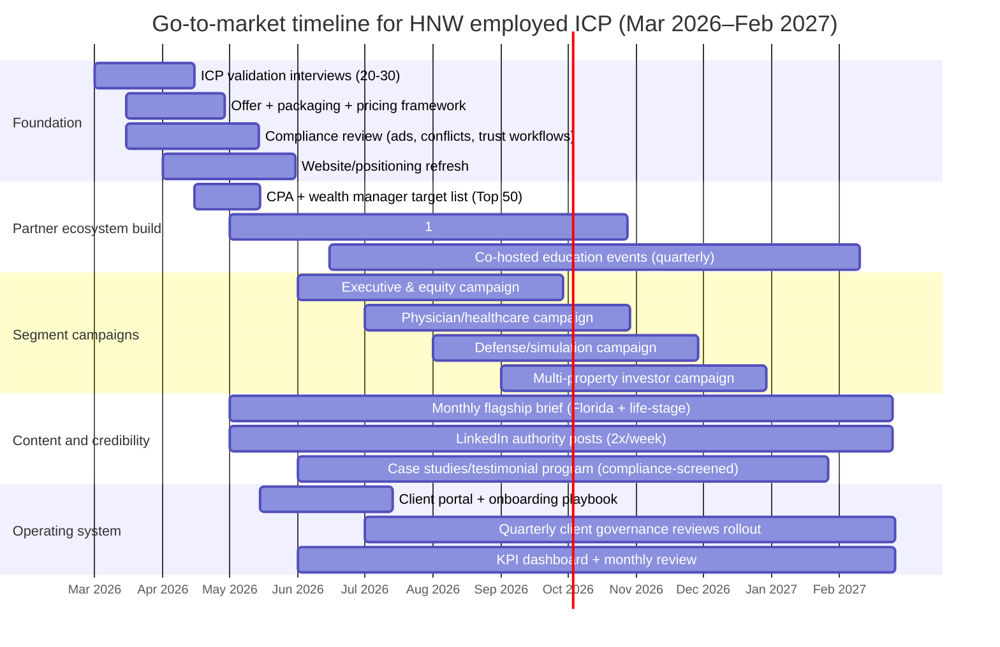

# Ideal Client Profile for an Orlando High-Net-Worth Personal Legal Service Umbrella

## Executive summary

This Ideal Client Profile (ICP) targets **high-net-worth (HNW) employed individuals in their 30s through 50s** who have **multiple, interrelated legal and financial-adjacent needs** and want them orchestrated under **one “quarterback” relationship** (your firm) rather than fragmented across specialists. The operational goal is to become the client’s “personal general counsel,” coordinating matters across estate planning, trusts, tax-facing planning, real estate, business/compensation issues, litigation management, family transitions, and (where relevant) cross-border or immigration-adjacent needs—without violating Florida legal ethics rules on fee sharing, referrals, and multidisciplinary practice. citeturn10search10turn20view1turn1search9

A **defensible, actionable proxy** for “HNW” in this market is to treat as “ICP-qualified” those who meet (or are close to meeting) the entity["organization","U.S. Securities and Exchange Commission","federal securities regulator"] “accredited investor” financial thresholds: **>$1M net worth excluding primary residence** and/or **>$200k individual income (>$300k joint)** for the last two years with expectation of continuation. This proxy is practical because it correlates with more complex assets (retirement plans, equity compensation, investment assets, multiple properties, private business interests) and the legal issues that cluster around them. citeturn1search4turn1search8

Orlando’s HNW employee supply is strongly shaped by: (a) **management and professional** wage bands, (b) a **large healthcare ecosystem**, (c) **aerospace/defense and simulation**, and (d) **professional services and technology** employers. The metro’s higher-paying major occupational groups include **management**, **computer and mathematical**, and **healthcare practitioners/technical**. citeturn29search0

Your highest-probability ICP segments (ranked by expected “bundle density”—i.e., likelihood of multiple matters that can be consolidated) are:
- **Corporate executives & senior managers** (including those in large hospitality/entertainment, healthcare, consulting, finance ops, and tech) citeturn29search0turn18view0  
- **Physicians and healthcare leaders** (often with employment contracts, liability exposure, practice ownership/partnership interests, and estate risk) citeturn29search0turn18view0  
- **Aerospace/defense, simulation, and advanced-tech program leaders** (clearance-sensitive, IP/confidentiality heavy, equity/bonus structures, relocation/cross-border issues) citeturn0search6turn0search2turn18view0  
- **Dual-income “HENRY” households** (high earners not yet “ultra” but with fast-growing complexity): equity comp + rental property + young-family estate planning + tax/insurance coordination citeturn1search4turn28view1  

Commercially, the ICP values **discretion, speed, and proactivity**, and prefers **secure digital workflows** plus high-touch human access—patterns consistent with broad U.S. finance behavior (e.g., high adoption of online banking) and wealth-management research emphasizing personalization and “always-on” expectations among affluent/HNW groups. citeturn28view0turn32search0turn32search12

## Market context and the practical HNW thresholds to use

**Local baseline economics and where “HNW employed” sits above it.** In the City of Orlando, recent ACS-based indicators show a **median household income around $72k**, **per-capita income in the low $40ks**, and a **median owner-occupied home value around the high $300ks** (all inflation-adjusted to the vintage shown by the Census). citeturn14view0 Those baselines are not “HNW,” but they anchor how far above the median your ICP must be to sustain multi-matter legal work (trusts, tax planning, complex real estate, litigation management, cross-border). citeturn1search4turn28view2

At the county level—useful because your target households often live outside the city core in higher-income enclaves—median household incomes are higher in the core commuter counties, with entity["place","Orange County, Florida","county, florida, us"] and entity["place","Seminole County, Florida","county, florida, us"] above Orlando city’s median in the latest QuickFacts/ACS views. citeturn31search0turn31search1 (Neighboring entity["place","Osceola County, Florida","county, florida, us"] and entity["place","Lake County, Florida","county, florida, us"] are somewhat lower on median income but still contain pockets of high-income households tied to relocation, executive housing, and second-home patterns.) citeturn31search2turn31search3

**Define the ICP with two thresholds: a financial gate and a complexity gate.**
- **Financial gate (proxy):** “Accredited investor” standard (net worth >$1M excluding primary residence and/or income >$200k individual or >$300k joint). This gives you a clear yes/no screen that is widely understood in financial services and is grounded in regulator guidance. citeturn1search4turn1search8  
- **Complexity gate (required):** The prospect must have **≥2** of the following **“bundle triggers”** active now (or imminent within 12 months):  
  1) Trust/estate plan needed or stale (life change, new child, new property state, new business interest).  
  2) Equity comp / bonus / deferred comp / partnership interest requiring tax-aware structuring.  
  3) Multiple properties (primary + second home and/or rental/investment property).  
  4) Current or credible threat of dispute (employment, business, real estate, family).  
  5) Cross-border exposure (foreign-born household member, inbound/outbound relocation, foreign assets/heirs).  
  6) Privacy/liability exposure that demands coordination across entity structuring, insurance, and asset protection. citeturn28view2turn13view0turn14view0  

**Why cross-border sensitivity matters in Orlando.** Orlando’s population includes a large foreign-born share (≈ one-quarter in the city’s ACS view). That correlates with higher incidence of immigration status management, cross-border family structures, international assets/inheritances, and planning for travel/residency changes—often alongside mainstream estate and real estate needs. citeturn14view0

## Orlando’s HNW employee “feeders” and the professions to target

### The wage structure that produces “HNW employed” households

In the Orlando metro, the entity["organization","U.S. Bureau of Labor Statistics","us labor statistics agency"] reports an average (mean) hourly wage for all occupations below the national average, but identifies **higher-paying major occupational groups** locally led by **management**, **computer and mathematical**, and **healthcare practitioners/technical**. citeturn29search0 These groups are the most reliable **employee-based** sources of HNW households (as distinct from entrepreneurs, whose wealth often concentrates in illiquid private business equity). citeturn28view2

### Industry clusters that concentrate high-compensation roles

Orlando’s economic development materials highlight clusters in **aerospace & defense**, **simulation**, **life sciences & healthcare**, **digital technology**, **FinTech**, and related advanced manufacturing and business services. These clusters are structurally compatible with your ICP because they generate (1) high W-2 earnings, (2) equity/bonus plans, (3) IP/confidentiality needs, and (4) relocation/cross-border movement. citeturn0search6turn0search2turn0search10

The simulation cluster is particularly material; Orlando is promoted as a major simulation hub with a large specialized workforce and significant contract flow through the region, implying a sustained base of program managers, engineering leaders, and executives who often have security, IP, and contracting-adjacent legal needs. citeturn0search2

### Major employers that function as “segment anchors”

Use a **target-account list** approach anchored on major employers (and adjacent vendors) because it improves message relevance and referral-path predictability. A recent “Top 50 Employers” list for the Orlando MSA (updated Nov 2025; excludes local government and retail operations) is a solid starting point for identifying employer ecosystems and the professional communities that surround them. citeturn18view0

Prioritize outreach and tailored messaging to employee segments connected to these employers (examples shown as anchors, not an exhaustive list):

- entity["organization","Walt Disney World Resort","theme park resort, lake buena vista"] (corporate leaders, senior managers, complex comp/benefits, family governance) citeturn18view0  
- entity["organization","Universal Orlando Resort","theme park resort, orlando"] (same patterns; plus media/brand contracts in some roles) citeturn18view0  
- entity["organization","AdventHealth","health system, florida"] and entity["organization","Orlando Health","health system, orlando"] (physicians, service line leaders, executives; high malpractice and employment-contract density) citeturn18view0turn29search0  
- entity["company","Lockheed Martin","aerospace defense company"] plus entity["company","Leidos","defense contractor"] (engineering/program leadership; security-sensitive matters; relocation) citeturn18view0turn0search10  
- entity["company","Deloitte Consulting","management consulting firm"] and entity["company","KPMG","professional services firm"] (partners/directors; mobility; equity/bonus; dispute management) citeturn18view0  
- entity["company","Oracle Corporation","software company"] and entity["company","Electronic Arts","video game company"] (tech talent; IP/confidentiality; equity comp; remote/hybrid multi-state issues) citeturn18view0turn0search2  
- entity["company","Siemens Energy","energy technology company"] and entity["company","FIS","financial technology company"] (senior technical and finance roles; comp and compliance) citeturn18view0  
- Private-banking/wealth-adjacent employers with local presence such as entity["company","Bank of America","banking company"], entity["company","JPMorgan Chase","banking company"], and entity["company","BNY Mellon","custody bank"] (produce both prospects and critical referral partners) citeturn18view0  
- entity["organization","University of Central Florida","public university, orlando fl"] (senior administrators, faculty physicians/adjuncts, and professional networks; also a referral node into tech and defense talent) citeturn18view0  

## The ICP archetype: demographics, assets, case clusters, and psychographics

### Demographics and income bands to operationalize

**Age band (core):** 33–55 (fits “30–50s” request while aligning with peak accumulation years—retirement plan build-out, first/second home, young-family planning, and role advancement). This is also the age band used in national retirement participation analysis within the SCF (“reference person aged 35–64”) when discussing working families and retirement-plan participation by income group. citeturn28view1

**Household income (screening bands):**
- **Entry to ICP (“HENRY+”):** $250k–$350k household income (often dual-earner; may or may not meet accredited thresholds yet, but typically has multiple bundle triggers). citeturn1search4turn29search0  
- **Core ICP:** $350k–$750k household income (senior management, specialist physicians, senior engineers, consulting/finance leaders). citeturn29search0turn18view0  
- **Upper ICP:** $750k+ household income (C-suite, highly compensated specialists, partners, notable public figures). Consider this “small N, high complexity.” citeturn1search4turn32search12  

**Net worth (operational, not guaranteed):**
- **Qualified HNW proxy:** $1M+ excluding primary residence (SEC accredited investor). citeturn1search4turn1search8  
- **Common “sticky” planning zone:** $2M–$10M (multiple entities/assets; meaningful estate tax/legacy planning even where federal estate tax is not always triggered, plus Florida-specific homestead/elective share considerations). citeturn13view0turn8search13  

### Typical assets held by your ICP and why they drive bundled legal needs

National household finance data (SCF) provides an evidence-based template for what assets commonly appear on U.S. balance sheets and how they scale with income/wealth. Translate these into your client discovery checklist:

- **Retirement accounts** are widespread; in 2022, retirement accounts were held by over half of families, and working families in higher-income groups show much larger average IRA/DC balances (material for beneficiary designations, trust coordination, and plan distribution strategy). citeturn28view0turn28view1  
- **Public equities and pooled investments** are significant for affluent households; SCF also documents direct/indirect stock ownership and large gaps between median and mean values—an indicator of high concentration at the top that you should expect in your ICP subset. citeturn28view2  
- **Multiple real estate holdings** commonly appear as wealth grows: “other residential property” (second homes, timeshares, 1–4 unit rentals) is a measurable category in SCF, and nonresidential real estate equity (commercial/land) shows up for a smaller share but with high conditional values—both drive entity structuring, title, creditor risk, and transfer planning. citeturn28view2  
- **Private business equity** is a major complexity driver. SCF reports that business equity ownership is meaningful and that the distribution has a very high mean relative to median—consistent with a small portion of businesses having very high valuations. In practice, even “employed” HNW clients frequently have side entities (consulting LLCs, real estate LLCs, partnership interests, carried interests) that behave like business equity for planning and dispute risk. citeturn28view2turn27view0  
- **Cash-value insurance** appears at non-trivial rates in SCF and is often tied to advanced planning conversations (irrevocable life insurance trusts, premium financing risk, creditor protection strategy, divorce exposure). citeturn28view0  

### The legal and financial-adjacent “case clusters” you can legitimately consolidate

Your ICP is defined less by a single matter and more by **interlocking matter families**. The most bankable service umbrella is “personal legal office + coordinated specialist network.”

**Core cluster (high prevalence): estate + property + tax-facing planning**
- Estate planning refresh (wills, revocable trusts, incapacity documents, beneficiary alignment) and trust administration planning. Florida-specific rules make homestead and spousal rights non-optional design inputs. Florida’s Constitution provides creditor protection for qualifying homestead property and restricts forced sale and liens subject to exceptions; it also includes devise restrictions when a spouse or minor child survives. citeturn13view0  
- Spousal protections such as Florida’s elective share statute (a surviving spouse’s right to a share of the elective estate) are a planning constraint for second marriages and blended families. citeturn8search13turn8search2  

**Real estate and title-driven cluster (moderate-to-high prevalence):**
- Residential and investment real estate acquisitions/dispositions, entity titling, and dispute prevention (contract review, partition/ownership disputes mitigation, landlord-tenant strategy for HNW landlords, construction defect triage). SCF’s documentation of “other real estate” ownership and nonresidential property equity provides the asset-side rationale for why this appears frequently in affluent households. citeturn28view2  

**Employment and compensation cluster (high prevalence for “employed HNW”):**
- Executive employment agreements, restrictive covenants, severance negotiations, internal investigations support, and compensation structuring (bonus, deferred comp, equity plans). This cluster is structurally connected to the highest-paying occupational groups locally (management, computer/math, healthcare practitioners). citeturn29search0  

**Business interest cluster (moderate prevalence, high complexity when present):**
- Side entities (LLCs), partnership agreements, governance/operating agreements, buy-sell planning, and loyalty/confidentiality/IP issues (especially for defense/simulation/tech leaders). Orlando’s promoted simulation and aerospace/defense ecosystems make this cluster more common than in a purely tourism-driven metro narrative. citeturn0search2turn0search10  

**Dispute and litigation management cluster (moderate prevalence, high retention impact):**
- High-stakes clients often need a single point of control for disputes even when outside trial counsel is engaged. You “own” strategy, selection, communication, budgeting, settlement posture, and reputational containment (within ethics rules). Florida Bar trust-account and safekeeping property rules become operationally important when handling retainers and settlement funds. citeturn1search6turn1search2turn24search7  

**Cross-border / immigration-adjacent cluster (variable prevalence, high differentiation):**
- For foreign-born clients and internationally mobile executives, planning frequently spans immigration status, international family structures, foreign bank/investment exposure, and multi-jurisdiction estate issues. Orlando’s foreign-born population share supports treating this as a meaningful add-on capability rather than a fringe offering. citeturn14view0  

### Psychographics: how the ICP decides and what they expect

**Values and decision drivers**
- **Control and risk reduction:** They pay to reduce downside (family conflict, tax surprises, title/ownership disputes, reputational harm) more than to “win” marginal upside. (This is consistent with wealth research emphasizing risk balancing and preservation tendencies among HNWIs across market cycles.) citeturn32search0  
- **Time compression:** They frequently have limited bandwidth; the winning value proposition is “one call, coordinated solution.” This aligns with wealth-management research stressing concierge-style access and personalization expectations at the affluent/HNW end. citeturn32search12turn32search0  
- **Discretion and confidentiality by default:** Particularly strong among defense/simulation leaders and public-facing professionals. Florida’s professional conduct rules reinforce that confidentiality is a baseline duty, and multi-matter representation heightens the need for careful consent and conflict management. citeturn24search2turn9search7  

**Pain points**
- “I have multiple advisors but nobody is accountable for the whole.” (Fragmentation cost: duplicated intake, inconsistent advice, missed deadlines.) citeturn32search12  
- “I’m not sure my plan works in Florida” (homestead, elective share, and relocation complexity). citeturn13view0turn8search13  
- “I can’t have this show up publicly” (reputational risk; disputes; family matters). citeturn24search2  

**Service preferences and communication channels**
- **Secure digital first + high-touch escalation.** SCF reports high usage of online banking nationally, supporting the expectation that affluent clients will accept secure portals, e-signing workflows, and structured digital communication—if it is frictionless and private. citeturn28view0  
- **Professional social channels as discovery, not as trust builders.** Pew reports LinkedIn usage is strongly associated with higher education, which is common in your HNW employee segments; use LinkedIn for credibility and “authority surface area,” but expect conversion to happen via introductions and private conversations. citeturn32search10turn29search0  
- **In-person trust-building still matters** for HNW retention and multi-stakeholder family meetings; wealth research repeatedly emphasizes relationship depth and personalization as the retention lever with affluent and ultra-affluent cohorts. citeturn32search0turn32search12  

## Segmentation, estimated prevalence, and acquisition channels

### Client segment comparison table

Estimated prevalence below is **within your targetable ICP universe** (HNW employed, 30–50s, multi-matter), not the general population. Percentages are **heuristics** grounded in local occupational wage structure and employer mix; treat them as planning weights for marketing focus, not as census counts. citeturn29search0turn18view0turn0search6

| Segment | What defines them in Orlando | Typical consolidated matters (examples) | Primary decision drivers | Best acquisition paths | Est. prevalence in ICP |
|---|---|---|---|---|---|
| Corporate executives & senior managers | Leaders across major hospitality/entertainment + healthcare + corporate services ecosystems | Estate plan + real estate + executive employment/comp review + litigation triage + privacy controls | “Quarterback” accountability; speed; discretion | Wealth managers, CPAs, executive networks, board affiliations | 30–35% citeturn29search0turn18view0 |
| Physicians & healthcare leadership | Employed specialists, service line leaders, hospital executives | Employment contract + liability/risk planning + trusts/estate + practice/side entity structuring + family transitions | Risk containment; clarity; responsiveness | Physician-to-physician referrals, healthcare CPAs, benefit advisers | 15–20% citeturn29search0turn18view0 |
| Aerospace/defense & simulation leaders | Program managers, senior engineers, cleared professionals, defense-adjacent executives | NDA/IP + employment/restrictive covenant + estate plan + relocation/multi-state + dispute management | Confidentiality; precision; low-noise execution | Defense-adjacent professional groups, targeted employer ecosystems | 10–15% citeturn0search2turn0search10turn18view0 |
| Tech, gaming, and digital product leaders | Senior ICs/managers with equity comp; remote/hybrid plus multi-state footprints | Equity comp + tax-facing planning + trusts/estate + IP/confidentiality + real estate | Technical competence; digital workflow; proactive planning | LinkedIn authority + referrals from tax/wealth advisers | 10–12% citeturn18view0turn32search10 |
| Finance/professional services partners and directors | Consulting/accounting/financial services leaders | Partnership/comp + estate plan + malpractice/claim triage + conflicts cleanup + entity structuring | Quality signals; predictability; documentation | Professional networks; estate planning councils; peer referrals | 8–10% citeturn18view0turn21search3 |
| Real estate investors who are primarily employed | W-2 HNW with 1–10 doors and/or a second home; often management/tech/healthcare by day | LLC structuring + lease strategy + estate plan + title planning + dispute containment | Fast turnaround; practical documents; prevent litigation | Realtor + CPA + lender networks (ethics-compliant) | 8–10% citeturn28view2turn21search0 |
| Public-facing professionals (athletes, entertainers, senior media) | Small numbers; high privacy and image risk | Contract review + privacy/reputation + tax-facing planning + estate plan + litigation firewall | Privacy; rapid access; tight coordination | Agent/manager introductions; private clubs; trusted counsel | 2–5% citeturn30search3turn18view0 |

### Referral sources and acquisition channels that fit Florida ethics constraints

Because Florida’s ethics rules **prohibit paying referral fees to nonlawyers** and **prohibit fee sharing with nonlawyers**, your acquisition strategy should be built around (1) relationship-driven referrals and (2) compliant marketing/qualifying-provider approaches—not “kickback economics.” citeturn10search10turn1search1turn10search3

High-yield, ethics-aligned channels:

**Professional referral ecosystems (primary channel):**
- Wealth managers / private bankers / trust officers (non-compensated referrals; reciprocal educational value; co-hosted client education where permitted). citeturn10search10turn21search3  
- CPAs and tax professionals (joint planning cadence; Circular 230 awareness if your firm touches IRS practice). citeturn9search6turn9search2  
- Specialist attorneys who don’t provide the “quarterback umbrella” (e.g., pure trial counsel, pure immigration counsel, niche tax controversy); you become the coordinator for the client. citeturn9search7turn24search2  

**Association and council participation (relationship accelerators):**
- entity["organization","Central Florida Estate Planning Council","estate planning council, orlando"] is a direct venue for forming trust-officer/CPA/attorney relationships and is explicitly designed around estate planning networking and continuing education. citeturn21search3turn21search7  
- entity["organization","Orlando Regional REALTOR® Association","real estate trade association, orlando"] provides access to the professional layer that influences affluent real estate decisions (note: manage compliance carefully—no “anything of value” for referrals). citeturn21search0turn10search10  
- Executive peer networks (EO/YPO) can be productive for high-quality introductions; treat them as long-cycle trust channels. citeturn21search5turn21search2  

**Authority marketing (secondary, supports referral conversion):**
- Publish “orchestration” thought leadership: Florida homestead + elective share + trust alignment; executive exits; multi-property structuring; dispute triage. (Substantive accuracy and advertising compliance must be controlled.) citeturn13view0turn8search13turn20view1  
- Use LinkedIn selectively: Pew shows high usage among those with bachelor’s degrees; your targets skew educated. citeturn32search10turn14view0  

## Orlando-specific targeting map: neighborhoods, institutions, and ecosystem nodes

**High-propensity residential nodes (where ICP households cluster).** Use income and per-capita income signals in nearby communities to inform geography-based targeting (events, sponsorships, partner breakfasts):

- entity["city","Winter Park","winter park, fl, us"] shows a six-figure median household income in Census QuickFacts and very high per-capita income—consistent with affluent professional households. citeturn15search0  
- entity["city","Lake Mary","lake mary, fl, us"] and entity["city","Maitland","maitland, fl, us"] also show high median household incomes relative to the regional baseline, matching executive/tech/professional services commuter patterns. citeturn15search2turn15search3  
- entity["place","Bay Hill","bay hill cdp, orange county fl"] and entity["place","Celebration","celebration cdp, osceola county fl"] are useful “affluence adjacency” targets and event geographies based on their high median household incomes in QuickFacts. citeturn16search3turn16search2  
- entity["city","Windermere","windermere, fl, us"] is not in QuickFacts due to population size, but ACS-derived community profiles show extremely high household incomes—making it a prime geographic marker for elite professional and executive households. citeturn16search11  

image_group{"layout":"carousel","aspect_ratio":"16:9","query":["Winter Park Florida Park Avenue","Windermere Florida luxury homes lakefront","Lake Nona Orlando community aerial","Downtown Orlando skyline Lake Eola"],"num_per_query":1}

**Country clubs and private-community nodes (relationship density).** These venues concentrate the social layer where high-trust introductions happen. They should be treated as **long-cycle** reputation plays (sponsorships and education events) rather than direct-response lead gen.

- entity["local_business","Isleworth","private golf club, windermere fl"] (prestige private club community) citeturn22search0turn22search12  
- entity["hotel","Arnold Palmer's Bay Hill Club & Lodge","golf club and lodge, orlando fl"] (membership + events; brand halo) citeturn22search5turn22search9  
- entity["local_business","Lake Nona Golf & Country Club","private golf club, orlando fl"] (ties to athletes and high-income professionals; high “family lifestyle” profile) citeturn22search2turn22search10  
- entity["local_business","Interlachen Country Club","private golf club, winter park fl"] (Winter Park affluence adjacency) citeturn22search3turn22search7  

**Private school nodes (family-stage fit).** Your ICP is often in a “young family + peak career” stage; schools become powerful community connectors.

- entity["organization","Lake Highland Preparatory School","private school, orlando fl"] citeturn23search0turn23search4  
- entity["organization","The First Academy","private christian school, orlando fl"] citeturn23search1  
- entity["organization","Trinity Preparatory School","private school, winter park fl"] citeturn23search2  
- entity["organization","Windermere Preparatory School","private school, windermere fl"] citeturn23search3  

**Data sources for micro-targeting in a compliant way.**
- County property records and tax roll data enable you to map high-value parcels and ownership patterns for **market research** and event placement—not for improper solicitation. The entity["organization","Orange County Property Appraiser","property appraiser, orange county florida"] and entity["organization","Seminole County Property Appraiser","property appraiser, seminole county florida"] maintain searchable ownership/value records; the entity["organization","Orange County Tax Collector","tax collector, orange county florida"] provides tax roll downloads and related property tax information. citeturn2search2turn2search3turn2search4turn2search12  
- The entity["organization","Internal Revenue Service","us tax agency"] publishes ZIP Code–level income and tax item data (SOI) that you can use to identify high-AGI ZIPs for event placement and partner density mapping (without claiming it identifies specific individuals). citeturn2search1turn2search0  

## Service packaging, pricing logic, compliance, and a 12-month go-to-market system

### Recommended service packaging for the “one umbrella” promise

Your offers should be **modular** (so clients can enter via one need) but **intentionally convergent** (so each module reveals adjacent risks you can manage).

**Package A: “Wealth & Life Admin Foundation” (core entry)**
- Florida-compliant estate plan (will/trust as appropriate), incapacity docs, beneficiary alignment, homestead and spousal-rights review. citeturn13view0turn8search13  

**Package B: “Executive & Equity Counsel” (employed HNW differentiator)**
- Employment agreement + restrictive covenant review; comp plan review; severance negotiation playbook; confidentiality/IP hygiene; dispute readiness. Connect this to the local wage reality: management + computer/math + healthcare practitioners are the high-paying groups locally, so this package matches the population that can pay and has recurring need. citeturn29search0  

**Package C: “Multi-Property & Entity Structuring”**
- LLC structuring, titling strategy, lease standards, dispute prevention, coordination with insurance/umbrella coverage planning (legal side). Tie back to SCF evidence that other real estate and nonresidential property holdings are common enough—and high value enough—to justify a dedicated module. citeturn28view2  

**Package D: “Family Transition & Dispute Containment”**
- Pre-divorce planning considerations (ethically appropriate), marital agreement coordination with specialist counsel, business interest protection, litigation management, and privacy controls. Operationally, ensure your intake system is conflict-safe (spouse and family member representation often creates conflicts). citeturn9search7turn24search2  

**Ongoing retainer: “Personal General Counsel Subscription” (the real LTV engine)**
- Quarterly/legal “balance sheet risk review,” annual estate plan maintenance, rapid-response for new issues, and coordination with outside counsel and financial professionals. HNW wealth research supports that affluent clients reward deeply personalized, high-availability service; structure your retainer around proactive governance rather than “hours.” citeturn32search12turn32search0  

### Pricing models and lifetime value

Specific numbers are **unspecified** because they depend on your practice mix, capacity, and competitive positioning. However, the **forms** that best fit the ICP are:
- **Flat-fee packages** for predictable scopes (foundation estate plan; baseline entity structure).  
- **Hybrid** (flat + hourly overage) for executive negotiations and complex multi-entity structuring.  
- **Annual/quarterly subscription retainer** for ongoing “quarterback” access and coordination.  
- **Litigation pricing** via hourly, phased budgets, or contingency where permitted and appropriate—paired with clear cost disclosures. Florida Bar consumer guidance describes contingency fee dynamics and the need for clarity on costs and fees. citeturn24search7  

LTV is typically driven by (a) initial foundation work, (b) a major life/role transition every few years (promotion, relocation, liquidity event, inheritance, dispute), and (c) annual governance/maintenance retainers. The more you succeed at “orchestration,” the more predictable and defensible your retention becomes. citeturn32search12  

### Regulatory and ethical considerations in Florida

This ICP is attractive precisely because it invites “umbrella” behavior—coordination across domains and with other professionals. That introduces ethics risk. The rules you must operationalize:

**No paid nonlawyer referrals; no fee sharing with nonlawyers.** Florida ethics materials emphasize that lawyers cannot pay nonlawyers for referrals and cannot divide fees with nonlawyers, making “wealth manager kickbacks” and many lead-gen schemes noncompliant. citeturn10search10turn1search1turn1search9  

**Advertising and “qualifying provider” compliance.** Florida has detailed advertising rules and filing requirements (including rules for testimonials, implied approvals, and required disclaimers). If you plan to scale via digital ads, you need a filing and review workflow and content standards aligned with the Florida Bar’s handbook/checklists. citeturn20view1turn10search6turn10search14  

**Confidentiality and conflicts compound in multi-matter/family work.** The Florida Rules of Professional Conduct include explicit duties around confidentiality and conflict identification; “family office legal” style relationships must be built on disciplined conflict checks and written consents where required. citeturn24search2turn9search7  

**Trust accounting and safekeeping property discipline.** Multi-matter clients often involve multi-party funds (retainers, settlements, escrow-like handling). Florida’s trust-account rules and compliance certifications are operationally non-negotiable. citeturn1search6turn1search2turn1search5  

**If you provide financial advice, you may trigger securities regulation.** Florida’s entity["organization","Florida Office of Financial Regulation","state financial regulator, florida"] explains that investment advisers must be registered unless an exclusion/exemption applies, and defines an investment adviser in line with securities-law concepts. If your “umbrella” includes investment advice for compensation, treat registration and supervision as a real risk area. citeturn24search0turn24search4turn24search1  

### Onboarding and retention best practices for this ICP

**Onboarding must feel like “control regained.”** Recommended structure:
1) **90-minute “legal balance sheet” intake** (assets, entities, titles, beneficiaries, contracts, disputes, cross-border flags). Anchor questions to SCF-style asset categories (primary residence, other real estate, retirement accounts, business equity, insurance) to avoid missing common complexity drivers. citeturn28view2turn28view0  
2) **Risk map + roadmap** delivered within 10 business days: what is urgent, what is important, what can wait; who owns each workstream.  
3) **Client portal and communication norms** (what goes in email vs. portal vs. phone; response SLAs), aligned with modern digital usage patterns. citeturn28view0turn32search2  
4) **Partner alignment** (CPA/wealth manager coordination) with written permissions and strict compliance boundaries. citeturn10search10turn24search2  

**Retention system (quarterly cadence):**
- Quarterly 30-minute governance check-in (changes in job, comp, property, family).  
- Annual estate plan and beneficiary audit (especially important in Florida due to homestead/spousal rules). citeturn13view0turn8search13  
- Annual “dispute readiness” update (contacts, document retention, escalation protocol).  

### KPIs to track

Track KPIs that measure whether you are becoming the client’s default counsel—not just closing one-off matters:

**Acquisition**
- Referral-source mix (wealth manager, CPA, attorney, internal client referral).  
- Conversion rate by segment (executive, physician, defense/sim, tech).  
- Cycle time: first contact → signed engagement.

**Delivery**
- Time-to-roadmap (days from engagement to written plan).  
- Matter bundling rate (average number of workstreams opened within 60 days).  
- Portal adoption and response SLA adherence.

**Retention and expansion**
- Subscription/retainer adoption rate.  
- Renewal rate and churn reasons.  
- Expansion: % of clients adding at least one new module annually.

**Compliance health**
- Advertising review/filing completion rate (if you advertise). citeturn10search6turn20view1  
- Trust accounting exceptions/incidents (target: zero). citeturn1search6  
- Conflict-check completion and documentation rate. citeturn9search7  

### Recommended 12-month marketing and sales timeline

This plan intentionally sequences **compliance and packaging before scale**, because Florida advertising/referral restrictions and trust-account discipline can create avoidable downside if you “market first and fix later.” citeturn10search10turn10search6turn1search6
map