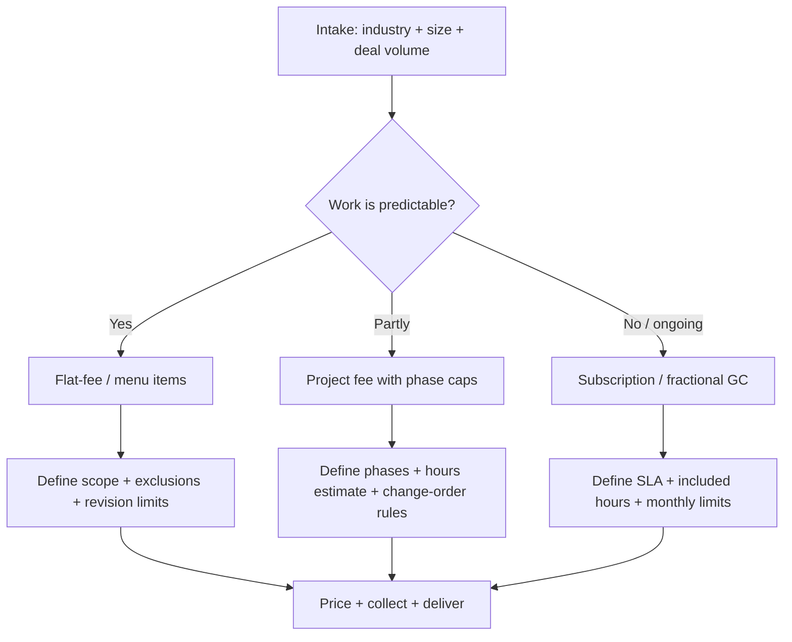

# Pricing and Packaging of Small-Business Legal Services in Orlando, Florida

## Executive summary

Small-business legal pricing in Orlando largely splits into three models: (1) hourly billing (still common for bespoke transactional work and disputes), (2) flat-fee “productized” work (entity formations, simple agreements, policy documents), and (3) subscription / fractional general counsel (FGC) plans designed to bundle predictable recurring legal support into a monthly price. Orlando’s market sits below Florida’s statewide cost-of-living benchmark but above many U.S. states in average lawyer rates, so local pricing typically looks like “mid-to-upper Southeast” rather than “coastal-biglaw.” citeturn30view0turn27search8turn26search1

Key Orlando-relevant benchmarks:

- **Florida Bar (2022) regional benchmark (Central/Southwest; includes Orlando): median attorney hourly rate $375.** citeturn1view0turn6view0  
- **Clio (2025 Legal Trends): Florida lawyers typically charge $215–$690/hour; average $351/hour.** Florida “Business” averages $395/hr, “Construction” $345/hr, “Employment Labor” $377/hr, “Real Estate” $332/hr, and “Intellectual Property” $420/hr. citeturn26search1  
- **Orlando cost-of-living proxy using BEA Regional Price Parities (RPP): 2023 RPP Orlando MSA 101.109 vs Florida 103.452** (Orlando slightly cheaper than the Florida average). citeturn27search8turn30view0  
- **Published, Orlando-area examples confirm a wide spread** from low-cost formation/templated flat-fees to premium subscription offerings:  
  - A local transactional firm advertises hourly billing **“between $45 and $375 an hour”** depending on staff level and sample flat-fees (e.g., LLC “rates start” at $300). citeturn11view0  
  - A local business-formation practice advertises **Florida LLC formation for $144 (including state filing fees)** and an unusually extensive à‑la‑carte menu (e.g., privacy policy $300; independent contractor agreement $80; construction workers’ comp exemption support listed separately). citeturn12view0  
  - A local firm publishes **subscription/FGC plans at $497, $2,025, $4,050, and $8,100 per month** with explicit response times and included deliverables. citeturn44view0  

Industry differences that matter to packaging and price:

- **Construction** tends to require heavier contract infrastructure (subcontractor agreements, lien-risk workflows, change orders), higher dispute exposure (payment and performance conflicts), and more regulatory edge cases—driving higher “burst” usage and making subscriptions attractive for contractors with steady deal flow. Construction is explicitly cited in small-business litigation research as a sector where customers may blame contractors for structural or expectation issues (a major dispute driver). citeturn43view0  
- **Restaurants** concentrate risk around leases, licensing, wage-and-hour practices, and rapid staff turnover. The legal “spikiness” often happens at opening, then stabilizes into periodic HR and contract review—well suited to launch bundles plus light ongoing counsel. (Local firms frequently market lease review and employment documents as the core recurring needs; subscription plans often list these explicitly.) citeturn44view0turn14view0  
- **Other professional small businesses** (clinics, agencies, consultants, studios, etc.) commonly require strong client-service agreements, IP basics (trademarks, confidentiality), privacy/terms, and employment/contractor classification—often fitting flat-fee templates plus periodic advisory. citeturn44view0turn12view0turn13search5  

## Definitions, sources, and how the benchmarks were built

Small-business size definitions (as requested):

- **Micro:** 1–9 employees  
- **Small:** 10–49 employees  
- **Medium:** 50–249 employees  

Pricing evidence used in this report prioritizes (a) bar association survey data where available, (b) Orlando-area law firm published pricing/menus, (c) subscription plan pricing pages, (d) government-published fee schedules (for Florida filing fees), and (e) large datasets on hourly rates by state/practice area (Clio Legal Trends). citeturn1view0turn26search1turn45search0turn44view0

Important methodological note on “metro examples” and comparability:

- Clio’s published lawyer-rate tables are **state-level** (not city-level) and reflect **aggregated billing data** from its user base; they are best treated as a broad market indicator and are not a guaranteed “going rate” for any single city or niche. citeturn26search1turn25search0turn25search1turn25search2turn25search3turn26search0  
- For metro-level benchmarking, this report uses **BEA Regional Price Parities (RPPs)** to create a *transparent cost-of-living adjustment* from state averages to metro estimates. This is an estimate under stated assumptions, not a direct observation of city billing rates. citeturn27search0turn28search0turn28search1turn28search2turn28search7turn29search0turn30view0turn31search1turn31search2turn31search3turn32search0turn34view0  

Entity formation filing-fee grounding (Florida):

- The Florida Division of Corporations lists **New Florida/Foreign LLC total fee $125** (filing fee $100 + registered agent designation $25). citeturn45search0  

## Hourly rates by seniority and geography

### What Orlando looks like in practice

Orlando sits in the Florida Bar survey’s **Central/Southwest** region, where the **median** hourly rate reported was **$375**. citeturn6view0turn1view0

Clio’s Florida benchmarking (2025 Legal Trends) suggests a statewide **typical range** of **$215–$690/hour** with an **average of $351/hour**, and notable practice-area differences relevant to the target industries (construction, employment, real estate/leases, business, IP). citeturn26search1

Published Orlando-area examples show that:

- Some firms disclose **broad internal rate bands** by staff level, e.g. **$45–$375/hour**. citeturn11view0  
- Some subscription pricing pages implicitly anchor “traditional” hourly rates (e.g., an example calculation uses **$450/hour**). citeturn44view0  
- Orlando-area governmental/legal procurement documents and public legal staffing memos provide reference points for partner/associate splits (e.g., a local public entity memo references a “current standard rate” **$250/hour for partners and $200/hour for associates** for a right-of-way legal services context). citeturn24view3turn24view2  
- A Central Florida oversight district board package (publicly posted) quotes **$500/hour for a board-certified partner, $450/hour for an associate attorney, and $100/hour for a paralegal** (useful as a high-end regional reference point). citeturn23search6  

### Orlando hourly rates by seniority (evidence-backed ranges + practical working ranges)

The table below separates **(a) observed published points** from **(b) a practical “working range”** for budgeting. The “working range” is a reasoned estimate for Orlando small-business counsel assuming reputable small-to-mid firms (not national biglaw), justified by the spread of Orlando-area published rates and Florida-wide benchmarks. citeturn6view0turn26search1turn44view0turn24view3turn23search6turn11view0

| Timekeeper level | Published Orlando / Central Florida examples | Practical Orlando budgeting range (estimate; excludes litigation spikes) | Notes |
|---|---:|---:|---|
| Paralegal / staff | $100/hr public quote (paralegal). citeturn23search6  $45–$375/hr “depending on staff member” (firm-wide band). citeturn11view0 | **$100–$175/hr** | Paralegal pricing often appears either explicitly (some quotes) or embedded inside flat-fee/subscription deliverables. citeturn44view0 |
| Junior associate | $200/hr associate (public entity memo). citeturn24view3  $225–$300/hr “our attorneys” (Orlando-area firm practice pricing). citeturn16view2 | **$200–$325/hr** | Lower end reflects institutional/discount contexts; upper end reflects private small-business work in higher-touch practices. citeturn24view3turn16view2 |
| Senior associate | $450/hr associate attorney (public quote; upper reference). citeturn23search6 | **$275–$400/hr** | Many firms do not publish associate tiering; in practice, senior associates often land near the top of “associate” pricing bands. citeturn44view0turn26search1 |
| Partner / board-certified / managing attorney | $250/hr partner (public entity memo). citeturn24view3  $450/hr used for “traditional bill” example. citeturn44view0  $500/hr board-certified partner (public quote). citeturn23search6 | **$350–$525/hr** | Construction disputes, complex real estate, or niche regulatory work can exceed this band; Florida ranges can be wide by practice area. citeturn26search1turn23search6 |

### Geographic benchmarking for major metros vs Orlando (transparent estimate)

Because the user requested metro examples, the following table provides an **estimated** metro “average lawyer hourly rate” using:

1) Clio’s **state average lawyer hourly rate**, and  
2) a cost-of-living scaling using **BEA RPP metro ÷ BEA RPP state**.

This is a *reasoned estimate* for comparison—not a substitute for city-specific attorney surveys. citeturn26search1turn25search0turn25search1turn25search2turn25search3turn26search0turn27search8turn28search0turn28search1turn28search2turn28search7turn29search0turn30view0turn31search1turn31search2turn31search3turn32search0turn34view0

| Metro example | State (Clio avg lawyer rate) | State RPP (2023) | Metro RPP (2023) | Estimated metro avg (Clio × RPP ratio) |
|---|---:|---:|---:|---:|
| Orlando | Florida: $351/hr citeturn26search1 | 103.452 citeturn30view0 | 101.109 citeturn27search8 | **≈ $343/hr** |
| New York City | New York: $420/hr citeturn25search0 | 107.626 citeturn31search2 | 112.473 citeturn28search0 | **≈ $439/hr** |
| Los Angeles | California: $420/hr citeturn25search1 | 112.581 citeturn31search1 | 115.455 citeturn28search1 | **≈ $431/hr** |
| Chicago | Illinois: $349/hr citeturn25search2 | 98.855 citeturn31search3 | 102.557 citeturn28search2 | **≈ $362/hr** |
| Houston | Texas: $367/hr citeturn25search3 | 97.175 citeturn32search0 | 100.220 citeturn28search7 | **≈ $379/hr** |
| Atlanta | Georgia: $363/hr citeturn26search0 | 96.699 citeturn34view0 | 100.933 citeturn29search0 | **≈ $379/hr** |

Interpretation:

- Orlando’s “RPP-adjusted” benchmark comes out lower than Florida’s statewide average because Orlando’s 2023 RPP is slightly below Florida’s. citeturn27search8turn30view0  
- In practice, Orlando small-business hourly pricing can still cluster near the Florida Bar median benchmark ($375) depending on specialization and firm type. citeturn6view0turn1view0  

## Common flat-fee services in the Orlando market and typical price ranges

### Observed Orlando-area flat-fee menus (explicit published pricing)

Orlando has at least two visibly different flat-fee “styles”:

- **Ultra‑low-cost, high-volume formation + menu pricing** (often emphasizing speed and standardized deliverables). citeturn12view0  
- **Hybrid transactional firms** that publish *starting* flat fees but keep many matters quote-based. citeturn11view0  

A third category is **campaign-style/promotional flat fees** (e.g., a limited-time employee manual offer). citeturn13search4  

#### Flat-fee reference table (Orlando-area published prices)

| Service category | Orlando-area published examples | Practical Orlando range for budgeting (estimate) | Comments / cautions |
|---|---:|---:|---|
| Florida LLC formation | $144 “Form your Florida LLC” including attorney fees and **state filing fees** (plus listed deliverables like articles, minutes, certificates, etc.). citeturn12view0  Another Orlando firm lists LLC “rates start at $300.” citeturn11view0 | **$150–$800** (+ add-ons) | Florida’s LLC fee schedule lists **$125 required** for a new LLC (excluding optional certified copy/status certificate). citeturn45search0turn45search1 Ultra-low advertised packages may rely heavily on standardized documents—confirm what is customized vs boilerplate. citeturn12view0 |
| EIN assistance | $30 (or $110 for foreign individual without SSN/ITIN). citeturn12view0 | **$0–$250** | Many businesses do EIN themselves; some firms/shops price as a small add-on. citeturn12view0 |
| Registered agent + “attorney guidance” annual service | $118/year with “ability to call an attorney… any legal question… all year long,” plus minutes drafting support. citeturn12view0 | **$100–$600/year** | This is effectively a low-cost retainer-like access model with unclear boundaries; verify exclusions (litigation, complex drafting, etc.). citeturn12view0 |
| DBA / fictitious name registration | $130 (with expedited options +$65 or +$110 stated). citeturn12view0 | **$130–$500** | Particularly common for restaurants and contractors using trade names. citeturn12view0 |
| Website privacy policy / terms | $300 each (privacy policy; terms & conditions). citeturn12view0 | **$300–$2,500** | High variance based on data collection, online ordering, marketing, and multi-state compliance. A $300 flat-fee implies templated content; confirm fit. citeturn12view0 |
| Independent contractor agreement | $80 (published). citeturn12view0  Draft independent contractor agreement took **2.8 hours** in an example matter under a subscription plan’s “traditional bill.” citeturn44view0 | **$150–$1,500** | Construction and hospitality frequently misclassify workers; higher-risk roles justify more customization. citeturn43view0turn12view0 |
| Employment agreement | $80 (published). citeturn12view0 | **$150–$2,000** | Complexity driven by incentives, confidentiality, noncompete/non-solicit, and role-specific wage rules. citeturn12view0turn44view0 |
| Employee handbook/manual | $500 flat-fee promotional offer with one set of edits included. citeturn13search4  Subscription plans include “template” and “custom” handbook options depending on tier. citeturn44view0 | **$500–$5,000** | Restaurants often need stronger wage-and-hour, tip, meal-break, scheduling, and harassment policies; multi-location increases complexity. (Range is an estimate.) citeturn44view0 |
| Construction workers’ comp exemption support | Published menu shows tiered fees (e.g., 1 officer $110; 2 officers $135; 3 officers $155) and distinguishes construction vs non-construction. citeturn12view0 | **$110–$500** | Construction-specific regulatory filings are classic “flat-fee add-ons.” citeturn12view0 |
| Trademark filing package (basic) | $1,600 flat fee “includes USPTO filing fee for one class,” plus search and filing. citeturn13search5 | **$1,200–$3,500+** | Opposition/office actions typically excluded from flat fees; confirm scope for prosecution beyond filing/search. citeturn13search5 |

### National “legal product” platforms as pricing anchors for Orlando buyers

Orlando small-business owners frequently compare local counsel to subscription platforms. The common tradeoff is price certainty and convenience vs depth and continuity.

- **LegalZoom business formation pricing** is tiered (example: “Economy” $149 + state filing fees; “Standard” $329 + state filing fees; “Express Gold” $349 + state filing fees). citeturn35search4  
- **LegalZoom Business Attorney Plan** advertises monthly pricing (e.g., $43.17/mo billed every 6 months and $39.09/mo billed annually per the page display) and notes the plan provides a **25% discount on the consulting attorney’s hourly rate** for work beyond consultations (subject to discretion/availability). citeturn35search1  
- **Rocket Lawyer membership pricing** shows $39.99/month (month-to-month) and $239.88/year (annual plan), with additional per-service pricing/discounts under membership. citeturn35search2turn35search8turn35search14  

These platforms create a “price ceiling” for many micro businesses’ willingness to pay for general legal access, pushing local firms either toward explicit differentiation (specialization, faster SLAs, deeper drafting) or toward their own subscription offerings. citeturn44view0turn35search1turn35search2  

## Retainers, subscriptions, and packaged offerings in Orlando

### Subscription / fractional general counsel plans with explicit pricing and SLAs

A locally headquartered firm publishes one of the most explicit subscription plan matrices observed, including what is covered, response times, and included billable hours. citeturn44view0

Key plan design elements (typical of modern small-business legal subscriptions):

- Monthly fixed fee with predefined scope and volume limits (e.g., contract reviews per month, included billable hours) citeturn44view0  
- Express SLAs (e.g., email response within 48 hours; 24 hours on higher tiers) citeturn44view0  
- Discounts for out-of-scope work (5%–20% depending on plan) citeturn44view0  
- Month-to-month cancellation terms with notice periods (e.g., cancel any time with 30-day notice per the page) citeturn44view0  

#### Orlando-area subscription plan example (published)

| Plan | Monthly price | Included billable hours | Response times (published) | Examples of included items (published) |
|---|---:|---:|---|---|
| Freelancer | $497/mo citeturn44view0 | Not stated as hours in the short list; matrix shows plan has baseline features citeturn44view0 | Up to 5 emails, response within 48 hrs citeturn44view0 | Contract review/drafting, limited consultations citeturn44view0 |
| Essentials | $2,025/mo citeturn44view0 | 5 hours included citeturn44view0 | Email response within 48 hrs citeturn44view0 | Contract review limits, formation items, demand letters (limited) citeturn44view0 |
| Strategic | $4,050/mo citeturn44view0 | 10 hours included citeturn44view0 | Email response within 24 hrs (matrix) citeturn44view0 | Adds lease review, privacy/terms, stronger formation/governance options citeturn44view0 |
| Enterprise | $8,100/mo citeturn44view0 | 20 hours included citeturn44view0 | Email response within 24 hrs (matrix) citeturn44view0 | Higher contract volumes, “serve as general counsel,” transaction negotiation (listed) citeturn44view0 |

The same page provides a concrete “traditional bill vs subscription” example: **9.6 hours at $450/hour = $4,320** versus those same tasks being “included” under the $2,025/mo plan. citeturn44view0

### Classic retainer model (outside general counsel)

Orlando firms also describe the traditional outside general counsel retainer as an upfront deposit drawn down over time; one Orlando firm’s explainer notes retainers can range from **“several thousand dollars to a hundred thousand dollars or even more”** depending on scope and complexity. citeturn15search0

A practical Orlando retainer typology (ranges below are reasoned estimates anchored to the existence of local subscriptions and published hourly benchmarks; where explicit pricing is unavailable, this is stated as an estimate):

- **Micro business retainer (light advisory):** $500–$2,500 deposit; replenished as used (estimate). Anchored by the fact that subscription alternatives exist as low as $497/mo. citeturn44view0  
- **Small business retainer (steady contract + HR):** $2,500–$10,000 deposit (estimate). Relative to the published $2,025/mo subscription tier. citeturn44view0  
- **Medium business retainer (multi-employee HR + ongoing transactions):** $10,000–$50,000+ deposit (estimate). Consistent with the described retainer magnitude range. citeturn15search0  

### Other subscription-style offerings (Orlando-area example)

One Orlando-area firm serving community associations states:

- **Monthly subscription/retainer packages start at $100 per month** (cost based on the association’s annual operating budget; no long-term commitment), and  
- Their attorneys “in general” bill **$225–$300/hour** (with many tasks done on a flat fee). citeturn16view2  

Although this is not positioned specifically for restaurants/contractors, it demonstrates how low the price of “access + guidance” subscriptions can go when scope is tightly constrained and volume is high. citeturn16view2  

### Response-time commitments (SLA patterns)

Two recurring SLA patterns appear in Orlando-area packaging:

- **Email response SLAs (24–48 hours)** in subscription offerings. citeturn44view0  
- **Fast intake scheduling promises** (e.g., a flat-fee services page stating the firm will call “within twenty-four (24) hours” to set up a review and that some drafting services may be performed within “seventy-two (72) hours,” depending on needs). citeturn14view0  

## Project-based pricing and estimated hours per task

### How firms translate work into predictable prices

Firms often “productize” work by limiting scope using one or more of the following:

- page-count limits for reviews (e.g., “contract review (15 pages)” limits inside a subscription tier) citeturn44view0  
- capped revisions turnaround (“revisions and edits within 48 hrs” stated in the subscription grid) citeturn44view0  
- volume caps per month (demand letters per month, contract review count per month) citeturn44view0  
- exclusion of government fees/third-party costs (explicitly excluded from subscriptions) citeturn44view0  

### Baseline task-hour estimates (anchored where possible)

The following table provides **estimated hours** for common small-business legal tasks and indicates where an observed example exists. Where no direct observational data was found in the Orlando pricing pages, hours are stated as a reasoned estimate (and should be validated by counsel based on facts and document complexity).

| Task | Baseline hours (estimate) | Observed anchor (if available) | Main cost drivers |
|---|---:|---|---|
| Contract review (single agreement) | 1–3 | Example “Contract Review” billed **1.5 hours** in a published “Traditional Bill” table. citeturn44view0 | Length, risk clauses (indemnity, limitation of liability), negotiation rounds citeturn44view0 |
| Draft an independent contractor agreement | 2–5 | Example billed **2.8 hours**. citeturn44view0 | Industry-specific scope, IP ownership, non-solicit/noncompete, misclassification risk citeturn44view0turn43view0 |
| Demand letter | 0.8–2.5 | Subscription grid includes demand letters with monthly limits (not hours). citeturn44view0 | Evidence review, legal theory complexity, strategic risk management citeturn44view0 |
| LLC formation + basic operating agreement | 2–6 | Subscription grid covers LLC formation & operating agreements (not hours); Florida LLC fees are standardized. citeturn44view0turn45search0 | Single vs multi-member, allocations, tax coordination, CTA/ownership reporting considerations citeturn45search3 |
| Employee handbook (template-based) | 4–10 | “Template” handbooks appear in subscription matrix; flat-fee example offers an employee manual draft with one edit set. citeturn44view0turn13search4 | Number of employees, tips, scheduling rules, multi-location consistency (restaurants), safety policies (construction) citeturn43view0 |
| Website privacy policy + terms (basic) | 2–6 | Some firms publish a low flat fee ($300 each), implying templated work. citeturn12view0 | Data flows, marketing tools, online ordering, multi-state compliance (estimate) citeturn12view0 |
| Trademark filing (search + application) | 4–8 | Flat-fee package includes search + filing + filing fee (one class). citeturn13search5 | Strength of mark, class strategy, current use, office actions/oppositions (often excluded) citeturn13search5 |

### Industry comparisons: where hours—and therefore project prices—shift

The following table applies **multipliers** to baseline task hours to reflect common industry complexity (an analytical estimate, supported qualitatively by the litigation drivers and document needs described in small-business litigation research and by the contract-heavy nature of subscription matrices). citeturn43view0turn44view0

| Task cluster | Construction | Restaurants | Other professional small businesses |
|---|---:|---:|---:|
| Contracts (MSA/vendor/client agreements) | **1.1×–1.4×** (subcontracts, scope, change orders, lien risk) citeturn43view0 | **1.0×–1.3×** (vendor terms, delivery platforms, franchising considerations) citeturn44view0 | **1.0×–1.2×** (service scope + payment terms dominate) citeturn44view0 |
| Employment / contractor classification | **1.2×–1.6×** (subcontractors, safety obligations, comp) citeturn12view0 | **1.2×–1.7×** (high turnover, tipped wages, scheduling) (estimate) | **1.0×–1.3×** (mix of employees/contractors) citeturn44view0 |
| Real estate / lease | **1.0×–1.3×** (warehouse/yard issues) (estimate) | **1.3×–2.0×** (percentage rent, exclusives, buildout, health compliance) (estimate) | **1.0×–1.4×** (office/clinic leases) (estimate) |
| Dispute likelihood (recurring) | Higher “burst risk” (payment/performance) citeturn43view0 | Moderate-to-high (employment/customer issues) citeturn43view0 | Moderate (client disputes, IP, employment) citeturn43view0 |

## Average annual legal spend by business size and industry

### What can be stated with primary-source support

Reliable, current U.S. data on *total annual legal spend by small-business size and industry* is sparse in public datasets, especially at the metro level. In contrast, litigation-specific studies do provide useful ranges and incidence estimates.

A major SBA Office of Advocacy study on small businesses and litigation (federal court–anchored, Release Date 2005) reports:

- **Legal costs for actual litigation ranged from $3,000 to $150,000**, with **approximately one-third under $10,000** among respondents. citeturn39view0turn37view0  
- Using a PACER-based sampling approach, the researchers estimated that **~45,000 civil cases annually involve a business** (14.8% of total annual federal civil cases used in their computation). citeturn43view0  
- They further estimate **~30,000 small firms** may be involved each year in litigation, based on an estimated **36%–53%** share of businesses involved in civil cases being “small” under their definition (<50 employees). citeturn43view0  
- The study’s qualitative synthesis identifies three broad dispute drivers for small businesses: **employee complaints**, **business-specific problems/claims** (including IP and construction-related blame for structural/results issues), and **customer satisfaction** conflicts. citeturn43view0  

These findings are dated and federal-court centered, but they establish a key budgeting truth that remains operationally relevant: **most annual legal spend volatility comes from infrequent disputes** rather than routine compliance, which motivates subscriptions and flat-fee standardization. citeturn39view0turn44view0  

### Reasoned Orlando annual spend estimates (transparent assumptions)

Because Orlando-specific annual spend surveys by business size and industry were not found in the primary sources above, the following are **reasoned budgeting estimates** using:

- Orlando/Florida hourly benchmarks (median $375 Central/Southwest; Florida average $351; observed local market points) citeturn6view0turn26search1turn44view0turn16view2  
- Typical task-hour requirements and subscription plan structures published by Orlando firms citeturn44view0turn12view0turn11view0  
- Litigation cost ranges from the SBA study as the “tail risk” layer citeturn39view0  

**Assumptions (explicit):**

- Routine transactional/advisory work is budgeted at a **blended $325–$425/hour** depending on who does the work (consistent with Orlando-area points and Florida benchmarks). citeturn6view0turn44view0turn16view2turn23search6  
- Construction has higher dispute/contract workload; restaurants have high HR + lease intensity; professional services have higher IP/terms intensity but generally fewer large-dollar disputes than construction (scenario assumption consistent with dispute categories described). citeturn43view0turn44view0  

#### Estimated annual “routine legal” spend (excluding major litigation)

| Business size | Construction | Restaurants | Other professional small businesses |
|---|---:|---:|---:|
| Micro (1–9) | **$4k–$18k/year** | **$5k–$20k/year** | **$3k–$15k/year** |
| Small (10–49) | **$18k–$60k/year** | **$15k–$55k/year** | **$12k–$45k/year** |
| Medium (50–249) | **$60k–$180k/year** | **$50k–$160k/year** | **$40k–$140k/year** |

How to interpret:

- The *lower ends* reflect a stable year with limited new contracting and minimal HR complications, potentially handled via flat-fee updates plus occasional counsel. citeturn12view0turn11view0  
- The *upper ends* reflect active growth (more contracts, hiring/terminations, renegotiations, landlords/vendors) and/or higher-risk industries, where subscription plans in the $24k–$97k per year range become competitive against hourly billing. citeturn44view0  

#### Adding litigation “tail risk” (scenario layer)

When disputes escalate, a single matter can dominate annual legal spend. The SBA study reports **$3,000–$150,000** in legal costs for actual litigation among respondents, with ~1/3 under $10,000. citeturn39view0

A practical way to budget is to treat litigation exposure as a separate contingency line (e.g., 0.5%–2% of revenue or a fixed reserve), then reduce the probability by investing in preventative contracts/HR systems (the exact prevention ROI is business-specific). The reason this is rational is that the SBA study also describes how firms attempt to avoid court due to hidden costs, implying that dispute avoidance itself consumes resources. citeturn39view0turn37view0  

## Package design patterns, pricing strategies, and sample package templates

### Common package strategies used by firms

Observed strategies in Orlando-area offerings include:

- **Transparent menu pricing** for standardized deliverables (formation, filings, standard agreements) to reduce sales friction and compete with online providers. citeturn12view0turn11view0  
- **Subscription bundling** with explicit included items, response SLAs, and monthly limits (page-count caps, number of contract reviews, included billable hours). citeturn44view0  
- **Price discrimination via tiering**: low-cost “access” tiers for freelancers/micro businesses vs higher tiers for weekly/daily needs. citeturn44view0turn16view2  
- **Discounted out-of-scope work** to reduce client fear of “runaway bills” while still permitting complex matters to be billed profitably. citeturn44view0turn35search1  
- **Operational SLAs** (e.g., 24–48 hour email response commitments) as a differentiation strategy, effectively selling *reliability* not just documents. citeturn44view0turn14view0  

### Flowchart of a practical Orlando packaging decision process

### Sample package templates with line-item pricing (illustrative)

These templates are **not quotes** and **not legal advice**. They are budgeting frameworks built from published Orlando/Florida benchmarks and observed subscription economics. Government fees, filing fees, and third-party costs are typically excluded from legal service fees unless explicitly bundled. citeturn44view0turn45search0turn12view0

#### Construction micro/small “Contractor Compliance Starter” (illustrative)

Assumptions: blended $375/hr (aligned with regional median), typical hours per task based on the task anchors and common workload. citeturn6view0turn44view0turn12view0

| Line item | Est. hours | Est. fee |
|---|---:|---:|
| Subcontractor / independent contractor agreement (one template customized) | 3.0–5.0 | $1,125–$1,875 |
| Basic lien-risk contract review workflow (checklist + 1 template notice) | 2.0–4.0 | $750–$1,500 |
| Change-order template + short terms addendum | 2.0–4.0 | $750–$1,500 |
| Workers’ comp exemption filing support (if applicable; published examples show separate fees) | flat | $110–$500 (range informed by published menu) citeturn12view0 |
| **Estimated package subtotal (legal fees)** |  | **$2,735–$5,375** |

When a subscription may beat this: contractors doing weekly negotiating/review may find $2,025–$4,050/mo tiers cost-effective compared to repeated hourly contracting cycles. citeturn44view0

#### Restaurant launch “Lease + Employment + Vendor Core” (illustrative)

Assumptions: lease work is more negotiation-intensive; restaurant HR policies require more tailoring (estimate). Subscription matrices explicitly include lease review, employment agreements/handbooks, and contract review volume caps, supporting these being common package components. citeturn44view0turn14view0turn13search4

| Line item | Est. hours | Est. fee (using $375/hr) |
|---|---:|---:|
| Commercial lease review (one pass) | 3.0–6.0 | $1,125–$2,250 |
| One negotiated redline round (landlord tenant) | 2.0–6.0 | $750–$2,250 |
| Employee handbook/manual (draft + 1 edit cycle) | 6.0–12.0 | $2,250–$4,500 *(a published promo example is $500, implying a highly constrained scope; confirm deliverables)* citeturn13search4 |
| Vendor agreement templates (2) | 3.0–6.0 | $1,125–$2,250 |
| **Estimated package subtotal (legal fees)** |  | **$5,250–$11,250** |

Ongoing model that often fits restaurants: a lighter subscription tier for recurring HR and contract questions once the lease/opening burst is complete. citeturn44view0turn35search1

#### Professional services micro/small “Client Contract + IP Basics” (illustrative)

Anchors: contractor agreement drafting example (2.8 hours), contract review example (1.5 hours), privacy/terms offered as included components in subscription tiers, and a published trademark flat-fee example ($1,600 including filing fee for one class). citeturn44view0turn12view0turn13search5

| Line item | Est. hours / pricing basis | Est. fee |
|---|---|---:|
| Master Services Agreement + SOW template | 5.0–10.0 hrs | $1,875–$3,750 (at $375/hr) |
| NDA template + internal IP ownership clause package | 2.0–4.0 hrs | $750–$1,500 |
| Website terms + privacy policy (basic) | 4.0–10.0 hrs | $1,500–$3,750 *(note: some published menu pricing is far lower, suggesting templated work)* citeturn12view0 |
| Trademark filing (search + filing) | flat fee | ~$1,600 (published example) citeturn13search5 |
| **Estimated package subtotal (legal fees)** |  | **$5,725–$10,600** |

## Practical conclusions for Orlando owners in construction, restaurants, and professional services

- If your legal work is **episodic and standardized** (formation, one-off agreements), Orlando has **aggressively priced flat-fee options**, but you must verify customization, exclusions, and whether state fees are included. citeturn12view0turn45search0turn11view0  
- If your legal work is **recurring and operational** (weekly contract review, repeated HR questions, routine compliance), **subscriptions in Orlando are priced similarly to a part-time legal function**: roughly **$6k–$97k per year** depending on tier, with explicit SLAs and volume limits. citeturn44view0  
- Construction firms should treat legal spend as both:  
  - a **preventative contract system cost** (predictable), and  
  - a **dispute contingency cost** (volatile). Litigation research shows construction companies face customer-blame disputes, and litigation legal costs can reach six figures. citeturn43view0turn39view0  
- Restaurants should expect a **front-loaded legal spend curve** (lease + opening + first hires), then settle into **HR/compliance maintenance**; subscriptions or a light annual retainer can smooth volatility if turnover is high. citeturn44view0turn14view0  
- Professional small businesses should prioritize **client contract clarity + IP/basic privacy posture**, with trademark work often priced as a discrete flat-fee package and contracts handled either via project fees or subscription caps before scaling to bespoke counsel. citeturn13search5turn44view0turn12view0