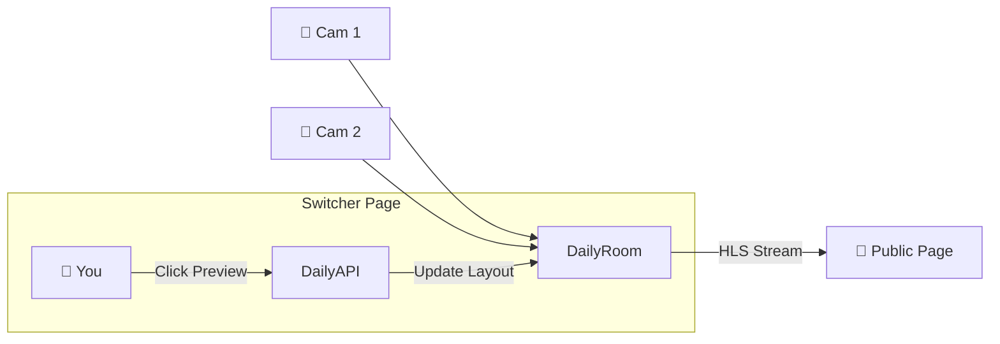

# Livestream Controller A - Implementation Plan (Simplified)

## 🎯 Overview
A lightweight, intuitive "Video Switcher" page embedded directly in the Admin Memorial workflow. This tool allows an admin to manage a multi-camera livestream for a specific memorial service without complex infrastructure.

## 🏗️ Architecture (The "Simple Switcher")

### **Concept**
- **Single Purpose**: One page to control the livestream for *one* memorial.
- **Route**: `/admin/services/memorials/[id]/switcher`
- **Inputs**: Up to 4 devices (phones/laptops) joining via a simple shared link.
- **Output**: Single HLS stream to the Memorial Page.
- **Tech**: Daily.co for WebRTC transport and Cloud Compositing.

### **Data Flow**


---

## 💻 Page Layout

**Design Philosophy**: "What You See Is What You Stream". Minimalist interface using existing components.

### **1. Header**
- **Title**: "Livestream Controller: [Memorial Name]"
- **Status**: 🔴 LIVE (Timer) | ⚪ OFFLINE
- **Primary Action**: [START STREAM] / [END STREAM] button (Red/Gray).

### **2. Program Monitor (Top, Large)**
- Displays the **Active Feed** currently being broadcast.
- **Overlay**: "Live Output" badge.
- **Stats**: Viewer count, connection quality.

### **3. Source Tray (Bottom, Row)**
- Grid of connected devices (Camera A, B, C, Screen Share).
- **Visuals**:
  - **Gray Border**: Connected, Ready.
  - **Red Border**: Currently Live.
  - **Click Interaction**: Clicking a preview instantly promotes it to the Program Monitor.
- **Add Source**: Button to generate a "Join Link" or QR code for a new camera.

---

## �️ Technical Strategy (Per Daily.co Docs)

### **1. Daily.co Integration**
Daily.co provides:
- **WebRTC rooms** for multi-party video (up to 200 participants default, 1000 max)
- **Client SDK streaming** via `callFrame.startLiveStreaming()` / `stopLiveStreaming()`
- **Layout presets**: `active-participant`, `single-participant`, `grid`
- **Mid-stream switching** via `callFrame.updateLiveStreaming({ layout: { preset, session_id } })`
- **HLS output** with ~12-20s latency (requires `streaming_endpoints` config or RTMP relay)
- **RTMP output** with ~8-20s latency (to YouTube, Twitch, etc.)

### **2. Key API Methods (Client SDK)**
```javascript
// Join room as admin (with is_owner: true token)
const daily = DailyIframe.createCallObject({ url, token });
await daily.join();

// Start streaming (admin only due to owner_only_broadcast room setting)
await daily.startLiveStreaming({
  layout: { preset: 'active-participant' },
  // For RTMP: rtmpUrl: 'rtmp://live.youtube.com/...'
  // For HLS: endpoint: 'hls_s3' (requires streaming_endpoints on room)
});

// Switch focused camera mid-stream
await daily.updateLiveStreaming({
  layout: { preset: 'single-participant', session_id: 'participant-id' }
});

// Stop streaming
await daily.stopLiveStreaming();
```

### **3. Room Configuration**
```javascript
// POST /rooms - create room with streaming enabled
{
  name: 'memorial-123',
  privacy: 'private',
  properties: {
    owner_only_broadcast: true,  // Only admins can start streams
    enable_recording: 'cloud',
    // For HLS output, configure streaming_endpoints:
    // streaming_endpoints: [{ type: 'hls', ... }]
  }
}
```

### **2. Backend Endpoints** (`/api/admin/switcher/...`)

1.  **`POST /init`**
    *   Input: `memorialId`
    *   Action: Checks for existing Daily room in Firestore. If none, creates one.
    *   Returns: `dailyRoomUrl`, `adminToken`.

2.  **`POST /invite`**
    *   Input: `memorialId`, `label` (e.g., "Cam 2")
    *   Action: Generates a join token.
    *   Returns: `joinUrl` (e.g., `https://daily.co/room?t=...`).

3.  **`POST /broadcast`**
    *   Input: `status` ('start' | 'stop')
    *   Action: Toggles Daily HLS streaming and recording. Updates Firestore status.

### **3. Frontend Components**
- **`<VideoGrid />`**: A custom Svelte component that iterates through `daily.participants()` and renders `<video>` elements.
- **`<StreamControls />`**: The Start/Stop button and status display.
- **`<JoinQR />`**: Display a QR code for the helper phones to scan and join instantly.

---

## 🚀 Implementation Steps

### **Phase 1: The "Room" (Foundation)** ✅ COMPLETE
- [x] Create route `/admin/services/memorials/[id]/switcher`.
- [x] Build the `init` API to create/retrieve a Daily room for the memorial.
- [x] Implement basic Daily-js client on the frontend to join the room as Admin.

### **Phase 2: The "Inputs" (Cameras)** ✅ COMPLETE
- [x] Build the `invite` API to generate camera links.
- [x] Create invite button on frontend for easy mobile connecting.
- [x] Display a grid of connected participants (video previews).

### **Phase 3: The "Switch" (Control)** ✅ COMPLETE
- [x] Implement the "Click to Switch" logic (visual selection).
- [x] Ensure the "Program Monitor" visually reflects the active stream.

### **Phase 4: The "Broadcast" (Go Live)** ✅ COMPLETE
- [x] Wire up the Start/Stop Broadcast buttons to Daily API.
- [x] Connect the Daily HLS URL to the actual Memorial Page database record.
- [x] Add HLS URL display banner when live.
- [ ] Test the full flow: Phone -> Switcher -> HLS -> Memorial Page.

## 📝 Simplified Data Model

### **Memorial Stream Config (Firestore)**
```typescript
// Added to existing 'memorials/{id}' or 'streams/{id}'
{
  dailyRoomName: "mem-123-service",
  dailyRoomUrl: "https://tributestream.daily.co/mem-123-service",
  hlsUrl: "https://...", // Populated when stream starts
  isLive: boolean
}
```
