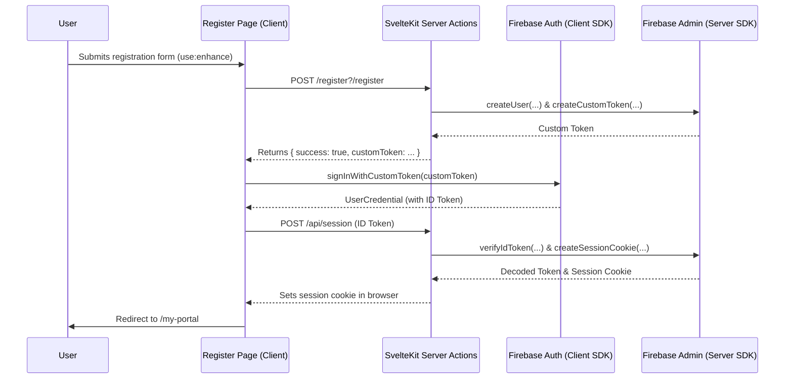

# Application Status Report - 08/21/2025

## 1. Overview

This document outlines the current state of the Tributestream application, focusing on the significant architectural improvements made to the user authentication system. The primary objective of the recent refactor was to implement a seamless, secure, and modern user registration and session management flow that aligns with SvelteKit best practices.

## 2. Core Authentication System

The authentication system has been successfully refactored to use Firebase Authentication as the central authority for user identity, fully integrated with the Firebase Emulator Suite for robust local development.

### Key Architectural Features:

*   **Technology Stack**:
    *   **Backend**: Firebase Admin SDK integrated into SvelteKit server actions and API routes.
    *   **Frontend**: Firebase Client SDK for user interaction in Svelte components.
    *   **Session Management**: Secure, HTTP-only session cookies managed by SvelteKit hooks.

*   **Seamless Registration Flow**:
    1.  A user submits their credentials via the new `Register.svelte` component.
    2.  The form submission is handled by a SvelteKit server action (`/register?/register`) which creates the user in the Firebase Auth service and a corresponding profile document in Firestore.
    3.  The server action generates a **Custom Token** and returns it to the client.
    4.  The client-side logic uses this token to sign the user in via `signInWithCustomToken`.
    5.  An **ID Token** is retrieved from the signed-in user.
    6.  This ID Token is sent to a dedicated session API endpoint (`/api/session`).
    7.  The API endpoint verifies the ID token and creates a secure session cookie.
    8.  The user is automatically redirected to the `/my-portal` page, completing the "register-and-login" flow without requiring a second manual login.

*   **SvelteKit Best Practices**:
    *   The registration form now uses SvelteKit's `use:enhance` directive for progressive enhancement. This provides a resilient user experience and correctly targets the named server action, resolving previous submission errors.

### High-Level Authentication Diagram

## 3. Development Environment

The local development setup is correctly configured to ensure a high-fidelity testing environment that mirrors production services without affecting live data.

*   **Firebase Emulators**: The project is configured to use local emulators for Authentication, Firestore, and Storage.
*   **Client & Server Integration**: Both the client-side SDK (`/src/lib/firebase.ts`) and the server-side Admin SDK (`/src/lib/server/firebase.ts`) correctly detect the development environment and connect to the local emulators automatically.

## 4. Summary of Changes

The following key files were created or modified to achieve the current state:

*   **Created**:
    *   `frontend/src/routes/api/session/+server.ts`: Handles session cookie creation.
    *   `refactor-plan.md`: Documented the plan for the refactor.
    *   `082125-status4.md`: This status report.
*   **Modified/Rewritten**:
    *   `frontend/src/lib/components/Register.svelte`: Rewritten to implement the full client-side registration and login flow using SvelteKit's `use:enhance`.
    *   `frontend/src/routes/register/+page.server.ts`: Updated to return a custom token instead of a simple message.
    *   `frontend/src/routes/register/+page.svelte`: Simplified to render the new `Register` component.

## 5. Current Status

The application's authentication foundation is now considered stable, secure, and complete. The user registration experience is seamless and aligns with modern web standards. All planned work for the authentication refactor has been successfully implemented.