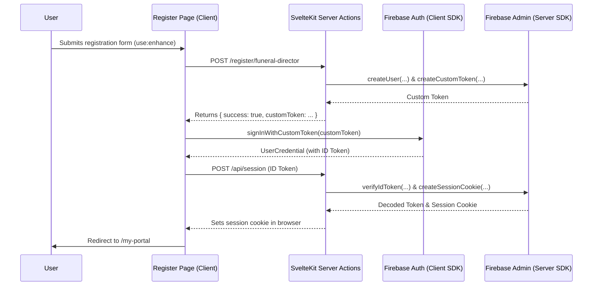

# Application Status Report - 08/22/2025

## 1. Overview

This document outlines the current state of the Tributestream application. It details the robust authentication system and highlights the recent addition of new features, including specialized user registration flows and photo management capabilities for memorial tributes. The primary objective is to continuously enhance the platform's functionality, security, and user experience in line with SvelteKit best practices.

## 2. Core Features

### 2.1. Authentication System

The authentication system uses Firebase Authentication as the central authority for user identity, fully integrated with the Firebase Emulator Suite for robust local development.

*   **Technology Stack**:
    *   **Backend**: Firebase Admin SDK integrated into SvelteKit server actions and API routes.
    *   **Frontend**: Firebase Client SDK for user interaction in Svelte components.
    *   **Session Management**: Secure, HTTP-only session cookies managed by SvelteKit hooks.

*   **Specialized Registration Flows**:
    *   The application now offers distinct registration paths to cater to different user roles:
        *   A dedicated page for funeral directors at `/register/funeral-director`.
        *   A streamlined page for loved ones at `/register/loved-one`.
    *   Both flows utilize SvelteKit's `use:enhance` for progressive enhancement, ensuring a resilient user experience. The process securely creates a user in Firebase, generates a corresponding Firestore profile, and seamlessly logs them in using a custom token mechanism.

### 2.2. Tribute Management

New components have been introduced to allow users to personalize memorial tributes with photos.

*   **Photo Uploading**: The `PhotoUploader.svelte` component provides an interface for users to upload images to a specific memorial.
*   **Photo Gallery**: The `PhotoGallery.svelte` component displays the uploaded photos in an organized and visually appealing gallery on the tribute page.

### High-Level Authentication Diagram

## 3. Development Environment

The local development setup is correctly configured to ensure a high-fidelity testing environment that mirrors production services without affecting live data.

*   **Firebase Emulators**: The project is configured to use local emulators for Authentication, Firestore, and Storage.
*   **Client & Server Integration**: Both the client-side SDK (`/src/lib/firebase.ts`) and the server-side Admin SDK (`/src/lib/server/firebase.ts`) correctly detect the development environment and connect to the local emulators automatically.

## 4. Summary of Changes

The following key files were created or modified to achieve the current state:

*   **Created**:
    *   `frontend/src/routes/register/funeral-director/+page.svelte`: New registration page for funeral directors.
    *   `frontend/src/routes/register/loved-one/+page.svelte`: New registration page for loved ones.
    *   `frontend/src/lib/components/PhotoUploader.svelte`: Component for uploading photos.
    *   `frontend/src/lib/components/PhotoGallery.svelte`: Component for displaying photo galleries.
    *   `frontend/src/routes/api/session/+server.ts`: Handles session cookie creation.
    *   `082225-status.md`: This status report.
*   **Modified/Rewritten**:
    *   `frontend/src/lib/components/Register.svelte`: Refactored to support the new specialized registration flows.
    *   `frontend/src/routes/register/+page.server.ts`: Updated to handle logic for different user roles.

## 5. Current Status

The application is stable, with a secure and flexible authentication system. The addition of specialized registration pages and photo management features significantly enhances the user's ability to create meaningful tributes. The platform is well-positioned for future feature development.