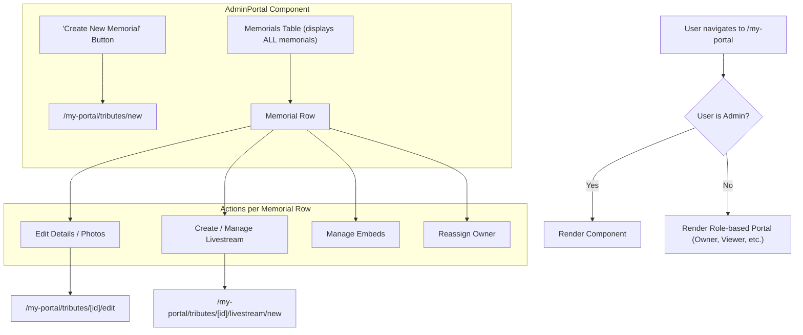

# Admin Dashboard Implementation Plan

This document outlines the technical design and phased implementation plan for creating a new Admin Dashboard for the Tributestream platform.

## 1. High-Level Design

The goal is to create a dedicated, comprehensive dashboard for users with the `admin` claim. This will replace the current practice of showing admins the `OwnerPortal` view.

### 1.1. Architectural Flow

The new user flow will be as follows:

### 1.2. Key Components & Changes

-   **`/my-portal/+page.svelte`**: Will be updated to conditionally render the new `<AdminPortal>` component if the logged-in user is an admin.
-   **`/my-portal/+page.server.ts`**: The `load` function will be enhanced to fetch all memorials and all users from Firestore when the user is an admin.
-   **`AdminPortal.svelte` (New Component)**: A new component will be created at `frontend/src/lib/components/portals/AdminPortal.svelte`. It will feature a table-based UI for displaying and managing all memorials.
-   **New API Endpoint**: A new endpoint at `/api/memorials/[memorialId]/assign` will be created to handle the reassignment of memorial ownership.

## 2. Phased Implementation Plan

This project will be implemented in three distinct phases to ensure a smooth and manageable development process.

### Phase 1: Foundation & Read-Only View

The focus of this phase is to build the basic structure of the admin dashboard and display the necessary data.

-   **[ ] Task 1.1:** Create the initial `AdminPortal.svelte` file.
-   **[ ] Task 1.2:** Update the `load` function in `/my-portal/+page.server.ts` to fetch all memorials if the user is an admin.
-   **[ ] Task 1.3:** Implement the conditional rendering logic in `/my-portal/+page.svelte` to display the `AdminPortal` for admin users.
-   **[ ] Task 1.4:** Implement a table in `AdminPortal.svelte` to display the list of all memorials with columns for `LovedOneName`, `Owner Email`, and `Livestream Status`.

### Phase 2: Core Actions

This phase involves adding the primary management actions to the dashboard.

-   **[ ] Task 2.1:** Add a "Create New Memorial" button to the `AdminPortal` that links to the existing `/my-portal/tributes/new` page.
-   **[ ] Task 2.2:** Add an "Actions" column to the memorials table.
-   **[ ] Task 2.3:** Add "Edit" and "Create Livestream" buttons to each row in the table, linking to the respective existing pages (`.../[memorialId]/edit`, `.../[memorialId]/livestream/new`).

### Phase 3: Advanced Functionality

The final phase will introduce more complex features like user reassignment and embed management.

-   **[ ] Task 3.1:** Create the new `POST /api/memorials/[memorialId]/assign` server endpoint.
-   **[ ] Task 3.2:** Update the `load` function in `/my-portal/+page.server.ts` to fetch all users for admins.
-   **[ ] Task 3.3:** Implement the UI for reassigning a memorial's owner within the `AdminPortal` (e.g., a button that opens a modal with a user selection dropdown).
-   **[ ] Task 3.4:** Design and implement the UI and backend logic for managing embeds.

This plan provides a clear roadmap for developing the Admin Dashboard.