# Integration Flows & Workflows

## Overview

Tributestream's integration flows define how different components, services, and user interactions work together to deliver a seamless memorial service experience. This document covers end-to-end workflows, data flows, and system integrations.

## Core User Workflows

### 1. Family Memorial Creation Flow

#### Family Self-Registration


#### Funeral Director Memorial Creation


### 2. Memorial Service Scheduling Flow

#### Service Details Configuration


### 3. Livestream Management Flow

#### Stream Creation & Start Process


#### Stream End & Archive Creation


### 4. Memorial Page Viewing Flow

#### Public Memorial Access

```mermaid
sequenceDiagram
    participant V as Visitor
    participant UI as Memorial Page
    participant Server as Page Server
    participant FS as Firestore
    participant CF as Cloudflare Stream

    V->>UI: Access /[fullSlug]
    UI->>Server: Load +page.server.ts
    Server->>FS: Load memorial by fullSlug
    Server->>FS: Load visible streams for memorial
    Server->>UI: Return memorial + streams data
    UI->>V: Display memorial content

    alt Has Live Streams
        UI->>V: Show "🔴 Live Memorial Services" section
        loop Live Stream Display
            UI->>CF: Load HLS stream
            CF->>UI: Return video stream
            UI->>V: Display live video player
        end
    end

    alt Has Recorded Streams
        UI->>V: Show "📹 Recorded Memorial Services" section
        loop Recorded Stream Display
            UI->>CF: Load recorded video
            CF->>UI: Return video content
            UI->>V: Display recorded video player
        end
    end

    loop Status Updates (if live streams)
        UI->>Server: GET /api/memorials/[id]/streams/status
        Server->>FS: Check stream statuses
        Server->>UI: Return current statuses
        UI->>V: Update live indicators
    end
```


## System Integration Flows

### 1. Cloudflare Stream Integration

#### Live Input Management
```typescript
// Stream creation with Cloudflare
async function createCloudflareStream(streamData: CreateStreamRequest) {
  // 1. Create Cloudflare Live Input
  const liveInputResponse = await fetch(
    `https://api.cloudflare.com/client/v4/accounts/${ACCOUNT_ID}/stream/live_inputs`,
    {
      method: 'POST',
      headers: {
        'Authorization': `Bearer ${API_TOKEN}`,
        'Content-Type': 'application/json'
      },
      body: JSON.stringify({
        recording: {
          mode: 'automatic',
          requireSignedURLs: false
        },
        meta: {
          name: streamData.title
        }
      })
    }
  );

  const liveInput = await liveInputResponse.json();

  // 2. Create stream document in Firestore
  const stream: Stream = {
    id: generateId(),
    title: streamData.title,
    description: streamData.description,
    memorialId: streamData.memorialId,
    cloudflareId: liveInput.result.uid,
    streamKey: liveInput.result.rtmps.streamKey,
    streamUrl: liveInput.result.rtmps.url,
    playbackUrl: `https://customer-${CUSTOMER_CODE}.cloudflarestream.com/${liveInput.result.uid}/manifest/video.m3u8`,
    status: 'ready',
    isVisible: streamData.isVisible ?? true,
    isPublic: streamData.isPublic ?? true,
    createdBy: user.uid,
    createdAt: serverTimestamp(),
    updatedAt: serverTimestamp()
  };

  await setDoc(doc(db, 'streams', stream.id), stream);
  return stream;
}
```

#### Webhook Processing Flow
```typescript
// Cloudflare webhook handler
export async function POST({ request }) {
  const webhook = await request.json();
  
  switch (webhook.eventType) {
    case 'live_input.connected':
      await handleStreamConnected(webhook);
      break;
    case 'live_input.disconnected':
      await handleStreamDisconnected(webhook);
      break;
    case 'video.recording.ready':
      await handleRecordingReady(webhook);
      break;
  }
  
  return json({ success: true });
}

async function handleStreamConnected(webhook: any) {
  const streamId = webhook.uid;
  
  // Update stream status to live
  await updateDoc(doc(db, 'streams', streamId), {
    status: 'live',
    actualStartTime: serverTimestamp(),
    updatedAt: serverTimestamp()
  });
  
  // Update memorial archive if exists
  const memorial = await getDocs(
    query(collection(db, 'memorials'), 
          where('livestreamArchive', 'array-contains-any', [{ cloudflareId: streamId }]))
  );
  
  // Trigger real-time updates to connected clients
  await notifyStreamStatusChange(streamId, 'live');
}

async function handleRecordingReady(webhook: any) {
  const { uid, playback, duration, thumbnails } = webhook;
  
  // Update stream document
  await updateDoc(doc(db, 'streams', uid), {
    recordingReady: true,
    recordingUrl: playback.hls,
    recordingDuration: duration,
    thumbnailUrl: thumbnails?.[0]?.url,
    status: 'completed',
    updatedAt: serverTimestamp()
  });
  
  // Update memorial archive entries
  await updateMemorialArchives(uid, {
    recordingReady: true,
    recordingPlaybackUrl: playback.hls,
    duration,
    thumbnailUrl: thumbnails?.[0]?.url
  });
}
```

### 2. Stripe Payment Integration

#### Payment Intent Creation Flow
```typescript
// Payment processing workflow
async function createPaymentIntent(memorialId: string, amount: number) {
  // 1. Verify memorial ownership
  const memorial = await getDoc(doc(db, 'memorials', memorialId));
  if (!memorial.exists()) {
    throw new Error('Memorial not found');
  }
  
  const memorialData = memorial.data();
  if (memorialData.ownerUid !== user.uid && !user.isAdmin) {
    throw new Error('Insufficient permissions');
  }
  
  // 2. Create Stripe payment intent
  const paymentIntent = await stripe.paymentIntents.create({
    amount: amount * 100, // Convert to cents
    currency: 'usd',
    metadata: {
      memorialId,
      userId: user.uid,
      type: 'livestream_booking'
    }
  });
  
  // 3. Update livestream config with payment intent
  await updateDoc(doc(db, 'livestreamConfigs', configId), {
    paymentIntentId: paymentIntent.id,
    status: 'pending_payment',
    updatedAt: serverTimestamp()
  });
  
  return {
    clientSecret: paymentIntent.client_secret,
    paymentIntentId: paymentIntent.id
  };
}

// Stripe webhook handler for payment completion
export async function POST({ request }) {
  const sig = request.headers.get('stripe-signature');
  const body = await request.text();
  
  let event;
  try {
    event = stripe.webhooks.constructEvent(body, sig, STRIPE_WEBHOOK_SECRET);
  } catch (err) {
    return json({ error: 'Invalid signature' }, { status: 400 });
  }
  
  if (event.type === 'payment_intent.succeeded') {
    const paymentIntent = event.data.object;
    
    // Update livestream config status
    const configs = await getDocs(
      query(collection(db, 'livestreamConfigs'),
            where('paymentIntentId', '==', paymentIntent.id))
    );
    
    for (const config of configs.docs) {
      await updateDoc(config.ref, {
        status: 'paid',
        paymentStatus: 'succeeded',
        paidAt: serverTimestamp()
      });
    }
    
    // Send confirmation email
    await sendPaymentConfirmationEmail(paymentIntent.metadata.userId);
  }
  
  return json({ received: true });
}
```

### 3. Firebase Authentication Integration

#### Session Management Flow
```typescript
// Client-side authentication
async function handleLogin(email: string, password: string) {
  try {
    // 1. Firebase Auth login
    const userCredential = await signInWithEmailAndPassword(auth, email, password);
    
    // 2. Get ID token for server session
    const idToken = await userCredential.user.getIdToken();
    
    // 3. Create server-side session
    const response = await fetch('/api/session', {
      method: 'POST',
      headers: { 'Content-Type': 'application/json' },
      body: JSON.stringify({ idToken })
    });
    
    if (response.ok) {
      // 4. Force page reload to ensure session cookie is sent
      window.location.href = '/profile';
    }
  } catch (error) {
    throw new Error(`Login failed: ${error.message}`);
  }
}

// Server-side session creation
export async function POST({ request, cookies }) {
  const { idToken } = await request.json();
  
  try {
    // 1. Verify ID token
    const decodedToken = await adminAuth.verifyIdToken(idToken);
    
    // 2. Create session cookie (24 hours)
    const sessionCookie = await adminAuth.createSessionCookie(idToken, {
      expiresIn: 24 * 60 * 60 * 1000
    });
    
    // 3. Set secure cookie
    cookies.set('session', sessionCookie, {
      maxAge: 24 * 60 * 60,
      httpOnly: true,
      secure: true,
      sameSite: 'lax',
      path: '/'
    });
    
    return json({ success: true });
  } catch (error) {
    return json({ error: 'Invalid token' }, { status: 401 });
  }
}

// Session validation in hooks.server.ts
export const handle: Handle = async ({ event, resolve }) => {
  const sessionCookie = event.cookies.get('session');
  
  if (sessionCookie) {
    try {
      const decodedClaims = await adminAuth.verifySessionCookie(sessionCookie, true);
      
      event.locals.user = {
        uid: decodedClaims.uid,
        email: decodedClaims.email,
        displayName: decodedClaims.name,
        role: decodedClaims.role || 'owner',
        isAdmin: decodedClaims.isAdmin || false
      };
    } catch (error) {
      // Clear invalid session
      event.cookies.delete('session', { path: '/' });
      event.locals.user = null;
    }
  }
  
  return resolve(event);
};
```

## Data Flow Patterns

### 1. Memorial Service Data Flow


### 2. Stream Status Propagation


### 3. Permission & Access Control Flow


## Error Handling & Recovery Flows

### 1. Stream Connection Failure Recovery

```typescript
// Connection retry with exponential backoff
class StreamConnectionManager {
  private retryAttempts = 0;
  private maxRetries = 3;
  private baseDelay = 1000;

  async startStream(streamId: string): Promise<StreamCredentials> {
    try {
      const response = await fetch(`/api/streams/${streamId}/start`, {
        method: 'POST'
      });
      
      if (!response.ok) {
        throw new Error(`Stream start failed: ${response.status}`);
      }
      
      this.retryAttempts = 0; // Reset on success
      return await response.json();
    } catch (error) {
      return this.handleStreamError(error, streamId);
    }
  }

  private async handleStreamError(error: Error, streamId: string): Promise<StreamCredentials> {
    if (this.retryAttempts < this.maxRetries) {
      this.retryAttempts++;
      const delay = this.baseDelay * Math.pow(2, this.retryAttempts - 1);
      
      console.warn(`Stream start attempt ${this.retryAttempts} failed, retrying in ${delay}ms`);
      
      await new Promise(resolve => setTimeout(resolve, delay));
      return this.startStream(streamId);
    } else {
      throw new Error(`Stream start failed after ${this.maxRetries} attempts: ${error.message}`);
    }
  }
}
```

### 2. Payment Processing Error Handling

```typescript
// Payment error recovery flow
async function handlePaymentError(error: any, paymentIntentId: string) {
  const errorCode = error.code;
  
  switch (errorCode) {
    case 'card_declined':
      // Update UI with decline reason
      return {
        type: 'card_error',
        message: 'Your card was declined. Please try a different payment method.',
        recoverable: true
      };
      
    case 'insufficient_funds':
      return {
        type: 'card_error',
        message: 'Insufficient funds. Please try a different card.',
        recoverable: true
      };
      
    case 'network_error':
      // Retry payment after delay
      await new Promise(resolve => setTimeout(resolve, 2000));
      return {
        type: 'network_error',
        message: 'Network error. Please try again.',
        recoverable: true,
        shouldRetry: true
      };
      
    default:
      // Log error and show generic message
      console.error('Payment error:', error);
      await logPaymentError(paymentIntentId, error);
      
      return {
        type: 'unknown_error',
        message: 'Payment processing failed. Please contact support.',
        recoverable: false
      };
  }
}
```

### 3. Database Transaction Failure Recovery

```typescript
// Firestore transaction with retry logic
async function updateMemorialWithRetry(memorialId: string, updates: any, maxRetries = 3) {
  let attempt = 0;
  
  while (attempt < maxRetries) {
    try {
      await runTransaction(db, async (transaction) => {
        const memorialRef = doc(db, 'memorials', memorialId);
        const memorial = await transaction.get(memorialRef);
        
        if (!memorial.exists()) {
          throw new Error('Memorial not found');
        }
        
        transaction.update(memorialRef, {
          ...updates,
          updatedAt: serverTimestamp()
        });
      });
      
      return; // Success, exit retry loop
    } catch (error) {
      attempt++;
      
      if (attempt >= maxRetries) {
        throw new Error(`Transaction failed after ${maxRetries} attempts: ${error.message}`);
      }
      
      // Exponential backoff
      const delay = Math.pow(2, attempt) * 1000;
      await new Promise(resolve => setTimeout(resolve, delay));
    }
  }
}
```

## Performance Optimization Flows

### 1. Lazy Loading & Code Splitting

```typescript
// Dynamic component loading
const LazyLivestreamControl = lazy(() => import('$lib/components/LivestreamControl.svelte'));
const LazyVideoPlayer = lazy(() => import('$lib/components/VideoPlayerCard.svelte'));

// Route-based code splitting
const routes = {
  '/memorial/[id]/livestream': () => import('./livestream/+page.svelte'),
  '/admin': () => import('./admin/+page.svelte'),
  '/profile': () => import('./profile/+page.svelte')
};
```

### 2. Data Prefetching & Caching

```typescript
// Memorial data prefetching
export async function load({ params, fetch }) {
  const memorialId = params.id;
  
  // Parallel data loading
  const [memorial, streams, config] = await Promise.all([
    fetch(`/api/memorials/${memorialId}`).then(r => r.json()),
    fetch(`/api/memorials/${memorialId}/streams`).then(r => r.json()),
    fetch(`/api/memorials/${memorialId}/config`).then(r => r.json())
  ]);
  
  return {
    memorial: memorial.data,
    streams: streams.data,
    config: config.data
  };
}

// Client-side caching
const cache = new Map();

async function getCachedData(key: string, fetcher: () => Promise<any>, ttl = 300000) {
  const cached = cache.get(key);
  
  if (cached && Date.now() - cached.timestamp < ttl) {
    return cached.data;
  }
  
  const data = await fetcher();
  cache.set(key, { data, timestamp: Date.now() });
  
  return data;
}
```

### 3. Real-time Updates Optimization

```typescript
// Efficient real-time listeners
class StreamStatusManager {
  private listeners = new Map<string, () => void>();
  private updateInterval: NodeJS.Timeout | null = null;
  
  subscribe(streamId: string, callback: (status: StreamStatus) => void) {
    this.listeners.set(streamId, callback);
    
    // Start polling if first subscriber
    if (this.listeners.size === 1) {
      this.startPolling();
    }
  }
  
  unsubscribe(streamId: string) {
    this.listeners.delete(streamId);
    
    // Stop polling if no subscribers
    if (this.listeners.size === 0) {
      this.stopPolling();
    }
  }
  
  private startPolling() {
    this.updateInterval = setInterval(async () => {
      const streamIds = Array.from(this.listeners.keys());
      
      // Batch status requests
      const statuses = await this.getBatchStreamStatus(streamIds);
      
      // Notify subscribers
      for (const [streamId, callback] of this.listeners) {
        const status = statuses[streamId];
        if (status) {
          callback(status);
        }
      }
    }, 15000); // 15 second intervals
  }
  
  private async getBatchStreamStatus(streamIds: string[]) {
    const response = await fetch('/api/streams/batch-status', {
      method: 'POST',
      body: JSON.stringify({ streamIds })
    });
    
    return await response.json();
  }
}
```

---

*These integration flows provide the foundation for Tributestream's seamless user experience, connecting all system components through well-defined workflows and robust error handling.*
