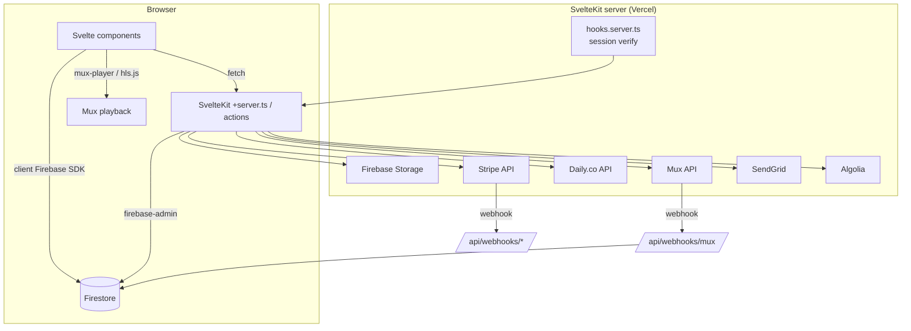
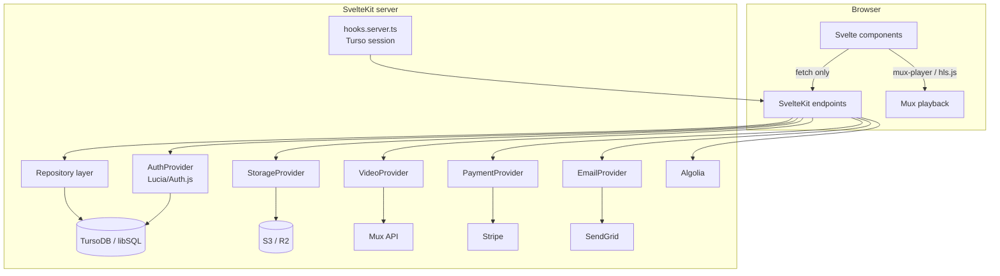

# 01 — System Overview

Tributestream is a **SvelteKit 2 / Svelte 5** application for memorial pages and funeral livestreaming, currently backed by Firebase (Auth + Firestore + Storage), with Mux/Daily/Cloudflare for video, Stripe for payments, SendGrid for email, and Algolia for search. This doc frames the current architecture and the target backend re-platforming.

## 1. Personas

- **Public / viewer** — browses memorials, watches livestreams/VOD, sends chat, contacts the company.
- **Owner (family)** — registers, owns a memorial, configures schedule/calculator, pays, manages streams/slideshows.
- **Funeral director (FD)** — registers a company, creates memorials on behalf of families.
- **Admin** — 5-tier RBAC; manages memorials, users, FDs, payments, blog, audit/email logs.

## 2. Current stack (confirmed from `package.json`)

| Layer | Technology |
| :--- | :--- |
| Framework | SvelteKit `^2.22`, Svelte `^5`, Vite `^7`, TypeScript `^5` |
| Adapter / host | `@sveltejs/adapter-vercel` (`maxDuration: 60`) |
| Auth | Firebase Auth (session cookies, custom claims) |
| Database | Firestore (via `firebase-admin` server-side; `firebase` client SDK in browser) |
| Storage | Firebase Storage (`adminStorage`) |
| Video | Mux (`@mux/mux-node`, `@mux/mux-player`), Daily.co (`@daily-co/daily-js`), Cloudflare Stream (legacy), `hls.js` |
| Payments | Stripe (`stripe`, `@stripe/stripe-js`) |
| Email | SendGrid (`@sendgrid/mail`) |
| Search | Algolia (`algoliasearch` v5) |
| UI | TailwindCSS v4, Skeleton, lucide, driver.js/shepherd.js (tours), svelte-dnd-action |
| Bot protection | reCAPTCHA v3 |

## 3. Current architecture

**Key coupling points** (what makes this Firebase-bound):

- `src/hooks.server.ts` verifies a Firebase **session cookie** on every request and populates `event.locals.user`.
- `src/lib/firebase-admin.ts` / `src/lib/server/firebase.ts` expose `adminDb`, `adminAuth`, `adminStorage` used throughout `+server.ts` and `+page.server.ts`.
- The **client** also talks to Firestore directly (client SDK) in some components, governed by `firestore.rules`.

## 4. Target architecture

The big shift: **Turso is server-only** (no browser SDK). Every current client-side Firestore read/write must move behind SvelteKit endpoints + the repository layer. See `12-frontend-routes-and-state.md`.

## 5. What stays vs what changes

| Area | Verdict |
| :--- | :--- |
| SvelteKit routing, Svelte components, UI, Tailwind, design tokens | **Keep** |
| `hooks.server.ts` session handling | **Rebuild** (Turso sessions, not Firebase cookie) |
| `firebase-admin` / client `firebase` modules | **Cut** after migration |
| Firestore reads/writes (server + client) | **Rebuild** behind repositories on Turso |
| Firebase Auth + custom claims | **Rebuild** (Lucia/Auth.js + SQL roles) |
| Firebase Storage usage | **Migrate** to S3/R2 behind `StorageProvider` |
| Mux integration | **Keep** (wrap in `VideoProvider`) |
| Daily.co integration | **Keep** (multi-cam switcher; handled in a later migration session) |
| Cloudflare | **Keep** as CDN for **last-mile HLS delivery + S3 object serving** (not ingest) |
| Hosting (Vercel) | **Keep** |
| Stripe, SendGrid, Algolia | **Keep** (decouple from direct Firestore writes) |

## Migration thesis

Introduce the abstraction layer first (`05`), build the Turso schema + repositories (`03`), migrate auth (`04`), then storage (`08`), then cut over feature-by-feature. Because providers are swappable, Firestore and Turso can run side-by-side during transition.
