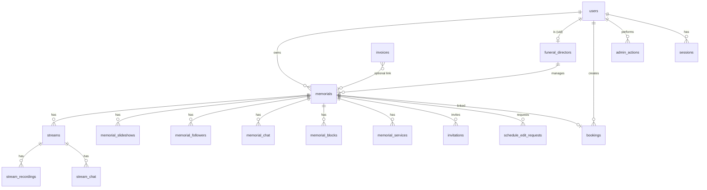
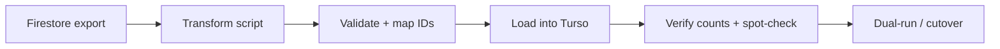

# 03 — Firestore → TursoDB Schema

Maps the current Firestore document model to a relational **TursoDB (libSQL/SQLite)** schema: collections observed, an ERD, table DDL sketches, mapping rules, and the data-migration strategy.

## 1. Collections observed (from code + rules)

| Firestore path | Entity | Source evidence |
| :--- | :--- | :--- |
| `users/{uid}` | User profile | `register/*`, `profile/+page.server.ts`, `firestore.rules` |
| `funeral_directors/{uid}` | FD profile | `register/funeral-*`, rules |
| `memorials/{id}` | Memorial | many `+page.server.ts`, rules |
| `memorials/{id}/slideshows/{id}` | Slideshow | `[fullSlug]/+page.server.ts` |
| `memorials/{id}/followers/{uid}` | Follower | `tributes/[fullSlug]`, rules |
| `memorials/{id}/chat/{id}` | Memorial chat | rules |
| `streams/{id}` | Stream | `stream/*`, `[fullSlug]` |
| `invitations/{id}` | Invitation | rules (`invitedByUid`, `inviteeEmail`) |
| `schedule_edit_requests/{id}` | Edit request | rules |
| `invoices/{id}` | Invoice | `api/invoices`, `invoice.ts` |
| `bookings/{id}` | Booking | `api/bookings`, `booking.ts` |
| `admin_actions/{id}` | Audit/admin action | `register/funeral-home`, `admin.ts` |
| `email_audit/*` | Email audit log | `email-audit.ts`, `server/emailAudit.ts` |
| `blog/{id}` | Blog post | rules (FireCMS-managed) |
| `wiki_pages` / `wiki_categories` / `wiki_page_versions` | Wiki | rules, `wiki.ts` |

> Subcollections (`slideshows`, `followers`, `chat`) become **child tables with FKs** in Turso (SQLite has no subcollections).

## 2. Mapping rules (apply consistently)

| Firestore concept | Turso/SQL approach |
| :--- | :--- |
| String document ID | `TEXT PRIMARY KEY` — **preserve existing IDs** during migration so cross-refs survive |
| Subcollection | Child table + `FOREIGN KEY` to parent; composite PK for join-style (followers) |
| `Timestamp` | `TEXT` ISO-8601 (default) or `INTEGER` epoch-ms for hot sort columns |
| Denormalized object (e.g. `memorial.funeralDirector{}`) | Either FK + JOIN, or keep denormalized columns; prefer FK |
| Array of scalars (`photos[]`, `publishedRecordings[]`) | `TEXT` (JSON) if display-only; child table if queried |
| Array of objects (`recordings[]`, `services.additional[]`, `contentBlocks[]`) | **child table** |
| Variant/union config (`MemorialBlock.config`) | `config_json TEXT` (shape varies by `type`) |
| Boolean | `INTEGER` (0/1) |
| Money | `INTEGER` cents (invoices already use cents; normalize memorials too) |
| Enums | `TEXT` + `CHECK(... IN (...))` |

## 3. Entity-Relationship Diagram



## 4. Table DDL sketches (libSQL)

> Illustrative, not final. Recommend **Drizzle ORM** for typed schema + migrations (see `05`). Times shown as `TEXT`.

```sql
CREATE TABLE users (
  id            TEXT PRIMARY KEY,          -- prior Firebase UID
  email         TEXT NOT NULL UNIQUE,
  display_name  TEXT,
  role          TEXT NOT NULL CHECK(role IN ('admin','owner','funeral_director','viewer')),
  admin_role    TEXT CHECK(admin_role IN ('super_admin','content_admin','financial_admin','customer_support','readonly_admin')),
  password_hash TEXT,                       -- NEW for Turso-native auth
  memorial_count INTEGER NOT NULL DEFAULT 0,
  suspended     INTEGER NOT NULL DEFAULT 0,
  suspended_reason TEXT,
  created_at    TEXT NOT NULL,
  last_login_at TEXT
);

CREATE TABLE sessions (                     -- NEW (Lucia/Auth.js)
  id         TEXT PRIMARY KEY,
  user_id    TEXT NOT NULL REFERENCES users(id) ON DELETE CASCADE,
  expires_at TEXT NOT NULL
);

CREATE TABLE funeral_directors (
  id           TEXT PRIMARY KEY,            -- == users.id
  company_name TEXT NOT NULL,
  contact_person TEXT,
  email        TEXT,
  phone        TEXT,
  street TEXT, city TEXT, state TEXT, zip_code TEXT,
  status       TEXT NOT NULL CHECK(status IN ('approved','suspended','inactive')),
  created_at   TEXT, updated_at TEXT,
  FOREIGN KEY (id) REFERENCES users(id)
);

CREATE TABLE memorials (
  id            TEXT PRIMARY KEY,
  loved_one_name TEXT NOT NULL,
  slug          TEXT NOT NULL,
  full_slug     TEXT NOT NULL UNIQUE,
  owner_id      TEXT REFERENCES users(id),
  fd_id         TEXT REFERENCES funeral_directors(id),
  creator_email TEXT, creator_name TEXT,
  is_public     INTEGER NOT NULL DEFAULT 0,
  is_complete   INTEGER NOT NULL DEFAULT 0,
  content       TEXT, custom_html TEXT,
  image_url     TEXT,
  family_contact_name TEXT, family_contact_email TEXT, family_contact_phone TEXT,
  is_paid       INTEGER NOT NULL DEFAULT 0,
  payment_status TEXT CHECK(payment_status IN ('paid','unpaid')),
  paid_at       TEXT,
  total_price   INTEGER,                    -- cents
  calculator_config_json TEXT,             -- JSON
  custom_pricing_json    TEXT,             -- JSON
  custom_title  TEXT,
  content_blocks_version INTEGER,
  created_at    TEXT NOT NULL
);
CREATE INDEX idx_memorials_owner ON memorials(owner_id);
CREATE INDEX idx_memorials_fd ON memorials(fd_id);

CREATE TABLE memorial_services (            -- services.main + services.additional[]
  id          TEXT PRIMARY KEY,
  memorial_id TEXT NOT NULL REFERENCES memorials(id) ON DELETE CASCADE,
  kind        TEXT NOT NULL CHECK(kind IN ('main','location','day')),
  location_name TEXT, location_address TEXT, location_unknown INTEGER,
  service_date TEXT, service_time TEXT, time_unknown INTEGER,
  hours       REAL,
  stream_id   TEXT REFERENCES streams(id)
);

CREATE TABLE memorial_blocks (
  id          TEXT PRIMARY KEY,
  memorial_id TEXT NOT NULL REFERENCES memorials(id) ON DELETE CASCADE,
  type        TEXT NOT NULL CHECK(type IN ('livestream','embed','text')),
  "order"     INTEGER NOT NULL,
  enabled     INTEGER NOT NULL DEFAULT 1,
  config_json TEXT NOT NULL,
  created_at  TEXT, updated_at TEXT
);

CREATE TABLE streams (
  id          TEXT PRIMARY KEY,
  memorial_id TEXT NOT NULL REFERENCES memorials(id) ON DELETE CASCADE,
  title       TEXT NOT NULL, description TEXT,
  status      TEXT NOT NULL CHECK(status IN ('scheduled','ready','live','ended','completed','error')),
  visibility  TEXT CHECK(visibility IN ('public','hidden','archived')),
  scheduled_start_time TEXT,
  mux_json    TEXT,                          -- MuxStreamConfig
  chat_json   TEXT,                          -- StreamChatConfig
  analytics_json TEXT,
  embed_json  TEXT,
  live_started_at TEXT, live_ended_at TEXT,
  created_at TEXT, updated_at TEXT, created_by TEXT
);
CREATE INDEX idx_streams_memorial ON streams(memorial_id);

CREATE TABLE stream_recordings (
  id          INTEGER PRIMARY KEY AUTOINCREMENT,
  stream_id   TEXT NOT NULL REFERENCES streams(id) ON DELETE CASCADE,
  asset_id    TEXT, vod_playback_id TEXT, duration REAL, created_at TEXT
);

CREATE TABLE memorial_followers (
  memorial_id TEXT NOT NULL REFERENCES memorials(id) ON DELETE CASCADE,
  user_id     TEXT NOT NULL REFERENCES users(id) ON DELETE CASCADE,
  followed_at TEXT NOT NULL,
  PRIMARY KEY (memorial_id, user_id)
);

CREATE TABLE chat_messages (                -- memorial + stream chat unified or split
  id          TEXT PRIMARY KEY,
  scope       TEXT NOT NULL CHECK(scope IN ('memorial','stream')),
  parent_id   TEXT NOT NULL,                -- memorial_id or stream_id
  user_id     TEXT, user_name TEXT, user_role TEXT,
  message     TEXT NOT NULL,
  is_anonymous INTEGER DEFAULT 0,
  reply_to    TEXT,
  is_edited   INTEGER DEFAULT 0, edited_at TEXT,
  is_deleted  INTEGER DEFAULT 0, deleted_at TEXT, deleted_by TEXT,
  flagged     INTEGER DEFAULT 0, flag_reason TEXT,
  created_at  TEXT NOT NULL
);
CREATE INDEX idx_chat_parent ON chat_messages(scope, parent_id);

CREATE TABLE memorial_slideshows (
  id          TEXT PRIMARY KEY,
  memorial_id TEXT NOT NULL REFERENCES memorials(id) ON DELETE CASCADE,
  title       TEXT,
  storage_path TEXT,                         -- was firebaseStoragePath → S3/R2 key
  playback_url TEXT, thumbnail_url TEXT,
  status      TEXT CHECK(status IN ('ready','error','processing','local_only','unpublished')),
  photos_json TEXT, settings_json TEXT, audio_json TEXT,
  embed_code  TEXT,
  created_by TEXT, created_at TEXT, updated_at TEXT
);

CREATE TABLE bookings (
  id          TEXT PRIMARY KEY,
  status      TEXT NOT NULL CHECK(status IN ('draft','pending_payment','confirmed','cancelled','completed')),
  user_id     TEXT REFERENCES users(id),
  memorial_id TEXT REFERENCES memorials(id),
  form_data_json TEXT, booking_items_json TEXT,
  total       INTEGER, step INTEGER,
  payment_intent_id TEXT,
  created_at TEXT, updated_at TEXT
);

CREATE TABLE invoices (
  id          TEXT PRIMARY KEY,
  items_json  TEXT NOT NULL,
  total       INTEGER NOT NULL,             -- cents
  customer_email TEXT NOT NULL, customer_name TEXT,
  status      TEXT NOT NULL CHECK(status IN ('pending','paid','expired','cancelled')),
  created_by  TEXT REFERENCES users(id),
  memorial_id TEXT REFERENCES memorials(id),
  stripe_session_id TEXT, payment_intent_id TEXT,
  created_at TEXT, paid_at TEXT, expires_at TEXT
);

CREATE TABLE invitations (
  id TEXT PRIMARY KEY,
  memorial_id TEXT REFERENCES memorials(id),
  invitee_email TEXT NOT NULL,
  role_to_assign TEXT NOT NULL DEFAULT 'owner',
  status TEXT NOT NULL CHECK(status IN ('pending','accepted')),
  invited_by_uid TEXT REFERENCES users(id),
  created_at TEXT, updated_at TEXT
);

CREATE TABLE schedule_edit_requests (
  id TEXT PRIMARY KEY,
  memorial_id TEXT REFERENCES memorials(id), memorial_name TEXT,
  requested_by TEXT, requested_by_email TEXT, request_details TEXT,
  status TEXT NOT NULL CHECK(status IN ('pending','approved','denied','completed')),
  current_config_json TEXT,
  created_at TEXT, reviewed_at TEXT, reviewed_by TEXT, admin_notes TEXT
);

CREATE TABLE admin_actions (
  id TEXT PRIMARY KEY,
  admin_id TEXT REFERENCES users(id),
  action TEXT, target_type TEXT, target_id TEXT,
  details_json TEXT, ip_address TEXT, created_at TEXT
);

CREATE TABLE email_audit (
  id TEXT PRIMARY KEY,
  type TEXT NOT NULL, to_email TEXT NOT NULL, cc_json TEXT, from_email TEXT,
  subject TEXT, template_id TEXT, template_name TEXT, template_data_json TEXT,
  status TEXT NOT NULL CHECK(status IN ('sent','failed','mocked')),
  sendgrid_message_id TEXT, error TEXT, environment TEXT,
  triggered_by TEXT, triggered_by_user_id TEXT, triggered_by_admin_id TEXT,
  memorial_id TEXT, user_id TEXT, invoice_id TEXT, stream_id TEXT,
  sent_at TEXT NOT NULL
);
-- blog / wiki_* tables: NOT created. Blog + Wiki are CUT (confirmed) and excluded from the Turso schema and data migration.
```

## 5. Security rules → application-layer authz

Firestore `firestore.rules` and `storage.rules` currently enforce access **at the database/storage layer**. Turso/libSQL has **no equivalent rules engine** — all authorization moves into the **server (repositories + endpoint guards)**. The current rules encode this logic to port:

- **Admin override**: `isAdmin()` (custom claim) or `isAdminEmail()` (`*@tributestream.com`, `austinbryanfilm@gmail.com`) → full access. Replace with `role='admin'` checks + the 5-tier RBAC (`04`).
- **users**: self or admin.
- **memorials read**: public OR creator/owner OR FD-of-record OR admin. **write**: owner/creator/FD(if `permissions.funeralDirectorCanEdit`)/admin.
- **followers**: self only.
- **memorial chat**: read if memorial public/owner/admin; create if authed + message 1..500 chars + `userId==auth.uid`.
- **invitations**: read by sender/recipient; create by sender; update by recipient (accept).
- **schedule_edit_requests**: user reads own; admin updates.
- ~~**blog**: public read if `status=='published'`; admin write.~~ (CUT — not ported)
- ~~**wiki_***: admin only.~~ (CUT — not ported)
- **storage**: memorial/slideshow paths writable by owner/family(accepted invitation)/FD/admin; public read.

> **Action item:** every rule above must become an explicit server-side check, since clients can no longer talk to the DB directly. See `12` (client coupling) and `04` (authz helpers).

## 6. Data migration strategy



1. **Export**: `firebase firestore:export` (or Admin SDK batched reads) per collection to JSON/NDJSON.
2. **Transform** (Node script, reuse existing TS types): flatten documents → rows; lift subcollections (`slideshows`, `followers`, `chat`) into child-table rows; convert `Timestamp`→ISO; drop deprecated fields; normalize money→cents.
3. **ID preservation**: keep Firestore doc IDs as `TEXT` PKs so all `memorialId`/`userId`/`streamId` references remain valid without remapping.
4. **Auth/users**: Firebase users export (`firebase auth:export`) → `users` rows; **passwords cannot be migrated** (Firebase hashes) → force password reset OR keep Firebase Auth temporarily (see `04`).
5. **Storage objects**: copy Firebase Storage → S3/R2 preserving keys; rewrite `playback_url`/`storage_path`/photo URLs (see `08`).
6. **Load**: batched `INSERT` via libSQL client / Drizzle; wrap per-collection in transactions.
7. **Verify**: row counts vs document counts; spot-check high-value memorials + streams; validate FKs.
8. **Cutover**: providers (`05`) allow running a read-from-Turso/write-to-both phase before full switch.

## Migration verdict

- **Rebuild** the schema in Turso per the DDL above; promote queried arrays to child tables, keep variant configs as JSON.
- **Rebuild** all authorization as server-side checks (no DB rules engine in Turso).
- **Migrate** data with ID preservation; **force password reset** (or bridge Firebase Auth) for users.
- **Cut** `blog` + `wiki_*` collections/tables (confirmed) — excluded from schema and migration.
