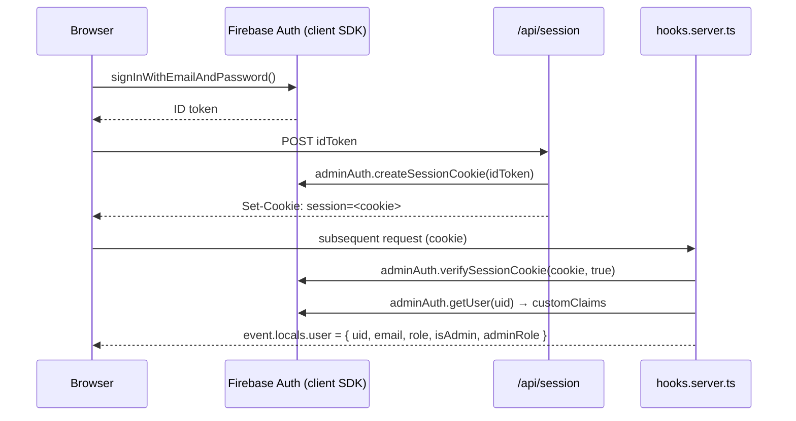

# 04 — Auth & RBAC → Turso-native

How authentication and authorization work today (Firebase Auth + custom claims + session cookies) and how they migrate to **Turso-native auth** (Lucia / Auth.js) with users, sessions, and roles in SQL.

## 1. Current auth flow



Key facts (from `src/hooks.server.ts`):
- Session is a **Firebase session cookie** named `session`, verified on every request (with a 5s timeout guard).
- After verifying, it calls `adminAuth.getUser(uid)` to read **custom claims**: `role`, `adminRole`.
- `isAdmin = claims.role === 'admin'`; `adminRole` defaults to `'super_admin'` for legacy admins.
- Static assets and `/logout` are skipped.
- `event.locals.user` shape: `{ uid, email, displayName?, role: 'admin'|'owner'|'funeral_director', isAdmin, adminRole? }`.

Custom claims are set via `api/set-admin-claim`, `api/set-role-claim` (server endpoints using `adminAuth.setCustomUserClaims`). User profile docs live in `users/{uid}` (Firestore), written during `register/*`.

## 2. Roles & RBAC

Two layers:

### a) Coarse account role (`role` claim)
`admin | owner | funeral_director | viewer` — drives routing (e.g. `requireAdmin` redirects non-admins to `/profile`).

### b) 5-tier admin RBAC (`src/lib/admin/permissions.ts`)
Granular `adminRole` evaluated by `hasPermission(user, resource, action, target?)`:

| Role | Capability summary |
| :--- | :--- |
| `super_admin` | `* / *` — everything |
| `content_admin` | memorial/stream/blog `*`; user read+update; FD read+approve; audit read |
| `financial_admin` | memorial read + update (only `markPaid/markUnpaid/editPaymentNotes`); audit read+export |
| `customer_support` | memorial read + update (only when `isPaid==false`); stream read; user read+update (not admins); FD read; own audit |
| `readonly_admin` | `* / read` |

Permissions support `resource`, `action`, `scope (own|team|all)`, and `conditions` (field operators `eq/ne/in/gt/...`). Enforced server-side via `src/lib/server/adminGuard.ts`:
- `requireAdmin(locals, check?)` — for loaders; throws `redirect` if unauthenticated/unauthorized.
- `requireAdminAction(locals, check?)` — for form actions; returns typed `fail(401|403)`.

## 3. Target: Turso-native auth (Lucia / Auth.js)

```mermaid
sequenceDiagram
    participant B as Browser
    participant A as /login action
    participant DB as Turso
    participant H as hooks.server.ts
    B->>A: POST email + password
    A->>DB: lookup users by email; verify password_hash (argon2/bcrypt)
    A->>DB: INSERT sessions(id, user_id, expires_at)
    A-->>B: Set-Cookie: session=<sessionId> (HttpOnly, Secure)
    B->>H: request (cookie)
    H->>DB: SELECT session JOIN users WHERE id=cookie AND not expired
    H-->>B: event.locals.user = { id, email, role, adminRole }
```

### Schema (from `03`)
- `users` gains `password_hash`.
- new `sessions(id, user_id, expires_at)`.

### Recommended library
- **Lucia-style sessions** (or Auth.js with the libSQL/Drizzle adapter). Lucia is lighter and integrates cleanly with SvelteKit `hooks.server.ts` + `locals`. Decision pending; either works.

### Keep `locals.user` shape stable
To minimize churn, keep `event.locals.user` the same shape (`uid`/`id`, `email`, `role`, `isAdmin`, `adminRole`). Then `adminGuard.ts` and `permissions.ts` **port unchanged** — only the population in `hooks.server.ts` changes (DB lookup instead of Firebase verify).

> `src/lib/admin/permissions.ts` has **no Firebase dependency** → **Keep as-is**. `src/lib/server/adminGuard.ts` only reads `locals` → **Keep as-is**.

## 4. Authorization moves fully server-side

Today, `firestore.rules`/`storage.rules` enforce a second layer of authz at the DB. Turso has no rules engine, so **all** access control becomes server-side. Port the rule logic (catalogued in `03 §5`) into repository methods / endpoint guards. Notable items:
- Admin-by-email backdoor (`*@tributestream.com`) → replace with explicit `role='admin'` seeding; **do not** carry email-pattern auth into production.
- Memorial read/write predicates (owner/creator/FD/public) → repository helpers like `canViewMemorial(user, memorial)` / `canEditMemorial(user, memorial)`.

## 5. User migration

- Export Firebase users (`firebase auth:export`) → `users` rows (preserve UID as `id`).
- **Passwords**: Firebase uses scrypt with project-specific params; not portable to a new hasher cleanly. Options:
  1. **Force password reset** for all users on first post-cutover login (simplest, recommended).
  2. **Bridge**: keep Firebase Auth for sign-in temporarily; mint Turso sessions after Firebase verifies (dual-run), migrating hashes lazily — more complex.
- Custom claims (`role`, `adminRole`) → `users.role` / `users.admin_role` columns.

## 6. Inventory of auth touch-points to change

| File / area | Today | Action |
| :--- | :--- | :--- |
| `src/hooks.server.ts` | Firebase session verify + getUser | **Rebuild** (Turso session lookup) |
| `src/routes/api/session` | createSessionCookie | **Rebuild** (create DB session) |
| `src/routes/api/set-admin-claim`, `set-role-claim` | setCustomUserClaims | **Rebuild** (UPDATE users.role) |
| `src/routes/login`, `register/*` | Firebase client sign-in/up | **Rebuild** (server actions + password hash) |
| `src/routes/reset-password`, `api/password-reset`, `validate-reset-token`, `reset-password-confirm` | Firebase reset | **Rebuild** (token table + email) |
| `src/lib/firebase.ts` (client) | client Auth SDK | **Cut** after migration |
| `src/lib/auth.ts` (`user` store) | client store | **Keep** (repopulate from server data) |
| `src/lib/admin/permissions.ts` | RBAC logic | **Keep** |
| `src/lib/server/adminGuard.ts` | guards | **Keep** |
| reCAPTCHA on auth forms | bot protection | **Keep** (or swap to Turnstile) |

## Migration verdict

- **Rebuild** session issuance/verification on Turso (Lucia/Auth.js); keep `locals.user` shape so RBAC code is reused verbatim.
- **Keep** `permissions.ts` + `adminGuard.ts` (framework-agnostic).
- **Migrate** users with UID preservation; **force password reset** (recommended) or bridge Firebase Auth during dual-run.
- **Cut** the admin-email backdoor and all client Firebase Auth usage post-cutover.
