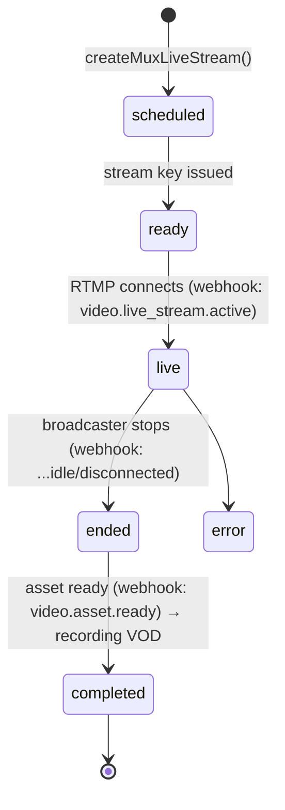

# 09 — Media & Streaming Pipeline

How live streaming + VOD work today (Mux primary, Daily.co for multi-cam switcher) and how it sits behind the `VideoProvider` abstraction. **Mux and Daily.co are both kept.** Cloudflare is kept too, but in a **CDN / last-mile role** (HLS segment delivery + S3 object serving), not as an ingest platform; legacy Cloudflare Stream ingest fields are cut.

## 1. Components

| Piece | Tech | Role |
| :--- | :--- | :--- |
| Live ingest | Mux Live Streams (RTMP `rtmps://global-live.mux.com:443/app`) | broadcaster pushes via OBS/mobile |
| Live playback | Mux HLS playback IDs + `@mux/mux-player` / `hls.js` | viewers watch |
| Recording / VOD | Mux assets (auto from live, `mp4_support: standard`) | post-event replay |
| Multi-cam switcher | Daily.co rooms (`owner_only_broadcast`, cloud recording) | admin switcher UI (**kept**, later migration session) |
| CDN / last-mile | Cloudflare | HLS segment delivery + S3 object serving (**kept**) |
| Legacy | Cloudflare Stream *ingest* fields on `Stream` | pre-Mux remnants (**cut**) |
| Chat | Firestore (Mux has **no** chat API) | live + memorial chat |

## 2. Stream data model (recap)

`Stream` (collection `streams`) holds `status`, `memorialId`, and a `mux: MuxStreamConfig` block: `liveStreamId`, `playbackId`, `rtmpUrl`, `streamKey`, recording fields (`assetId`, `vodPlaybackId`, `recordings[]`, `publishedRecordings[]`), `streamingStatus`. Streams are surfaced on memorial pages via `livestream` content blocks (`memorial-blocks.ts`).

## 3. Lifecycle



- **Create**: `createMuxLiveStream(title, opts)` → returns `{ id, playbackId, rtmpUrl, streamKey, reconnectWindow, status }`; persisted into `streams.mux`.
- **Webhooks** (`api/webhooks/mux`): `verifyMuxWebhookSignature(body, headers, MUX_WEBHOOK_SECRET)` then update stream `status`/`streamingStatus` and append `recordings[]` when assets are ready.
- **Recordings**: admin curates `publishedRecordings[]` (ordered vodPlaybackIds) shown on the public page; falls back to latest recording.
- **Analytics**: `getMuxAnalytics` is a **placeholder** (Mux Data not subscribed); `StreamAnalytics` largely unpopulated.

## 4. `VideoProvider` abstraction

```ts
video.createLiveStream(title, opts)   // wraps createMuxLiveStream
video.getLiveStream(id)
video.deleteLiveStream(id)
video.verifyWebhook(rawBody, headers) // wraps verifyMuxWebhookSignature
```

Mux is mostly **stateless from our DB's perspective** (IDs + playback IDs), so it ports cleanly: only the **persistence** of stream records moves Firestore→Turso. Webhook handlers swap their DB writes to `services.streams`.

## 5. The chat problem (biggest media-related migration risk)

Chat (`ChatMessage`, `StreamChatMessage`) is **Firestore realtime** today (client `onSnapshot`). Turso has no built-in realtime subscriptions. Options:
1. **Polling** via server endpoints (simplest; acceptable for low-volume memorial chat).
2. **SSE / WebSocket** endpoint backed by Turso writes (better live UX).
3. **Dedicated realtime service** (e.g. a pub/sub) with Turso as the system of record.

Recommend starting with **SSE + Turso writes** for live streams; polling for memorial chat. Decision pending.

## 6. Daily.co + Cloudflare

- **Daily.co** (`daily.ts`): powers the admin multi-cam switcher (`api/admin/switcher/*`). **Kept** — it has its own dedicated migration session. Wrap behind `VideoProvider` alongside Mux; only its persistence (room/stream metadata) moves to Turso.
- **Cloudflare**: **kept** as the **CDN / last-mile** layer — it fronts HLS segment delivery and serves S3/R2 objects at the edge. This is infrastructure/DNS config, not app code. Mux stays the live ingest + playback origin; S3/R2 stays the file origin.
- **Legacy Cloudflare Stream ingest fields** on `Stream` (`cloudflareInputId`, `cloudflareStreamId`, etc.) are migration leftovers — **Cut** these fields.

## Migration verdict

- **Keep** Mux **and** Daily.co behind `VideoProvider`; migrate only stream/room **persistence** to Turso and rewire the Mux webhook's DB writes. (Daily.co work is a later session.)
- **Keep** Cloudflare as CDN/last-mile (HLS delivery + S3 object serving).
- **Rebuild** chat realtime (SSE/polling) — no Firestore `onSnapshot` after migration.
- **Cut** only the legacy Cloudflare Stream **ingest** fields.
- **Note**: Mux Data analytics is unconfigured today; treat `StreamAnalytics` as future work.
