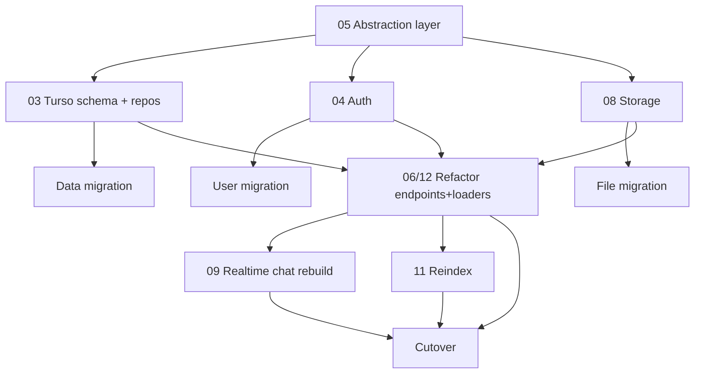

# 15 — Migration Decision Matrix & Sequencing

Consolidated Keep / Migrate / Refactor / Cut / Rebuild verdicts across the whole system, plus a recommended sequencing plan. Read this last; act from it.

## 1. Master decision matrix

| Area | Component | Verdict | Target | Ref |
| :--- | :--- | :--- | :--- | :--- |
| Framework | SvelteKit/Svelte/Vite/Tailwind | **Keep** | unchanged | 01 |
| Database | Firestore | **Rebuild** | TursoDB schema + repos | 03 |
| Data | Firestore documents | **Migrate** | export→transform→load (ID-preserving) | 03 |
| Auth | Firebase Auth + claims | **Rebuild** | Lucia/Auth.js on Turso | 04 |
| Auth | `permissions.ts`, `adminGuard.ts` | **Keep** | reuse verbatim | 04 |
| Auth | user passwords | **Migrate** | force reset (or bridge) | 04 |
| Abstraction | provider interfaces + factory | **New** | `src/lib/server/providers` | 05 |
| Storage | Firebase Storage | **Migrate** | S3/R2 (S3-compatible) | 08 |
| Storage | client direct uploads | **Rebuild** | presigned URLs | 08 |
| Video | Mux | **Keep** | `VideoProvider` | 09 |
| Video | Daily.co | **Keep** | `VideoProvider` (later migration session) | 07/09 |
| CDN | Cloudflare | **Keep** | last-mile HLS delivery + S3 object CDN | 09/14 |
| Video | Cloudflare Stream (legacy ingest fields) | **Cut** | legacy fields only | 09 |
| Realtime | chat (`onSnapshot`) | **Rebuild** | SSE/polling on Turso | 09/12 |
| Payments | Stripe | **Keep** | `PaymentProvider` | 10 |
| Email | SendGrid | **Keep/Refactor** | `EmailProvider`, split `email.ts` | 10 |
| Search | Algolia | **Keep/Refactor** | `SearchProvider`, reindex from Turso | 11 |
| Query layer | Firestore SDK | **Rebuild** | **Drizzle ORM** over libSQL | 05 |
| Feature | Blog | **Cut** | routes + rules + tables removed | 02/03/14 |
| Feature | Wiki | **Cut** | `wiki.ts` + tables removed | 02/03 |
| API | data endpoints (`api/**`, loaders) | **Refactor** | route via repositories | 06/12 |
| API | auth/session/claims endpoints | **Rebuild** | Turso sessions | 04/06 |
| API | webhooks (mux/stripe) | **Keep** | rewire DB writes | 06 |
| Frontend | routes/components/UI | **Keep** | audit Firebase coupling | 12/13 |
| Frontend | `firebase.ts`/`firebase-admin.ts` | **Cut** | after cutover | 13 |
| Config | Firebase rules/emulator/.firebaserc | **Cut** | port authz first | 14 |
| Config | hosting | **Keep** | **Vercel** (confirmed) | 14 |
| Bot | reCAPTCHA | **Keep** | or → Turnstile | 14 |
| Scripts | backfill/seed/admin | **Rewrite** | against Turso | 14 |
| Scripts | Firebase/CF debug scripts | **Cut** | — | 14 |
| Dead code | `webmap.*`, `wiki.*`, `*-example`, `debug/`, `dev/`, `sigma/`, `theme-showroom`, deprecated memorial fields, legacy stream fields, `TIER_PRICING` | **Cut** | — | 02/12/13 |

## 2. Dependency graph

## 3. Recommended sequencing

**Phase 0 — Abstraction (no behavior change)**
1. Build provider interfaces + factory (`05`); adapt existing Firebase calls behind them.
2. Refactor loaders/endpoints to call `locals.services.*` (still Firestore-backed). Ship.

**Phase 1 — Storage**
3. Implement `StorageProvider` on S3/R2; copy objects; switch `STORAGE_DRIVER=s3`; rebuild uploads as presigned. Store keys not URLs.

**Phase 2 — Database**
4. Define Turso schema (Drizzle) from `03`; implement Turso repositories.
5. Build + run export→transform→load migration; verify counts/FKs.
6. Flip `DB_DRIVER=turso` (optionally dual-run reads first).

**Phase 3 — Auth**
7. Implement Turso-native sessions (Lucia/Auth.js); rebuild login/register/reset + session/claims endpoints; migrate users (force reset).

**Phase 4 — Realtime & search**
8. Rebuild chat (SSE/polling); rewrite Algolia indexing triggers + backfill from Turso.

**Phase 5 — Cleanup**
9. Remove Firebase SDKs, rules, emulator config, dead routes/scripts, deprecated fields. Decide hosting.

## 4. Risk register

| Risk | Severity | Mitigation |
| :--- | :--- | :--- |
| Realtime chat parity (no Firestore listeners) | High | SSE + Turso; start with polling for low-volume |
| Password migration | Medium | Force reset on first login |
| Client Firebase coupling missed | Medium | Definitive `from 'firebase/'` grep before cutover (`12`) |
| Authz gaps (rules → server) | High | Port every rule predicate into repository guards (`03 §5`) |
| Storage URL rewrites | Medium | Store keys, resolve via `storage.publicUrl()` |
| Money unit inconsistency | Low | Normalize all amounts to integer cents |
| Daily.co left for later session | Low | Keep behind `VideoProvider`; migrate room/stream persistence with the rest |

## 5. Decisions (confirmed 2026-06-24)

- **Daily.co**: **Keep** — migrated in a later, dedicated session.
- **Blog + Wiki**: **Cut** now (routes, rules, types, tables).
- **Hosting**: **Vercel** (unchanged). Cloudflare is CDN/last-mile only.
- **Turso query layer**: **Drizzle ORM**.
- **Scope**: `frontend/` is the entire system (no separate backend repo).

### Remaining open question

- **reCAPTCHA → Turnstile**: candidate, not committed.

## Outcome

With the abstraction layer first and providers swappable, the migration is **incremental and reversible per concern** — Firestore and Turso can coexist during cutover, de-risking the move to the new stack.
