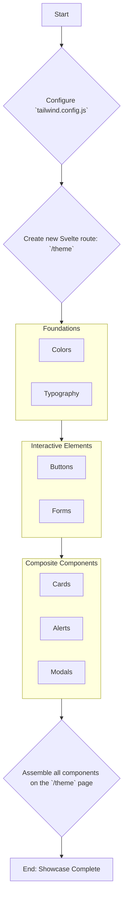

# Theme Showcase Page Implementation Plan

**Date:** 2025-08-23

## 1. Objective

To create a single Svelte page within the `frontend` application that serves as a comprehensive UI kit and style guide. This page will display all core UI components, demonstrating the application's visual theme. Its primary purpose is to facilitate rapid theme development, ensure design consistency, and provide a reference for developers.

## 2. Core Strategy: Theming with Tailwind CSS

Given that the project uses Tailwind CSS, our entire theming strategy will be centralized in the `tailwind.config.js` file. This approach allows us to define our design system as a configuration, making it maintainable and easily adaptable.

**Key actions:**

*   **Centralize Design Tokens:** All colors, fonts, spacing, and border-radius values will be defined under the `theme.extend` object in `tailwind.config.js`.
*   **Use Semantic Naming:** We will use semantic names for colors (e.g., `primary`, `secondary`, `accent`, `destructive`) rather than literal names (e.g., `blue-500`). This makes the theme more abstract and easier to change.
*   **Leverage CSS Variables for Dynamic Theming:** For features like light/dark mode, we will configure Tailwind to use CSS variables. This allows us to switch themes by changing a class on the `<html>` or `<body>` element, without needing to recompile styles.

## 3. Component Inventory for Showcase

The showcase page will be organized into logical sections, each displaying a category of UI elements.

### Foundations
- [ ] **Color Palette:** A grid of swatches displaying all theme colors (primary, secondary, neutral, success, warning, error).
- [ ] **Typography:**
    - [ ] Headings `<h1>` through `<h6>`.
    - [ ] Body text (`
`).
    - [ ] Links (`<a>`) in default, hover, and visited states.
    - [ ] Unordered (`<ul>`) and ordered (`<ol>`) lists.
    - [ ] Blockquotes (`<blockquote>`).

### Core Interactive Elements
- [ ] **Buttons:**
    - [ ] Primary, Secondary, and Tertiary (Ghost/Link) variants.
    - [ ] All states: `default`, `hover`, `active`, `disabled`.
    - [ ] Different sizes (e.g., small, medium, large).
- [ ] **Form Elements:**
    - [ ] Text Input (with placeholder, filled, and disabled states).
    - [ ] Text Area.
    - [ ] Select Dropdown.
    - [ ] Checkbox (checked, unchecked, disabled).
    - [ ] Radio Button (selected, unselected, disabled).
    - [ ] Validation states (input with helper text for error and success).

### Composite Components
- [ ] **Cards:** A standard card with an image, title, body text, and action buttons.
- [ ] **Alerts / Notifications:** Banners for `info`, `success`, `warning`, and `error`.
- [ ] **Modals:** A button that triggers a sample modal with a title, content, and close/confirm actions.
- [ ] **Navigation:** A simple example of the primary site navbar.
- [ ] **Tables:** A simple table demonstrating header and row styling.

## 4. Implementation Plan

Here is the proposed workflow to create the theme showcase.

## 5. Actionable Steps

1.  **Create a Todo List:** Use the `update_todo_list` tool to create a trackable list of tasks based on this plan.
2.  **Propose Mode Switch:** Once the plan is approved, switch to `code` mode to begin implementation, starting with the `tailwind.config.js` file.

This plan provides a clear path to creating a robust and useful theme showcase page that will serve as the foundation for the application's UI.