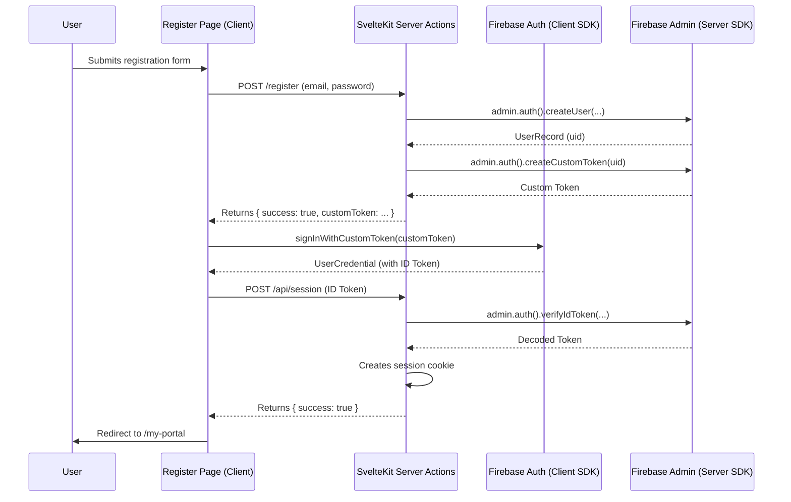

# Refactor Plan: Seamless User Registration and Login

## 1. Current State Analysis

The current user registration process correctly performs the necessary backend operations:
1.  It uses the Firebase Admin SDK's `adminAuth.createUser()` method to create a new user in the Firebase Authentication service (and by extension, the Auth emulator).
2.  It creates a corresponding user profile document in a `users` collection in Firestore to store application-specific data.

However, the user experience is disjointed. After the server-side action successfully creates the user, it simply returns a success message. The client-side does not automatically sign the user in, forcing them to go to the login page and enter their credentials again immediately after creating them.

## 2. Target State Architecture

The goal is to create a seamless "register-and-login" flow. When a user successfully registers, the application should automatically authenticate them and create a session, redirecting them to their user portal without requiring a separate login step.

This will be achieved by modifying both the client-side and server-side logic to handle authentication state more effectively immediately after registration.

### High-Level Flow Diagram

## 3. Step-by-Step Refactoring Plan

The following steps will be taken to implement the target architecture. This will be tracked in a TODO list.