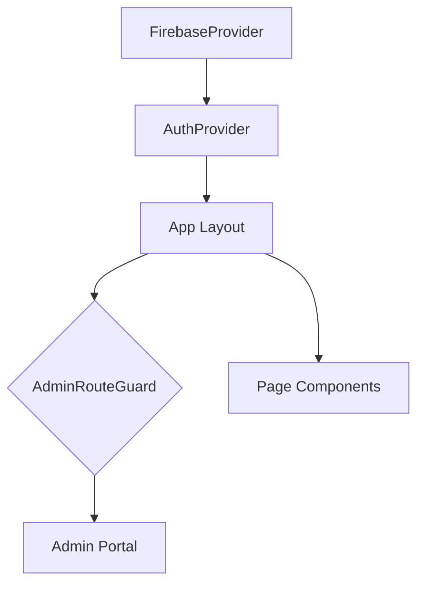
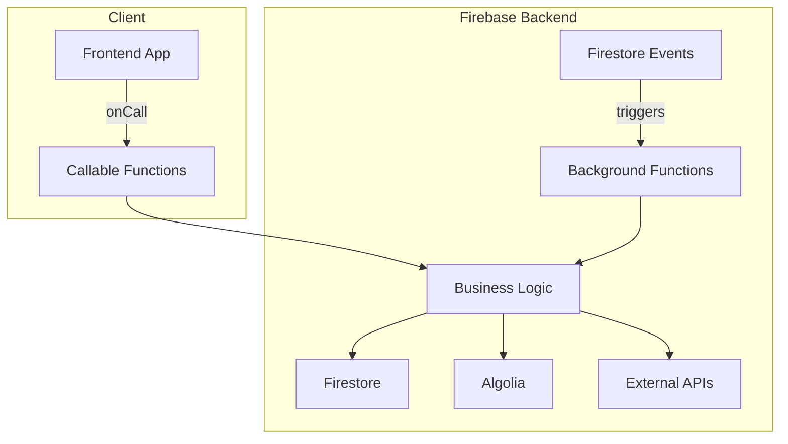

# Current State Architecture

## 1. Purpose

This document defines the technical architecture of the existing Tributestream application, which is built on React and Next.js. It serves as a comprehensive baseline for the planned rebuild, ensuring that all current functionalities, integrations, and data flows are understood and accounted for in the new system design.

## 2. Content

This section provides a high-level overview of the application's structure and data flow using Mermaid.js diagrams.

### React Component Hierarchy

The application follows a standard component-based architecture, with key providers wrapping the main layout to provide global state and services.



*   **FirebaseProvider:** Centralizes Firebase initialization, providing a single source of truth for all Firebase services.
*   **AuthProvider:** Manages user authentication state and provides it to the application via the `useAuth` hook.
*   **AdminRouteGuard:** Protects admin routes by checking for the `admin: true` custom claim.

### Next.js Routing and Data Flow

The application uses the Next.js App Router for routing and data fetching. Data is fetched on the server side where possible and passed down to client components.

```mermaid
graph TD
    subgraph "Browser"
        A[User Request] --> B[Next.js Server];
    end

    subgraph "Next.js Server"
        B --> C{App Router};
        C --> |matches /admin| D[Admin Layout];
        C --> |matches /[memorialPageSlug]| E[Memorial Page];
        D --> F[Admin Page Component];
        E --> G[Memorial Page Component];
        F --> H[API Routes];
        G --> H;
    end

    subgraph "Data Sources"
        H --> I[Firestore];
        H --> J[Cloud Functions];
    end
```

### Firebase/Firestore Connectivity

The frontend connects to Firebase services through the centralized `FirebaseProvider`. Direct SDK calls are used for data access, governed by Firestore security rules.

```mermaid
graph TD
    subgraph "Tributestream Frontend"
        A[React Components] -->|useFirebase()| B(FirebaseProvider);
        B --> C[Firebase SDK];
    end

    subgraph "Firebase Backend"
        C --> D[Authentication];
        C --> E[Firestore];
        C --> F[Cloud Functions];
        C --> G[Storage];
    end

    E -- Security Rules --> C;
```

### Cloud Functions Integration

Cloud Functions are used for backend logic, triggered by events or called directly from the client.



*   **Callable Functions:** Handle client-initiated actions (e.g., processing payments).
*   **Background Functions:** Respond to events in Firestore (e.g., syncing data to Algolia).

## 3. Key Question

### What are the current strengths and weaknesses of the existing architecture?

**Strengths:**

*   **Modern Tech Stack:** Utilizes current versions of Next.js, React, and TypeScript, providing a solid foundation with good performance and developer experience.
*   **Clear Development Patterns:** The project has well-defined guidelines for state management, form handling, and Firebase usage, which promotes consistency and maintainability.
*   **Scalable Backend:** Firebase provides a scalable and managed backend, reducing operational overhead.
*   **Decoupled Search:** The use of Algolia for search offloads complex queries from Firestore and provides a better user experience.

**Weaknesses:**

*   **Monolithic Cloud Functions:** The current structure of `functions/index.js` can become difficult to manage and test as the application grows. A more modular, domain-driven approach would be beneficial.
*   **Potential for Tight Coupling:** Direct Firebase SDK calls in the frontend can lead to tight coupling between the client and the database schema. Introducing a more formal data access layer could improve separation of concerns.
*   **Client-Side Redirects:** While partially addressed, the reliance on `window.location.href` for redirects can be jarring for users and is a workaround for a deeper issue with client-side routing in stale deployments.