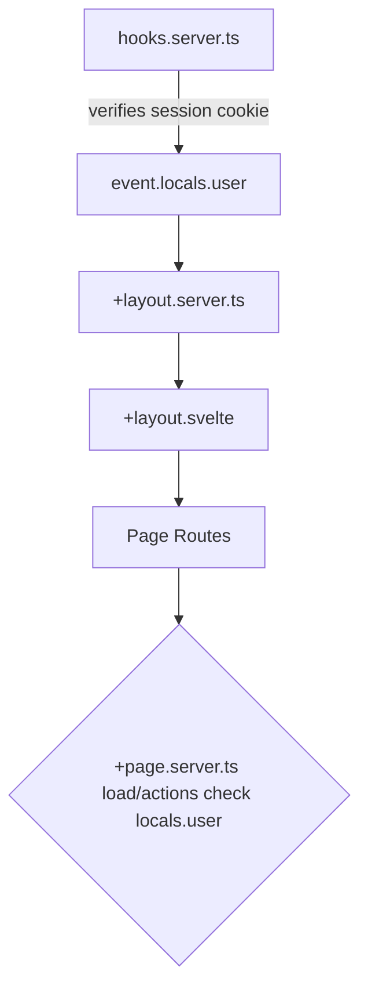
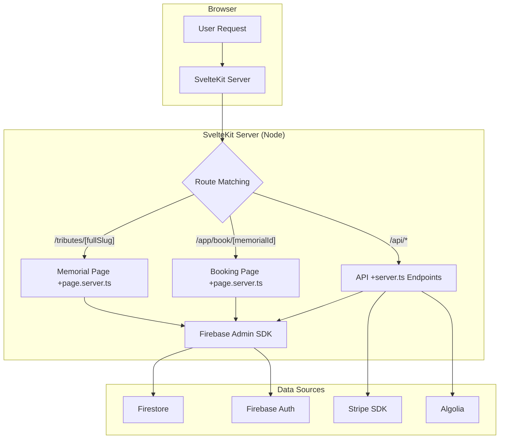
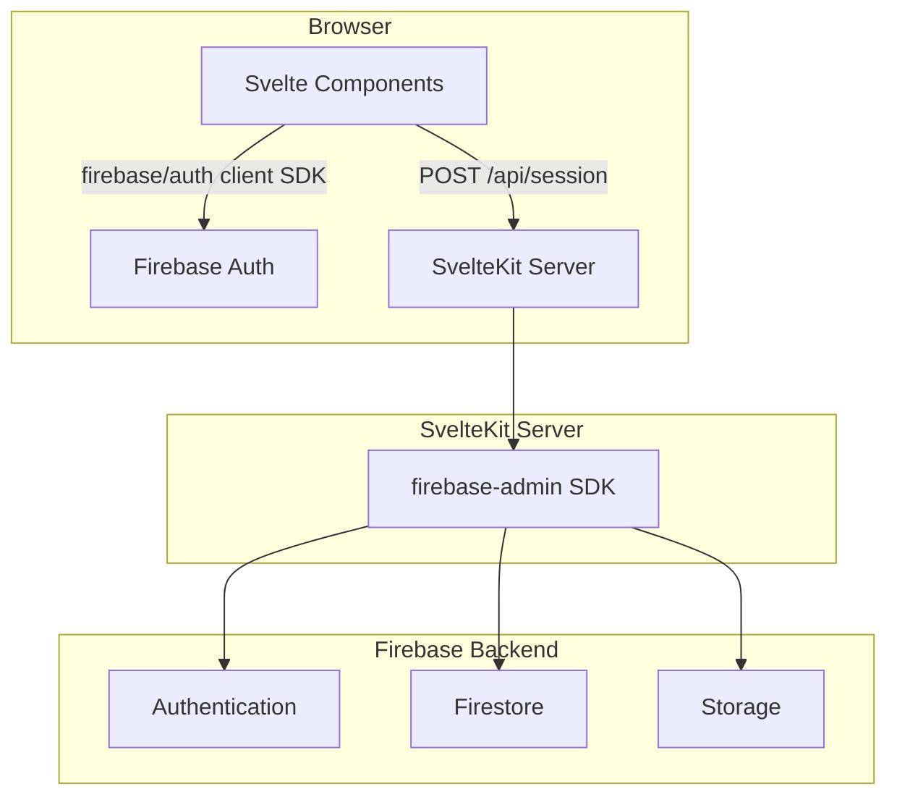
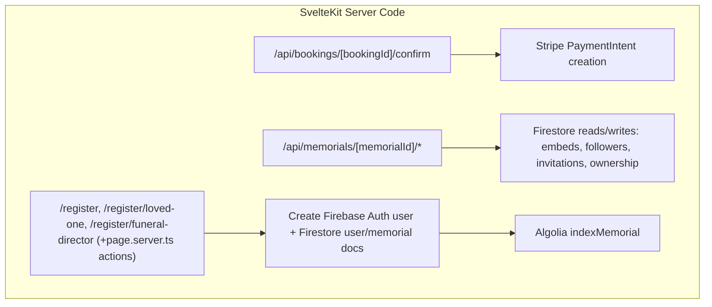

# Current State Architecture

## 1. Purpose

This document defines the technical architecture of the Tributestream application **as it currently exists in this repository**: a SvelteKit 2 / Svelte 5 frontend backed directly by Firebase (Auth, Firestore, Storage) with no Cloud Functions layer. It supersedes the earlier Next.js/React baseline that was used to plan the SvelteKit migration — that migration is complete, and this document reflects the live implementation found in `frontend/src`.

## 2. Content

### Tech Stack

*   **Framework:** SvelteKit `^2.22.0` with Svelte `^5.0.0`, built by Vite `^7`, deployed with `@sveltejs/adapter-auto`.
*   **Styling/UI:** Tailwind CSS v4, Skeleton UI (`@skeletonlabs/skeleton`), Lucide icons.
*   **Backend:** Firebase — `firebase` (client SDK) and `firebase-admin` (server SDK). **No Firebase Cloud Functions exist in this repo** — all backend logic runs inside SvelteKit server code (`+page.server.ts` actions and `+server.ts` endpoints).
*   **Payments:** Stripe, called directly from SvelteKit server endpoints via the `stripe` npm package (see `frontend/src/lib/server/stripe.ts`). No Stripe webhook/Cloud Function was found.
*   **Search:** Algolia (`algoliasearch`), indexed via `frontend/src/lib/server/algolia-indexing.ts` calls made inline from server actions when memorials are created.
*   **Email:** Custom SMTP/API-based sending via `frontend/src/lib/server/email.ts` (not the `firestore-send-email` extension pattern).

### SvelteKit Component/Route Hierarchy

There is no global "AuthProvider" component. Auth state is managed by a Svelte store (`frontend/src/lib/auth.ts`) synced with the server via cookies, and enforced per-route in `+page.server.ts` / `+server.ts` files rather than a wrapping route guard component.

```mermaid
graph TD
    A[hooks.server.ts] -->|verifies session cookie| B[event.locals.user];
    B --> C[+layout.server.ts];
    C --> D[+layout.svelte];
    D --> E[Page Routes];
    E --> F{"+page.server.ts load/actions check locals.user"};
```

*   **`hooks.server.ts`:** Runs on every request, verifies the `session` HttpOnly cookie via Firebase Admin, and populates `event.locals.user` (uid, email, displayName, role, admin).
*   **`+layout.server.ts`:** Passes `user` and a `showFirstVisitPopup` flag down to all pages.
*   **Per-route authorization:** Each protected `+page.server.ts`/`+server.ts` checks `locals.user` (and `locals.user.admin`/`role`) itself — there is no single admin route guard component.

### SvelteKit Routing and Data Flow

```mermaid
graph TD
    subgraph "Browser"
        A[User Request] --> B[SvelteKit Server];
    end

    subgraph "SvelteKit Server (Node)"
        B --> C{Route Matching};
        C --> |"/tributes/[fullSlug]"| D[Memorial Page +page.server.ts];
        C --> |"/app/book/[memorialId]"| E[Booking Page +page.server.ts];
        C --> |"/api/*"| F[API +server.ts Endpoints];
        D --> G[Firebase Admin SDK];
        E --> G;
        F --> G;
    end

    subgraph "Data Sources"
        G --> H[Firestore];
        G --> I[Firebase Auth];
        F --> J[Stripe SDK];
        F --> K[Algolia];
    end
```

### Firebase Connectivity

Two separate Firebase touchpoints exist: a client SDK for the browser (`frontend/src/lib/firebase.ts`) used for sign-in/sign-up and `onIdTokenChanged`, and a server-only Admin SDK singleton (`frontend/src/lib/server/firebase.ts`) used by all `+page.server.ts`/`+server.ts` code for Firestore/Auth/Storage access.

```mermaid
graph TD
    subgraph "Browser"
        A[Svelte Components] -->|firebase/auth client SDK| B[Firebase Auth];
        A -->|POST /api/session| C[SvelteKit Server];
    end

    subgraph "SvelteKit Server"
        C --> D[firebase-admin SDK];
    end

    subgraph "Firebase Backend"
        D --> E[Authentication];
        D --> F[Firestore];
        D --> G[Storage];
    end
```

*   In local dev, the Admin SDK connects to the Auth/Firestore emulators (`127.0.0.1:9099` / `127.0.0.1:8080`); in production it authenticates via a service-account JSON stored in `PRIVATE_FIREBASE_SERVICE_ACCOUNT_KEY`.

### Backend Logic Placement (No Cloud Functions)

Business logic that a Next.js/Cloud-Functions architecture would put in callable functions instead lives directly in SvelteKit server files:

```mermaid
graph TD
    subgraph "SvelteKit Server Code"
        A["/register, /register/loved-one, /register/funeral-director (+page.server.ts actions)"] --> B[Create Firebase Auth user + Firestore user/memorial docs];
        C["/api/bookings/[bookingId]/confirm"] --> D[Stripe PaymentIntent creation];
        E["/api/memorials/[memorialId]/*"] --> F[Firestore reads/writes: embeds, followers, invitations, ownership];
        B --> G[Algolia indexMemorial];
    end
```

*   **Registration flows** (`register/+page.server.ts`, `register/loved-one/+page.server.ts`, `register/funeral-director/+page.server.ts`) create the Firebase Auth user, set custom claims, write `users`/`memorials` Firestore docs, index the memorial in Algolia, send email, and mint a custom token for auto-login — all inline, no callable function.
*   **Payments** are handled by `/api/bookings/[bookingId]/confirm` creating a Stripe PaymentIntent directly via the server-side `stripe` client.
*   **Memorial sub-resource management** (`embeds`, `follow`, `invite`, `assign`, `update-details`) are individual `+server.ts` REST-style endpoints under `/api/memorials/[memorialId]/`.

## 3. Key Observations / Known Inconsistencies

*   **No admin portal exists.** There are only two admin-gated utility endpoints (`/api/set-admin-claim`, `/api/set-role-claim`) and admin-only checks inside memorial endpoints (`embeds`, `assign`). There is no `/admin` route tree, unlike what earlier planning docs assumed.
*   **Inconsistent memorial storage location.** `register/loved-one` writes memorials to the top-level `memorials` collection, while `register/funeral-director` writes to `users/{uid}/memorials/{id}` (a subcollection). Public memorial lookups (`tributes/[fullSlug]/+page.server.ts`) only query the top-level `memorials` collection, so funeral-director-created memorials may not be discoverable the same way.
*   **Inconsistent booking storage location.** `login/+page.server.ts` updates a top-level `bookings` collection, while the `/api/bookings/[bookingId]/*` endpoints all read/write `users/{uid}/bookings/{id}`.
*   **No Cloud Functions or `functions/` directory** exist in this repository — all "backend" behavior is SvelteKit server code running on whatever Node host the adapter targets.
*   **Extensive `console.log` instrumentation** throughout server actions/endpoints, used in lieu of a structured logger.

**Strengths:**

*   **Modern stack:** SvelteKit 2 + Svelte 5 + TypeScript + Tailwind v4.
*   **Simplified backend:** No separate Cloud Functions deploy/build step; all server logic ships with the SvelteKit app.
*   **Direct control over auth:** Session-cookie flow in `hooks.server.ts` is explicit and easy to trace.

**Weaknesses:**

*   **Data model drift:** As noted above, two different registration flows write memorials/users to different locations with different shapes, and there's no consolidated data-access layer to enforce consistency.
*   **No formal admin surface**, making role-management (`set-admin-claim`, `set-role-claim`) ad hoc and only lightly secured.
*   **Business logic embedded in route files** rather than a shared service layer, making reuse across `+page.server.ts` and `+server.ts` files harder.