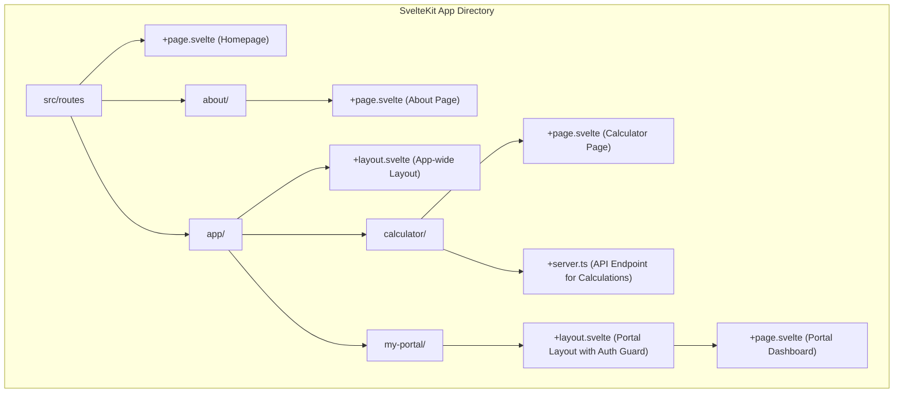
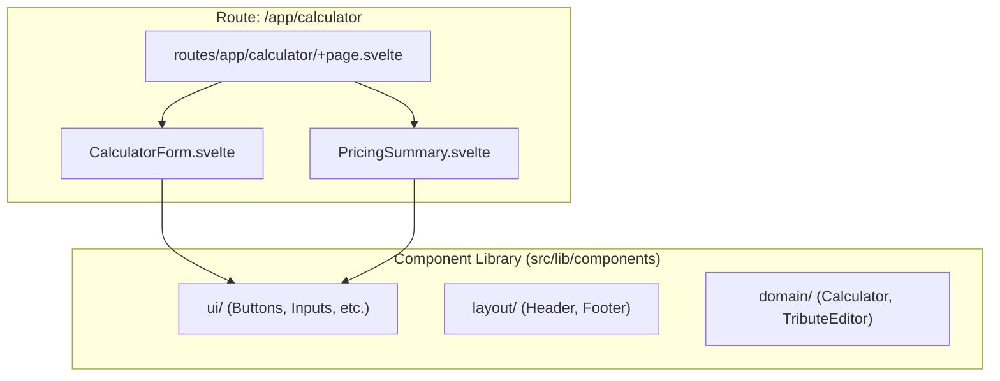
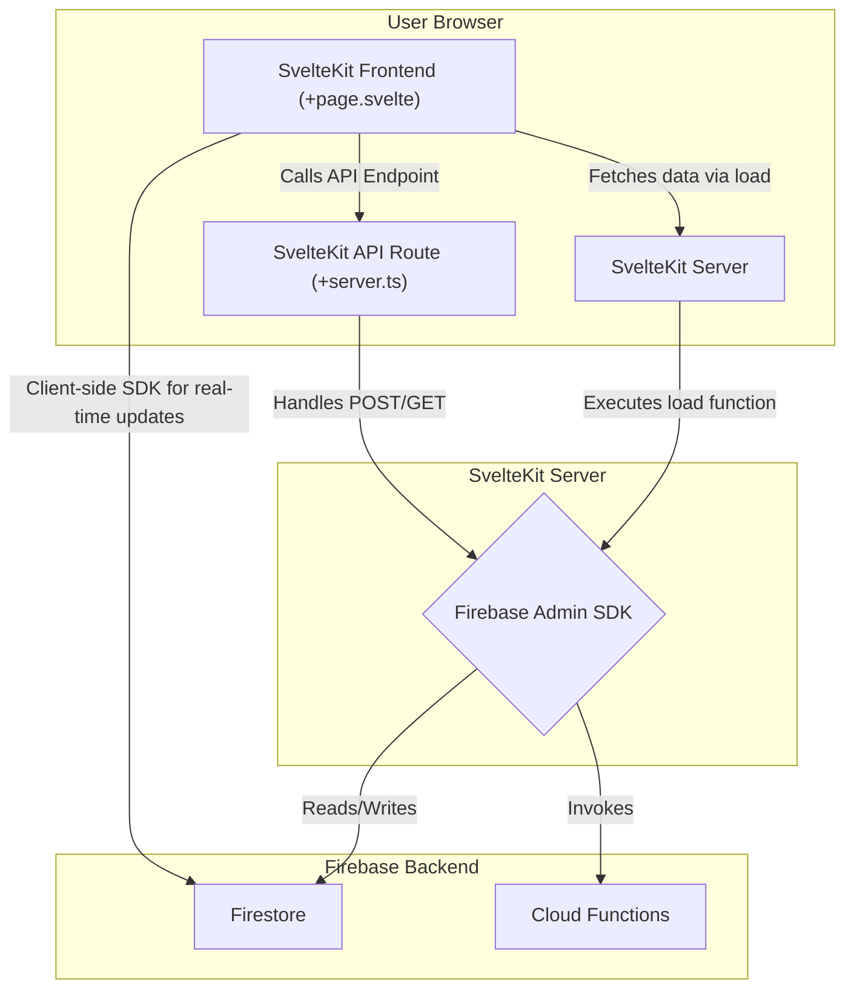

# Target State Architecture: SvelteKit Migration

## 1. Purpose

This document serves as the future blueprint for the Tributestream application following its migration to SvelteKit. It outlines the envisioned architecture, component structure, and data flow, providing a clear technical roadmap for development. This target state is designed to leverage SvelteKit's features to create a more performant, maintainable, and scalable platform.

## 2. Content

### SvelteKit Routing Structure

SvelteKit's file-based routing provides a clear and intuitive structure for organizing pages, layouts, and server-side logic.

### Svelte Component Structure

Components will be organized by feature or domain, promoting reusability and separation of concerns. Shared components will reside in a central `lib` directory.

### Firebase Integration with SvelteKit

Firebase services will be integrated directly into SvelteKit's server-side and client-side paradigms, ensuring secure and efficient data handling.

## 3. Key Question

### How will SvelteKit's features improve upon the previous architecture?

The migration from Next.js to SvelteKit is projected to deliver significant improvements in several key areas:

1.  **Performance:** Svelte compiles components to highly optimized, vanilla JavaScript at build time, resulting in smaller bundle sizes and faster client-side execution. SvelteKit's server-side rendering (SSR) and granular reactivity model will lead to quicker initial page loads and a more responsive user experience compared to the React virtual DOM.
2.  **Simplified State Management:** Svelte's built-in reactive primitives (`$state`, `$derived`) eliminate the need for complex state management libraries like React Query for most client-side state. This simplifies the codebase, reduces dependencies, and makes state easier to reason about.
3.  **Integrated Backend and Frontend:** SvelteKit's `+server.ts` files and `load` functions provide a cohesive model for writing backend logic that is tightly coupled with the frontend routes that consume it. This is a more integrated approach than Next.js's API routes, reducing boilerplate and making data fetching more straightforward and secure.
4.  **Improved Developer Experience:** The Svelte component syntax is more concise and closer to standard HTML, CSS, and JavaScript, which can lead to faster development cycles and easier onboarding for new developers. The framework's simplicity reduces cognitive overhead.