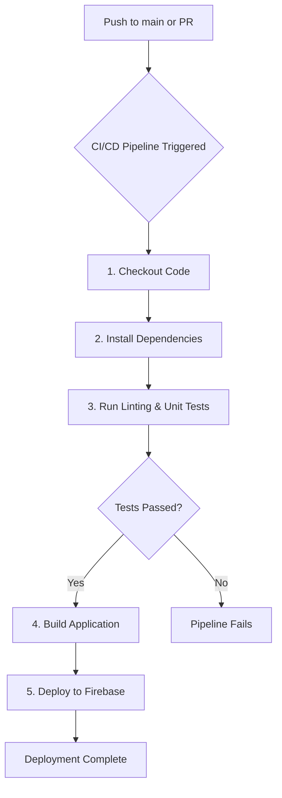

# Deployment and CI/CD Process for SvelteKit Migration

## 1. Purpose

This document outlines the comprehensive process for building, testing, and deploying the new SvelteKit application. Its goal is to establish a clear, automated, and efficient CI/CD (Continuous Integration/Continuous Deployment) pipeline that ensures code quality, stability, and rapid delivery of new features. This process is designed to integrate seamlessly with the existing Firebase and Google Cloud infrastructure.

## 2. Content

### SvelteKit Adapter Selection

To deploy the SvelteKit application on our existing Google Cloud Run infrastructure (via Firebase Hosting rewrites), a Node.js server environment is required. The choice of adapter is critical for ensuring compatibility.

*   **`adapter-auto`**: This is the recommended default for SvelteKit. It automatically detects the deployment environment and selects the appropriate adapter. For a Node.js environment like Google Cloud Run, it will correctly build a Node server. This provides flexibility and is the primary choice.
*   **`adapter-node`**: This adapter can be used to explicitly build a standalone Node.js server. It offers more direct control if specific server configurations are needed but is generally less flexible than `adapter-auto`.
*   **`adapter-static`**: This adapter is unsuitable for our application. It generates a purely static site, which would not support the dynamic, server-side logic required for features like the "My Portal" dashboard, API endpoints, and server-side rendering that interacts with Firebase.

**Decision:** We will use **`adapter-auto`** to maintain flexibility and leverage SvelteKit's intelligent environment detection.

### Build Process

The build process will compile the SvelteKit application into an optimized format ready for deployment.

1.  **Command:** The application will be built using the standard SvelteKit build command:
    ```bash
    npm run build
    ```
2.  **Output:** This command will generate a `build/` directory containing the server-side Node.js code, client-side assets (JavaScript, CSS), and prerendered HTML.
3.  **Configuration:** Environment variables required for connecting to Firebase (e.g., `FIREBASE_PROJECT_ID`, `FIREBASE_PRIVATE_KEY`) will be managed securely through Google Cloud's Secret Manager and accessed within the CI/CD environment.

### CI/CD Pipeline

We will implement an automated CI/CD pipeline using **GitHub Actions**. This pipeline will trigger on every push to the `main` branch and on every pull request, ensuring that all changes are automatically tested and deployed.

The pipeline will consist of the following stages:



**Pipeline Steps:**

1.  **Checkout Code:** The latest version of the code is checked out from the repository.
2.  **Install Dependencies:** `npm install` is run to install all project dependencies.
3.  **Run Tests:** Automated tests (unit tests, integration tests) are executed to validate the code. This is a critical quality gate.
4.  **Build Application:** If tests pass, the `npm run build` command is executed to create a production-ready build.
5.  **Deploy to Firebase:** The built application is deployed to Firebase Hosting, which will serve the application via the Google Cloud Run rewrite. This step will use the Firebase CLI and require authentication via a service account.

## 3. Key Question

### What is the most efficient and cost-effective way to deploy a SvelteKit app integrated with Firebase?

The most efficient and cost-effective deployment strategy for a SvelteKit application integrated with Firebase is to **leverage the existing Firebase Hosting and Google Cloud Run infrastructure.**

**Efficiency:**

*   **Unified Ecosystem:** Keeping the frontend and backend within the Google Cloud/Firebase ecosystem simplifies infrastructure management, authentication, and networking. The SvelteKit server can securely communicate with Firestore and Cloud Functions using the Firebase Admin SDK with minimal latency.
*   **Automated Workflow:** A GitHub Actions CI/CD pipeline provides a "push-to-deploy" workflow, which is highly efficient for development teams. It automates testing and deployment, reducing manual effort and the risk of human error.
*   **Seamless Integration:** `adapter-auto` makes building for this environment straightforward, requiring minimal custom configuration.

**Cost-Effectiveness:**

*   **Serverless Scaling:** Google Cloud Run is a serverless platform, meaning you only pay for the compute resources you use when the application is actively handling requests. This is highly cost-effective compared to maintaining a constantly running server, especially for applications with variable traffic.
*   **Firebase Hosting CDN:** Firebase Hosting provides a global CDN for free, which will serve all static assets (JS, CSS, images) for the SvelteKit application. This improves performance and reduces the load on the Cloud Run instance, further lowering costs.
*   **Shared Infrastructure:** By using the existing infrastructure, we avoid the costs and complexity associated with setting up and managing a new hosting environment.

In summary, the combination of SvelteKit with `adapter-auto`, deployed to Google Cloud Run and served via Firebase Hosting, offers a powerful, scalable, and cost-effective solution that aligns perfectly with our current technical architecture.