# Cloudflare Stream API Discrepancy Analysis

## 🚨 Critical Issue Identified

**Date**: 2025-09-27  
**Status**: BLOCKING - Live streams cannot be viewed on public pages  
**Root Cause**: Incorrect understanding and implementation of Cloudflare Stream API endpoints

---

## 🔍 Current Implementation vs Cloudflare API Documentation

### **What We're Currently Doing (INCORRECT)**

#### 1. **WHIP Endpoint (Working)**
```
✅ CORRECT: https://customer-dyz4fsbg86xy3krn.cloudflarestream.com/7416078d1cabad6b79e8ce62da7563dck07e08b9042bbb6f39de6e367f6c4b5fc/webRTC/publish
```

#### 2. **Playback Endpoint (BROKEN)**
```
❌ CURRENT: https://customer-dyz4fsbg86xy3krn.cloudflarestream.com/07e08b9042bbb6f39de6e367f6c4b5fc/webRTC/play
❌ ALSO TRIED: https://customer-dyz4fsbg86xy3krn.cloudflarestream.com/07e08b9042bbb6f39de6e367f6c4b5fc/manifest/video.m3u8
```

**Error**: `404 Not Found` - These URLs don't exist

---

## 📚 Cloudflare Stream API Documentation Analysis

### **Live Input vs Stream Video Confusion**

We're conflating two different Cloudflare Stream concepts:

#### **1. Live Inputs (WHIP/RTMP Streaming)**
- **Purpose**: Real-time streaming ingestion
- **WHIP Endpoint**: `https://customer-{CUSTOMER_CODE}.cloudflarestream.com/{LIVE_INPUT_ID}/webRTC/publish`
- **Used for**: Broadcasting live video TO Cloudflare

#### **2. Stream Videos (HLS/DASH Playback)**
- **Purpose**: Video playback and distribution
- **HLS Endpoint**: `https://customer-{CUSTOMER_CODE}.cloudflarestream.com/{VIDEO_ID}/manifest/video.m3u8`
- **Used for**: Playing video FROM Cloudflare

---

## 🔧 The Fundamental Misunderstanding

### **What Happens During Live Streaming**

1. **Live Input Created**: Gets a `live_input_id` (e.g., `07e08b9042bbb6f39de6e367f6c4b5fc`)
2. **WHIP Stream Starts**: Uses the live input ID for ingestion
3. **Recording Happens**: Cloudflare creates a separate `video_id` for the recorded content
4. **Playback**: Must use the `video_id`, NOT the `live_input_id`

### **Current Problem**
```
❌ We're using: live_input_id for playback
✅ Should use: video_id for playback
```

---

## 📊 Data Flow Analysis

### **Correct Cloudflare Stream Workflow**

```mermaid
graph TD
    A[Create Live Input] --> B[Get live_input_id]
    B --> C[Start WHIP Stream]
    C --> D[Cloudflare Records Stream]
    D --> E[Creates video_id]
    E --> F[Use video_id for HLS Playback]
    
    G[❌ Current: Use live_input_id for playback]
    H[✅ Correct: Use video_id for playback]
```



---

## 🚨 Specific Issues in Our Implementation

### **1. Wrong Stream ID Usage**
```javascript
// ❌ WRONG: Using live input ID for playback
const playbackUrl = `https://customer-${CUSTOMER_CODE}.cloudflarestream.com/${liveInputId}/manifest/video.m3u8`;

// ✅ CORRECT: Should use video ID for playback
const playbackUrl = `https://customer-${CUSTOMER_CODE}.cloudflarestream.com/${videoId}/manifest/video.m3u8`;
```

### **2. Missing Video ID Retrieval**
We never fetch the `video_id` that Cloudflare creates during recording.

### **3. Incorrect API Endpoint Assumptions**
```javascript
// ❌ These endpoints don't exist:
// - /webRTC/play (not a real Cloudflare endpoint)
// - Using live_input_id for HLS playback
```

---

## 🔍 Evidence from Error Logs

### **Current Error Pattern**
```
🚨 [HLS ERROR]: manifestLoadError, fatal: true
URL: https://customer-dyz4fsbg86xy3krn.cloudflarestream.com/07e08b9042bbb6f39de6e367f6c4b5fc/webRTC/play
Status: 404 Not Found
```

### **Analysis**
- `07e08b9042bbb6f39de6e367f6c4b5fc` = Live Input ID (correct for WHIP)
- `/webRTC/play` = Non-existent endpoint
- Should be using a different Video ID for `/manifest/video.m3u8`

---

## 🛠️ Required Fixes

### **1. Implement Video ID Retrieval**
```javascript
// After live stream ends, get the recorded video ID
const videoResponse = await fetch(`https://api.cloudflare.com/client/v4/accounts/${ACCOUNT_ID}/stream/live_inputs/${liveInputId}/videos`);
const videos = await videoResponse.json();
const videoId = videos.result[0]?.uid; // Most recent recording
```

### **2. Use Correct Playback URLs**
```javascript
// For live streams (if supported)
const livePlaybackUrl = `https://customer-${CUSTOMER_CODE}.cloudflarestream.com/${liveInputId}/iframe`;

// For recorded streams
const recordedPlaybackUrl = `https://customer-${CUSTOMER_CODE}.cloudflarestream.com/${videoId}/manifest/video.m3u8`;
```

### **3. Implement Proper Live vs Recorded Logic**
```javascript
if (stream.status === 'live') {
    // Use live playback method (iframe or WebRTC)
    playbackUrl = livePlaybackUrl;
} else if (stream.status === 'completed' && stream.videoId) {
    // Use recorded video HLS
    playbackUrl = recordedPlaybackUrl;
}
```

---

## 📋 Action Items

### **Immediate (Critical)**
1. ✅ **Research Cloudflare Live Playback**: Determine if live streams can be played back in real-time
2. ✅ **Implement Video ID Retrieval**: Get recorded video IDs from live inputs
3. ✅ **Fix Playback URL Generation**: Use correct endpoints for live vs recorded

### **Short Term**
1. ✅ **Update Database Schema**: Store both `liveInputId` and `videoId`
2. ✅ **Implement Recording Detection**: Know when recordings are ready
3. ✅ **Fix CORS Configuration**: Ensure proper origin allowlists

### **Long Term**
1. ✅ **Comprehensive Testing**: Test entire live-to-recorded workflow
2. ✅ **Error Handling**: Graceful fallbacks for missing recordings
3. ✅ **Documentation**: Update technical docs with correct API usage

---

## 🎯 Success Criteria

### **Live Streaming**
- ✅ WHIP connection works (already achieved)
- ❌ Live playback works on public pages
- ❌ Proper status indicators

### **Recorded Playback**
- ❌ Recordings are automatically detected
- ❌ HLS playback works without CORS errors
- ❌ Seamless transition from live to recorded

---

## 📚 References

- [Cloudflare Stream API Documentation](https://developers.cloudflare.com/stream/manage-video-library/using-the-stream-api/)
- [Cloudflare Live Inputs Documentation](https://developers.cloudflare.com/stream/stream-live/start-stream-live/)
- [WHIP Protocol Specification](https://datatracker.ietf.org/doc/draft-ietf-wish-whip/)

---

**Next Steps**: Implement video ID retrieval and correct playback URL generation to resolve the 404 errors and enable proper video playback.
