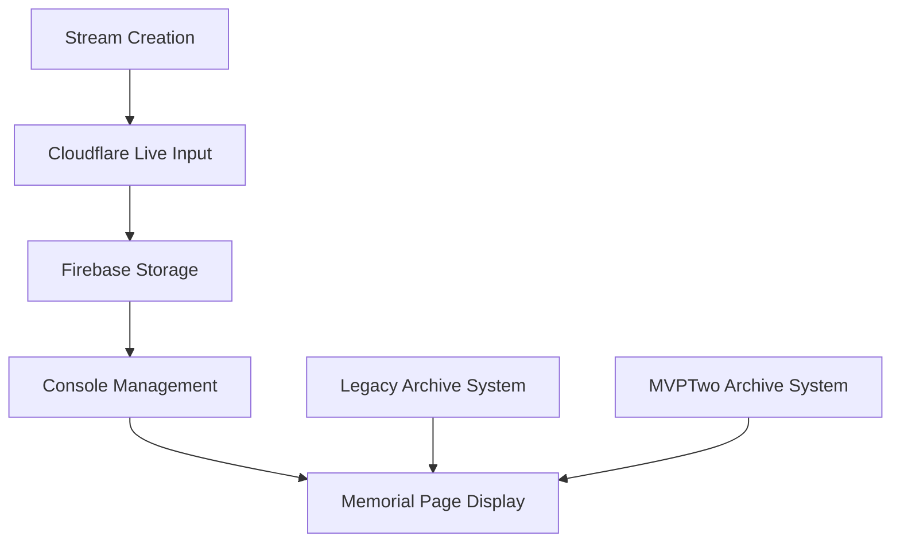
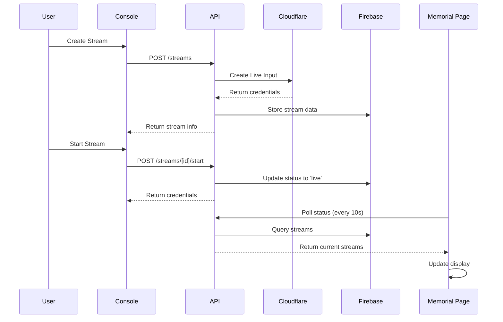

# Livestream MVP Two - Codebase Review & Analysis

## Executive Summary

This document provides a comprehensive review of the Livestream MVP Two system, identifying discrepancies, documenting APIs, and analyzing data models across the setup stream, console, and memorial page components.

## System Architecture Overview



## Critical Discrepancies Identified

### 🚨 **1. Dual Archive Systems**
**Issue**: Two separate archive systems exist simultaneously
- **Legacy System**: Uses `memorial.livestreamArchive` array
- **MVPTwo System**: Uses `mvp_two_streams` collection with `status: 'completed'`

**Impact**: Confusion, data duplication, inconsistent user experience

### 🚨 **2. Field Name Inconsistencies**
**Issue**: Mixed usage of Cloudflare ID field names
- Stream Creation: `cloudflareId` (fixed)
- TypeScript Interface: Both `cloudflareId` and `cloudflareStreamId` defined
- Some legacy code may still reference `cloudflareStreamId`

### 🚨 **3. Redundant Setup Endpoint**
**Issue**: Setup endpoint duplicates stream creation functionality
- Stream creation now includes all Cloudflare integration
- Setup endpoint becomes redundant but still exists
- Could cause confusion about which endpoint to use

### 🚨 **4. Recording Status Complexity**
**Issue**: Multiple recording status tracking mechanisms
- `recordingReady` boolean
- `recordingPlaybackUrl` field
- Legacy webhook system
- Manual status checking

## API Documentation

### Stream Management APIs

#### **POST /api/livestreamMVPTwo/streams**
Creates a new stream with immediate Cloudflare integration.

**Request Body:**
```json
{
  "title": "string",
  "description": "string (optional)",
  "memorialId": "string",
  "memorialName": "string",
  "scheduleType": "now | scheduled",
  "scheduledDateTime": "string (ISO) (optional)",
  "isVisible": "boolean"
}
```

**Response:**
```json
{
  "id": "string",
  "cloudflareId": "string",
  "playbackUrl": "string",
  "streamKey": "string",
  "streamUrl": "string",
  "status": "scheduled",
  "createdAt": "string (ISO)",
  "updatedAt": "string (ISO)"
}
```

#### **GET /api/livestreamMVPTwo/streams**
Retrieves all streams for the authenticated user.

**Response:**
```json
[
  {
    "id": "string",
    "title": "string",
    "status": "scheduled | live | completed",
    "cloudflareId": "string",
    "playbackUrl": "string",
    "memorialId": "string",
    "isVisible": "boolean",
    "createdAt": "string (ISO)",
    "updatedAt": "string (ISO)"
  }
]
```

#### **POST /api/livestreamMVPTwo/streams/[id]/setup**
⚠️ **REDUNDANT** - Functionality now handled in stream creation

#### **POST /api/livestreamMVPTwo/streams/[id]/start**
Marks a stream as live.

**Response:**
```json
{
  "streamKey": "string",
  "streamUrl": "string", 
  "playbackUrl": "string"
}
```

#### **GET /api/memorials/[id]/streams/status**
Polling endpoint for real-time stream status updates.

**Response:**
```json
{
  "liveStreams": "Array<Stream>",
  "scheduledStreams": "Array<Stream>",
  "completedStreams": "Array<Stream>",
  "timestamp": "string (ISO)"
}
```

### Memorial Page APIs

#### **GET /[fullSlug]**
Loads memorial page with all stream data.

**Server Response:**
```json
{
  "memorial": "Memorial",
  "liveStreams": "Array<Stream>",
  "scheduledStreams": "Array<Stream>", 
  "completedStreams": "Array<Stream>",
  "archiveEntries": "Array<LegacyArchiveEntry>"
}
```

## Data Model Analysis

### MVPTwoStream Interface
```typescript
interface MVPTwoStream {
  // Core Identity
  id: string;
  title: string;
  description?: string;
  
  // Cloudflare Integration
  cloudflareId?: string;           // ✅ Primary field
  cloudflareStreamId?: string;     // ⚠️ Legacy - should be removed
  playbackUrl?: string;
  streamKey?: string;
  streamUrl?: string;
  
  // RTMP (Redundant with streamKey/streamUrl)
  rtmpUrl?: string;               // ⚠️ Duplicate of streamUrl
  rtmpStreamKey?: string;         // ⚠️ Duplicate of streamKey
  
  // Status & Lifecycle
  status: 'scheduled' | 'live' | 'completed' | 'cancelled';
  actualStartTime?: Date;
  actualEndTime?: Date;
  whipActive?: boolean;
  
  // Recording
  recordingReady: boolean;
  recordingPlaybackUrl?: string;
  
  // Visibility & Access
  isVisible: boolean;
  isPublic: boolean;
  
  // Association
  memorialId?: string;
  createdBy: string;
  
  // Metadata
  displayOrder: number;
  featured: boolean;
  createdAt: Date;
  updatedAt: Date;
}
```

### Data Storage Patterns

#### Firebase Collections
```
mvp_two_streams/
├── {streamId}/
│   ├── cloudflareId: string
│   ├── playbackUrl: string
│   ├── streamKey: string
│   ├── streamUrl: string
│   ├── status: string
│   ├── memorialId: string
│   └── ...other fields

memorials/
├── {memorialId}/
│   ├── livestreamArchive: Array<LegacyArchiveEntry>  // ⚠️ Legacy
│   └── ...other memorial fields
```

## Component Analysis

### Console Components
- **MVPTwoStreamCredentials.svelte**: Displays stream credentials
- **Stream Console Page**: Manages individual stream lifecycle
- **Stream List**: Shows all user streams

### Memorial Page Components  
- **MemorialStreamDisplay.svelte**: Main display component
- **Real-time polling**: Updates stream status every 10 seconds
- **Multi-stream support**: Shows live, scheduled, and completed streams

## Workflow Analysis

### Current Stream Lifecycle


## Recommendations

### 🎯 **High Priority Fixes**

1. **Remove Redundant Setup Endpoint**
   - Stream creation now handles all setup
   - Remove `/setup` endpoint to avoid confusion

2. **Standardize Field Names**
   - Remove `cloudflareStreamId` from TypeScript interface
   - Remove `rtmpUrl` and `rtmpStreamKey` (duplicates)
   - Use only `cloudflareId`, `streamKey`, `streamUrl`

3. **Consolidate Archive Systems**
   - Decide on single archive approach
   - Migrate legacy archives to MVPTwo system
   - Remove dual system complexity

### 🔧 **Medium Priority Improvements**

4. **Simplify Recording Status**
   - Use single `recordingReady` boolean
   - Implement consistent webhook handling
   - Remove manual status checking complexity

5. **Improve Error Handling**
   - Add retry logic for Cloudflare API calls
   - Better error messages for users
   - Graceful degradation when services fail

### 📈 **Low Priority Enhancements**

6. **Performance Optimizations**
   - Reduce polling frequency when no active streams
   - Implement WebSocket for real-time updates
   - Cache stream data on client side

## Testing Recommendations

### Critical Test Cases
1. **Stream Creation**: Verify all fields populated correctly
2. **Status Transitions**: Test scheduled → live → completed
3. **Memorial Page Display**: Verify correct stream filtering
4. **Real-time Updates**: Test polling mechanism
5. **Error Scenarios**: Test Cloudflare API failures

### Data Integrity Tests
1. **Field Consistency**: Verify no orphaned fields
2. **Memorial Association**: Test memorialId relationships
3. **Archive Migration**: Test legacy → MVPTwo conversion

## Conclusion

The Livestream MVP Two system has solid core functionality but suffers from:
- **Architectural debt** from rapid development
- **Dual systems** creating complexity
- **Field inconsistencies** causing confusion
- **Redundant endpoints** needing cleanup

Priority should be given to consolidating the dual archive systems and removing redundant code paths to improve maintainability and user experience.
